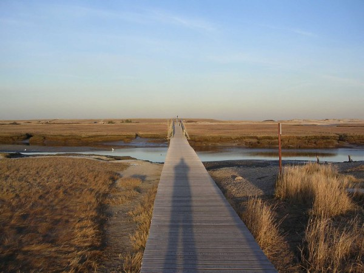

Jonathan Kelly is only half-joking when he says he can go bowling on the main street of Wellfleet, Mass. in February. There are about 3,000 who live in Wellfleet year-round; come summer, more than 9,000 will be there. It’s a seasonal ebb and flow typical of Cape Cod, where many local business owners opt to close up shop from October through May.

Kelly is not one of them. As a co-owner of Beanstock Coffee Roasters in Wellfleet, Kelly endures seasonal business cycles that are near-perfect reflections of the town’s annual population flux – in August, Beanstock does at least three times the amount of business that it does in the slowest winter months, Kelly said.

Kelly and his wife both grew up on Cape Cod, and they lived in Chicago and San Francisco before returning to the Cape. While in San Francisco, Kelly admired *Peet’s Coffee*, and he wondered why there wasn’t more of that style of coffee being roasted in the Northeast. He joined Beanstock in 1999, and the roaster now has a loyal following throughout the Cape. Business grows each year, but the pace of business still shifts dramatically through the seasons. “It’s something I’ve thought about every year,” Kelly said. “For us, it really is a challenge.”

From Coastal Maine to Cape Cod to the Jersey Shore to North Carolina’s Outer Banks, hundreds of cafes and roasters in popular summertime destinations face the same decision: to close during the offseason or persevere through the winter months with a fraction of the summer clientele.

“There’s something to be said for the seasonal business,” said Paul Whitaker, owner of Paul’s Bean and Bagel in the Cape Cod town of Sandwich, Mass. “It’d be easier to stay motivated and charged-up if you knew you could close in December and open again in May.”

But Whitaker also stays open year-round. He opened Bean and Bagel three years ago, and serving premium coffee and ice cream, he decided he’d need to be a reliable year-round presence to win over new customers. “It’s a daily obsession, and you can’t shut them off … and expect that in May that they’re all going to come back,” Whitaker said.

As co-owner of the Front Porch Cafe and Kill Devil Coffee Roasters in North Carolina’s Outer Banks, Paul Manning also said it’s barely even an option to close during the slow months. The Outer Banks’ population increases about tenfold during the summer months when the Front Porch Cafes do about 40 percent more business than in the winter. But Manning said it would be hard to go from closed in the offseason to open during the summer rush. “We’ve always based our business around the local market out of necessity,” Manning said.

  
*Hundreds of people will traverse the Sandwich Boardwalk each day in the summer, but in the off-season, it’s a quiet place.*

### Winter: ‘The Unromantic Part’

Beanstock is exclusively a roasting business; they don’t run a cafe. All the same, the departure of Wellfleet’s summer crowds has a major impact on the company’s off-season business. A majority of Beanstock’s clients are on Cape Cod; many of them are on the Outer Cape and do the bulk of their business during a four-month stretch each year. Some of Beanstock’s accounts are only open in the summer, and even for the ones that are open year-round, Kelly estimates that 95 percent of them purchase less coffee during the off-season.

Kelly remains busy during the winter months, albeit with different kinds of work from the rest of the year. “You’re catching up with repairs \[to the machinery\], which is the very unromantic part of the business,” Kelly said.

There is some upside to the slower pace winter brings. It’s a time to strategize, plan, design, and perhaps experiment with some new blends. “You do have more time to have fun with it,” Kelly said.

In North Carolina, Manning has a similar approach to the winter months. “We have a steady clientele,” he said. “It’s nice to have your business ramp up in the summer, but in the winter, you have time to relax a bit and work on some projects. … The pace varies, which is kind of neat.”

Manning estimates that Kill Devil will roast about 50 percent more beans in July and August than in January or February. Still, there is one staffer who roasts year-round, and even in the offseason, she manages to work a steady 40 hours or so each week.

For Whitaker, running Bean and Bagel is actually more difficult in the winter. He too has less business in the winter months – sometimes less than a quarter of the daily customers he has in the summer – but he also has less staff. Most of his half-dozen winter staffers are college or high-school students working one or two shifts a week. Whitaker, therefore, must be there in person seven days a week, from opening to closing time.

### Spring: ‘A Switch Is Turned’

On a late March day this year, the temperature on the Outer Banks went up into the high 70s; it fell to the 40s a day later. The pleasant days are enough to bring a small influx of budget-savvy families and college spring-breakers to the Outer Banks in March. At Front Porch, there’s a tiny uptick in business already.

Manning finalizes his summertime staff at this time. When Front Porch opened in 1999, Manning said, “I had college kids applying in droves. … \[Now\] I only get a couple of college kids applying for a job.” These days, about half of Manning’s summer staff consists of foreign exchange students, something that has become typical of many area businesses – 5,000 foreign exchange students came to the Outer Banks to work last summer. Many of Front Porch’s summer staff hail from Eastern European countries like Lithuania, Ukraine, and Russia.

Both Kelly and Whitaker said their clientele on Cape Cod doesn’t increase much until May or June. Spring in New England can be a frustrating, drawn-out time of year. Cape Cod had temperatures in the teens and the 60s in March 2008, and with hundreds of microclimates, Cape Cod’s weather will remain mercurial almost until the summer solstice. “It gets busier, but not busy enough for me to hire more people,” Whitaker said. “It’s slow, and I pretty much have to do it myself.”

All the same, Whitaker’s and Kelly’s workdays are already changing as spring arrives. “At this time of year \[March\], a switch is turned,” Kelly said.

At Beanstock, Kelly will prepare for summer accounts. At Bean and Bagel, local students who worked there in previous summers stop by and chat with Manning about working the upcoming summer. They’re all preparing for the summer rush, which will come suddenly.

  
*Paul Whittaker, owner of Paul’s Bean and Bagel in Sandwich, Mass. on Cape Cod*

### Summer: ‘We Go All-Out’

“In the summertime, we go all-out just to keep up with demand,” Kelly said. By late June, Beanstock’s weekly business triples. “I’m not going to try a lot of new blends in the summertime. … I just don’t have the time.”

On the thermometer and the calendar, summer arrives a bit earlier at the Outer Banks.

“Memorial Day is really the kickoff,” Manning said. “By June 10, we’re into the full season.” Instead of the two or three morning-shift staffers during the winter months, four or five staff members will work the morning shift at Front Porch during the summer.

From that point on, Manning tries to keep five days ahead of the elements. He views extended weather forecasts throughout the season because as busy as nice summer days are at Front Porch, rainy summer days bring even more customers to the cafe.

“It’s all you can do to keep up,” Manning said. He tries to be prepared and asks staffers to come in on the foul-weather days, even if they have an off-day scheduled. They’ll typically get a bonus, and it’s well worth the expense for Manning. “It’s all hands on deck,” he said.

Same with Bean and Bagel, where Whitaker’s staff is doubled and the total payroll hours of his staff nearly quadrupled.

“The difference is dramatic, and it actually makes it easier to run a business,” Whitaker said. “I don’t have to be there every minute.” He can delegate more, and somebody on his staff opens the shop on some mornings. One part that’s tougher in the summer is keeping pace with inventory. Something that lasts a month in Bean and Bagel during the winter tends to be gone in one week during peak season.

Both Manning and Whitaker said there’s a different atmosphere with the summer clientele. On the Outer Banks, said Manning, people have come to relax, but it can take a while before they adjust. The morning rush begins later, usually from 10-11 a.m. “If it’s a really nice beach day, it will be pretty quiet around lunch until the afternoon,” Manning said. People will stop in for iced coffee later in the afternoon.”

There’s also a difference in the spending habits of summer customers, Whitaker said. “The clientele that comes in during the summer … they almost want to spend their money,” he said. Year-round customers tend to want to save their money; people on vacation tend to splurge more often.

### Fall: ‘A Big Sigh of Relief’

Generations of Americans near the East Coast have known that Cape Cod and the Outer Banks are summer paradises. It remains a bit of a secret that the areas remain a paradise for a month or two after Labor Day.

This, in fact, is the nicest time of year for business, according to Kelly and Manning. “The sweet spot is probably late October and November,” Kelly said. In more moderate numbers, people continue to vacation on the Cape. “There’s plenty of business, but you’re not going nonstop.”

Manning also said the fall is his favorite time of year – he especially likes September after Labor Day on the Outer Banks. Although it’s the beginning of hurricane season, the water is still warm, and daytime temperatures are still often in the 80s. The business remains steady, yet the pace of life slows down to a near-offseason level. “The day after Labor Day, it’s like a big sigh of relief out here,” Manning said. “You can just feel everybody slowing down.”

### Worth the Seasonal Ups and Downs

Kelly would be happy to have a steadier rate of business throughout the year. Beanstock has some customers on the far side of Cape Cod Canal, and they’d love to have more. “We’ve been trying to \[do more business\] off-Cape and get accounts in more year-round areas,” Kelly said.

Like many Cape Cod year-rounders, though, they’re willing to endure the off-peak months because the summer months are so nice and because of the community mentality in the area throughout the year. “Whey you’re here year-round, you’re all in it together,” Kelly said. “There’s kind of a sense of helping one another out… It’s our neighbors who are drinking our coffee. I also want to do the best I can by these people.”

For Whitaker, being a steady year-round presence pays off in the long run. In his third year running Bean and Bagel, winter business is up about 30 percent from last year. “\[Locals\] appreciate people sticking it out during the winter season,” Whitaker said. His store sells ice cream as well as coffee, and continuity helps him keep competitive in an area that’s loaded with seasonal ice cream shops.

The business climate of Outer Banks makes up for much of the seasonal volatility. “It’s a great environment for a small business owner,” Manning said. “You’re not in competition with a saturation of chain stores.”

Manning said that he and many other year-round residents feel that there’s something to enjoy about the winter season. “From a residential point of view, I love the fact that we live on the edge of the continent,” Manning said. “It’s pretty neat to walk on the beach in the winter and not see a single person.”