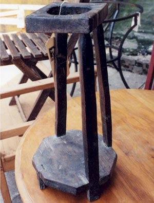

One could sit here and write volumes about coffee in Brazil, but if you want to read a good book about it, go to your local library and look for a copy of *Vassouras: A Brazilian Coffee County, 1850-1890. The Roles of Planter and Slave in a Changing Society.* Stanley J. Stein. New York: Atheneum, 1976.

Instead, we’ll tell you a little about cafézinho, a word that more than being a diminutive for coffee (cafe, in Portuguese) is almost a synonym for *welcome* in Brazil. Wherever you go, the minute you walk in the door, someone will pop the question *would you like a cafézinho?* and they won’t take no for an answer. Or maybe they won’t even ask and the cafézinho will soon materialize on a dainty tray brought in by a maid.

In offices, someone will come by and pour cafézinhos at people’s desks, so don’t be surprised if, smack in the middle of a business discussion, your Brazilian counterpart offers you a little coffee, too. And, at that point, the conversation may well switch to a non-business topic while you sip away. You’ll even be offered a *cafézinho* while shopping at H. Stern and other ultra-sophisticated stores and boutiques. Or you can “belly up to the bar” at any of the countless places that serve *cafézinho*, order one, and sip away while standing on the sidewalk. If you can spare the time, sit at a table in any of the fabulous cafes where tiny, scrumptious little cookies or sugar-dipped orange peel are always placed next to your cup.

  
*Cafézinho – The antique coffee maker pictured here comes from the state of Minas Gerais, home to Milton Nascimento and many other world-renowned musicians. The cloth strainer fits in the hole, and the coffee pot sits right underneath it.*

Here’s a traditional recipe for Brazilian *cafézinho* passed on from generation to generation. I have a Brazilian friend in Miami Beach who still makes coffee like this.

For each cup of water, use a heaping Tbsp of good coffee ground for espresso. The recipe also calls for sugar to taste. (You’ll need a saucepan that you’ll promise to use ONLY for making coffee.) This is how it’s done:

1.  Add the water to the pan, add the sugar, and dissolve well.
2.  Bring to a boil over medium heat.
3.  When the water and sugar mixture boils, add the coffee powder, stir well, and pour through a traditional cloth coffee strainer (or a paper filter).
4.  Pour immediately into a tiny cup. Espresso cups can now be found rather easily in the U.S. Cloth coffee strainers can be found in markets and supermarkets in Brazil and in Latino stores in the U.S.

Ah, if you can bring home the micro spoons decorated with Brazilian semi-precious stones – Brazilians usually find them the epitome of kitsch – you’ll wow your guests every time! You’ll find them in souvenir shops in Rio and at major airports.
