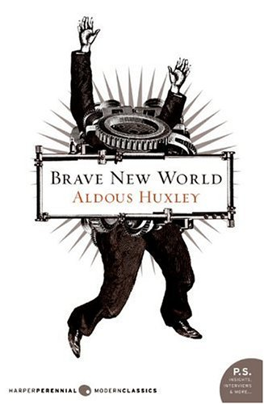

Deep down inside, do each of us really yearn for some conflict, struggle, and sadness in our lives? What would be lost if we were to become permanently happy? This is what Aldous Huxley explores in *Brave New World*, the fifth-best novel of the 20th century if you’re inclined to believe the Modern Library editorial board.

Can permanent happiness be achieved without coffee? It seems implausible, and Huxley apparently agrees. Aging, career quandaries, and unrequited love — unrequited anything, really, as well as any form of love — are absent in the Brave New World. But in the year 632 AF (After Ford — and yes, that’s Henry Ford), they’re still drinking coffee. Occasionally. Coffee only appears once in *Brave New World*, and even then, it’s used to wash down soma, a happy-pill drug the characters constantly take.

> Landing on the roof of Henry’s forty-story apartment house in Westminster, they went straight down to the dining-hall. There, in a loud and cheerful company, they ate an excellent meal. *Soma* was served with coffee. *— Brave New World by Aldous Huxley, Chapter 5, Part 1*

  
*Brave New World by Aldous Huxley*

I wonder if Huxley made an error in this lone mention of coffee — elsewhere in the book, characters drink “caffeine solution.” That seems more in tune with Brave New World, where every desire is instantly gratified. Fine hotels give guests what they want — caffeine solution, amongst other luxuries:

> They slept that night at Santa Fe. The hotel was excellent — incomparably better, for example, than that horrible Aurora Bora Palace in which Lenina had suffered so much the previous summer. Liquid air, television, vibro-vacuum massage, radio, boiling caffeine solution, hot contraceptives, and eight different kinds of scent were laid on in every bedroom. *— Brave New World, Chapter 5, Part 3*

The book is set in London, and some traditions endure. Taking caffeine solution, perhaps with crumpets, is still a mark of polite society. Helmholtz is unfazed when he gets into, uhm, hot water with his fordship, the Resident Controller of Western Europe.

> Helmholtz laughed aloud. “It’s more like a caffeine-solution party than a trial,” he said, and let himself fall into the most luxurious of pneumatic armchairs. *— Brave New World, Chapter 16, Part 1*

I’m reluctant to opine much when discussing classics. After all, they’re classics, right? I can either affirm the self-evident — the classic novel is really good — or I can be the contrarian blogger who trashes the classic novel. And who would I be kidding then?? I’ll leave it at this: I enjoyed Brave New World, especially the dark humor that grows darker and yet more humorous as the book goes on — A Clockwork Orange by Anthony Burgess similarly resonated with me. I don’t think BNW was the 5th-best 20th-century novel I’ve read, but there have been many more laughable best-of-list inclusions than this one. Huxley, if nothing else, knew that all the soma in the world couldn’t keep people happy in a world that lacked coffee.

### Resources

Modern Library 100 best 20th century novels – From the Modern Library editorial board
