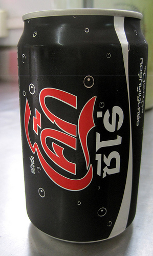
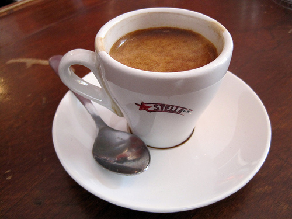

Once people learn about the INeedCoffee website, they come to the same conclusion. *You must drink a lot of coffee!* I tried to defend myself for the longest time by explaining that I prefer quality over quantity. I don’t think I drink a lot of coffee. But what is considered *a lot of coffee*? I have an uncle who consumes more coffee in a day than I do in a week. But I also know people who could make the same comparison about me.

In this article, I’ve decided to lay my cards on the table and let you decide if I consume too little or too much caffeine. To make it more interesting, I’ve invited other INeedCoffee contributors to send me a *typical day* journal of caffeine consumption.

**Michael Allen Smith, Seattle**

My weapon of choice is espresso, although recently I have developed a taste for many oolong and green teas.

-   **5:45 AM** – Oolong Tea
-   **6:15 AM** – Double Espresso
-   **7:45 AM** – Double Espresso
-   **10:00 AM** – Coke Zero (1 can)
-   **12:15 PM** – Double Espresso
-   **2:45 PM** – Double Espresso (gym days only)
-   **5:45 PM** – Green Tea

  
*Coke Zero in Thailand*

**Paul Rj Muller, CaffiNation USA**

Paul runs the [CaffiNation](https://www.caffination.com/) website. He drinks coffee from morning to night. On the weekends he consumes a *drastically smaller amount of coffee*.

-   **6:25 AM** – 1 Mug of black coffee, usually instant, as I’m rushing out the door.
-   **7:30 AM** – 1 Large cup from an on-campus coffee stall that roasts their own beans each morning (the Freshest cup I’ve ever had)
-   **10:30 AM** – 1 Mug of black coffee (Office coffee; this past week, it was Chock Full of Nuts)
-   **12:30 PM** – Small mug with lunch
-   **3:00 PM** – 1 large mug from the same pot as earlier
-   **10:00 PM** – 1 large mug of good coffee before I get to work writing articles, podcasting, and answering emails.

**Myron Joshua, Israel**

Myron has [written a few articles](/by/myron-joshua/) on coffee history and he prefers drinking French Press coffee. He drinks it all day long and often makes coffee for his co-workers.

-   **7:00 AM** – French Press (7-10 grams)
-   **9:30 AM** – French Press
-   **1:00 PM** – French Press
-   **4:30 PM** – often the “usual” French Press before the trip home. (Thank G-d it is not usual.)
-   **7:00 PM** – Double Espresso or French Press
-   **10:30 PM** – Double Espresso or French Press before bed

**Chris Arnold, San Diego**

Home roaster [Chris Arnold](/by/chris-arnold/) has recently started writing country guides for the coffee-growing regions. He actually drinks more coffee on weekend. Below is Chris’s typical weekday caffeine journal.

-   **9:00 AM** – Double shot of espresso at home
-   **10:00 AM** – Cup of Drip Coffee at work
-   **11:00 AM** – Cup of Drip Coffee at work
-   **7:00 PM** – Cup of Drip Coffee or Cappuccino after dinner at home

  
*Stella Espresso*

**Ryan Jacobs, Columbus**

Longtime contributor [Ryan Jacobs](/by/ryan-jacobs/) consumes most of his coffee in the morning.

-   **6:30 AM** – 2 mugs of drip coffee or two double espressos
-   **8:00 AM** – 1 mug of drip coffee
-   **2:30 PM** – 1 mug of drip coffee

**Alex Scofield, Cape Cod**

Frequent contributor [Alex Scofield](/by/alex-scofield/) is a fan of the giant mug.

-   **7:00 AM** – 2 giant mugs of drip-pot coffee (each mug approx. 4 “cups” as listed on the drip pot)
-   **11:00 AM** – 2 large mugs of French Press coffee at the office (each mug approx. 3 “cups”)
-   **6:00 PM** – 1 giant mug drip-pot coffee – at home on a short workday, in the office out of a go-cup if I’m working late.
