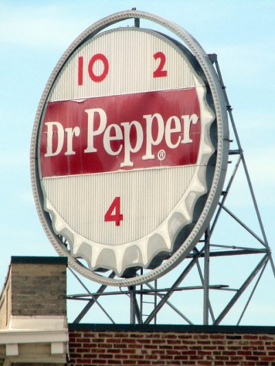
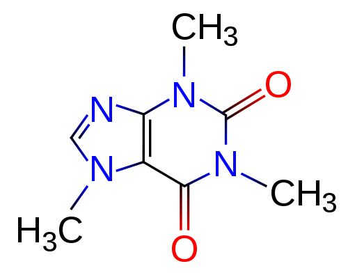

Caffeine is classified as a methylxanthine, along with theobromine and theophylline. Of these three chemicals, caffeine had the greatest stimulant effect on the central nervous system and the skeletal muscles, and the least effect on the cardiovascular system.

The absorption of caffeine is rapid. Its effects take about 30 minutes, which is the time the peak blood levels are reached. Maximal central nervous system effects take about 2 hours and caffeine’s half-life is about 3 hours. (Remember the 10-2 and 4 ads for Dr. Pepper?) It is metabolized almost completely, with only 10% or less being excreted from the body unchanged.

  
*[Dr. Pepper 10-2-4 Vintage Sign](http://www.flickr.com/photos/brent_nashville/5789164343/in/photostream/) sign by Brent Moore*

Caffeine’s stimulant action on the central nervous system is caused by its ability to block the brain’s neuroreceptors for adenosine. Adenosine itself acts as a neuromodulator to produce behavioral sedation in several areas of the brain by inhibiting the release of neurotransmitters. By inhibiting adenosine’s sedative effects, caffeine causes stimulation.

Low doses of about 200 mg of caffeine cause reduced drowsiness and fatigue in most individuals. The stimulant effect on skeletal muscles increases the body’s ability to perform physically exhausting work for longer periods of time. The same dose of 200 mg keeps most people awake longer and causes sleep disturbances.

  
*Caffeine Molecule*

Caffeine’s stimulant qualities caused the National Academy of Sciences’ Institute of Medicine to recommend ways to add caffeine to U.S. soldiers’ rations. Since caffeine might give an athlete an unfair advantage, the U.S. Olympic Committee considers it a “performance enhancer”, and regularly screens athletes for the drug.- from a paper presented at Penn State University by Robert L. Badgett- also published in *Badgett’s Coffee eJournal*, Issue 4, June 16, 2000