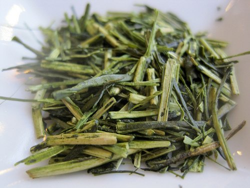

John D. Rockefeller is universally known as one of the best businesspeople of all time and was recently named the wealthiest person of all time. He revolutionized the petroleum business by understanding exactly how much everything costs in his business. He said he could tell you the cost of refining oil down to installing every nail in each barrel. And this was in the late 1800s, long before computers were invented.

If you are in the tea business, you should know how much each serving of tea is costing you. This knowledge can tell you which teas are profitable, which ones are not, and which ones you can sell and still make money with. Before you can determine what each serving costs, you need to figure out what the serving size of each cup of tea is.

  
*Japanese Tea Class – Teacup*

### What is the serving size of tea?

The first thing you need to know is tea is traditionally served in 6oz cups. This is due to the fact people generally sip tea, not guzzle it.

The second thing you have to do is determine the amount of tea to use. If you are using a scale, the recommended amount of tea per teacup is 2.5 grams per 6oz cup. For most people, a heaping teaspoon will equal roughly that.

### How many cups come in a pound of tea?

A pound of tea will make 181 cups of tea. The way we get this is by converting pounds to grams and dividing by the 2.5 grams serving size.

> 1 pound = 453 grams
> 
> 2.5 grams of tea per cup
> 
> Divide 453 (1 lb) by 2.5 (grams per serving) and you have 181.2 cups of tea per pound

**So, how do I figure out how much each cup costs?**

To determine how much each cup of tea costs, you need to do some division. Since we already determined that each pound of tea has 181 cups of tea, what you need to do is divide the total weight of the tea you are buying by 181, for example. If you want to purchase a pound of tea for $30, you would divide $30 (the price of the tea) by 181 (the total cups in a pound) for a total cost per cup. The general equation is:

> (Cost per Pound of Tea) / 181 = Cost Per Cup

### What happens if you buy less than a pound?

If you are buying less than a pound, most American tea companies measure in ounces. Since 1 pound is equal to 16 ounces, you need to divide (181 cups per pound) by 16 to get the total cups per ounce. This equation will tell you that there are 11 cups per ounce of tea. Once you know this, the equation is:

> (Cost of tea) / (Ounces of tea \* 11) = Cost Per Cup
> 
> For example, of you buy 4 ounces of tea at $12, the equation would be $12 / (4\*11) = 27 cents per cup

**This looks like a lot of math. Is there a simpler way of figuring this out?**

There is a much simpler way. Luckily many websites will give you this information. This will prevent you from having to use a calculator just to find out the CPC.

Cost per cup is just one step in understanding the costs of your tea program. Whether it is tea or nails, the more we know about our business, the faster we can grow it. Just ask John D. Rockefeller.
