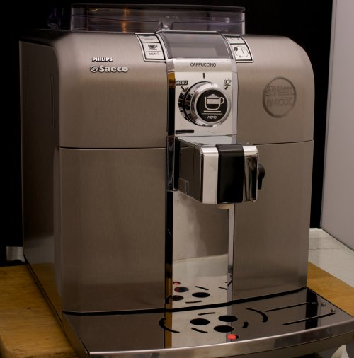
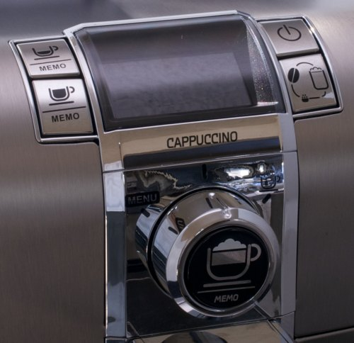
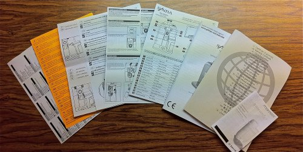
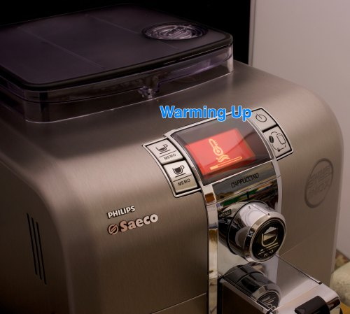
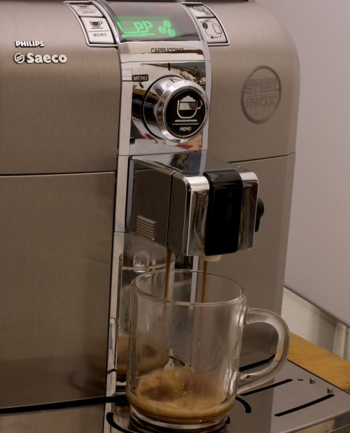
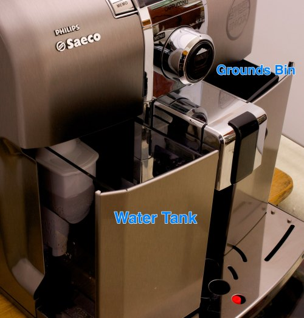
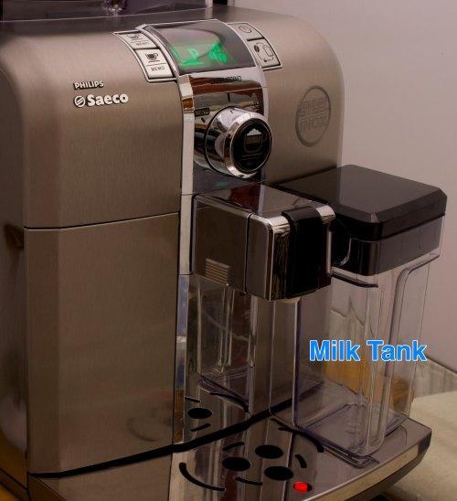
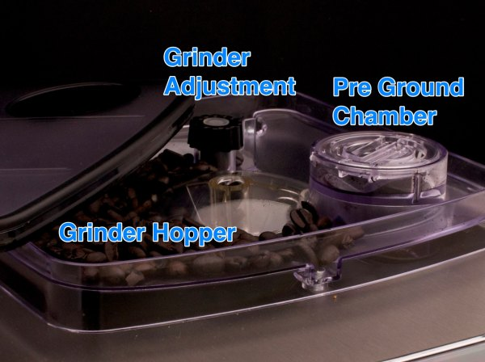
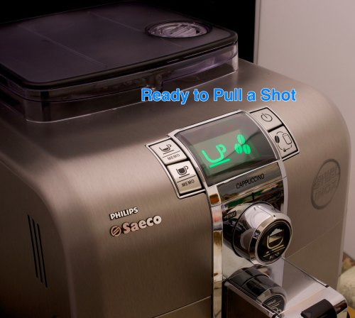
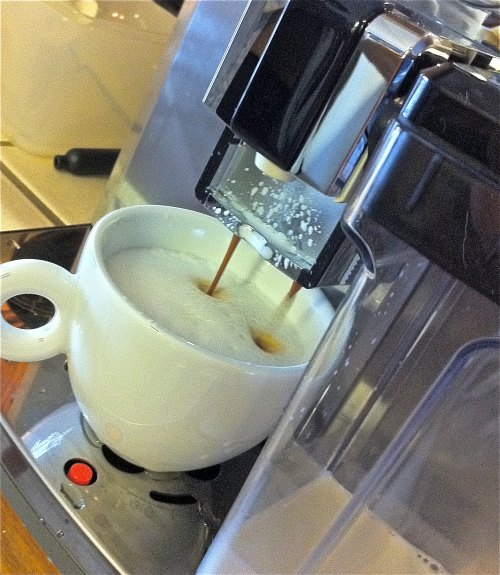

Anyone who has had a great espresso or cappuccino at a local coffee shop, while traveling to Europe, or even from their own semi-auto espresso machine has probably dreamed of a machine that can do all that grinding, tamping, pulling, and steaming on its own.

There are a lot of Super-Auto espresso machines that try to make good on this promise. The Philips Saeco HD8838/47 is one of them. Does it deliver? Read on to find out.

### What’s in the Box?

Philips-Saeco really delivers a complete package. There is of course the main unit and power cord, but also a plethora of paperwork and manuals, coffee scoop, a water filter, a water test strip, and a tube of grease for monthly lubrication of the brew group.

  
_Philips-Saeco_

### Looks & Build Quality

The sides and top are quite handsome, being made of brushed metal. The buttons, knobs, and spout are also a silver color, but are sadly cheap, shiny, chintzy plastic. If these had been made of metal, or even classy matte-black rubberized plastic, it certainly would have enhanced the entire experience. Instead, it ruins the experience the minute you touch them. And it makes the labels on the buttons hard to read. Not good Saeco.

  
_Saeco Controls_

### Instructional Material

  
_Saeco Instructional Material_

As the story goes, Steve Jobs said that none of his computers should require a user manual to use, and most Apple users would probably agree with that, at least to some degree.

I think Philips-Saeco wanted to turn this saying on its head and provide you with no less than 9 different sheets or booklets if you are an English speaker. And the main manual is not intuitive. The sheer number of languages is sort of confusing, since they split them up differently, depending on the item you are looking at. There is some duplication across some of the sheets, some are scaled differently; it is just weird. A single, unified manual would be a much better experience.

### User Interface / User Experience (UI/UX)

  
_Saeco Warming Up_

This is where it starts to get real ugly. To start there is a multi-colored LCD (only one color at a time), that appears at the center of the user experience. Depending on what is happening, the color is Green, Orange, or Red.

Outside the 4 corners of this LCD, there are 4 buttons that have icons on them but also double as “Soft” buttons depending on what is shown on the LCD. 2 of the buttons have the word “Memo” on them. Confusing if you ask me since I am not sure what “Memo” really means…

Below that there is a dial with 3 positions, and has its own button in the center of the dial with an icon of a cappuccino cup and the word “Memo”. Again, not sure what Memo means, and why is it on 3 of the buttons? Also, why would you have totally different button locations for a cappuccino than for espresso?

I tend to use my espresso machines as much for coffee and milk, as I do for the hot water function. No dedicated button for that I am sorry to say. Instead, you perform a combination of presses to get some simple hot water. Too bad.

The UI/UX is just weird, confusing, and unintuitive. Let’s put it this way – this UI is from the school of “How to drive anyone (even a computer geek) crazy”. I pretty much needed the manual for everything. I really cannot imagine a worse UI/UX, though I am sure it exists somewhere. Make no mistake about it, this is a user experience from hell. And I didn’t even believe in hell before using this thing.

### Coffee Quality

  
_Saeco Espresso Pull_

So the UI/UX is bad. What about the quality of the coffee?

You start by filling the water tank and putting some beans in the hopper. One nice touch is that the hopper is very well sealed, so you could keep beans in there for a few days, and in theory, they should stay pretty fresh. The hopper has a cool shaking/vibration action that makes all the beans get down into the throat of the hopper very nicely. Would like to see this on some of the high-end espresso grinders, especially on oily beans that refuse to get down there.

  
_Saeco Water Tank_

  
_Saeco Milk Tank_

  
_Saeco Grinder_

The strength of coffee can be adjusted in a couple of ways. You can adjust the grinder finer or coarser. There is also a Mild, Medium, and Strong setting that can be set in the menu. You can also use the “Strong” button (which uses less water to coffee ratio than the “Long” button). You can also program the ratio of water to coffee to be less or more, and finally, you could use your own pre-ground coffee, in the event the built-in grinder is not grinding to your liking. I started with the defaults, with a “Strong” double.

As soon as the shot is started, it decided to dump some water in the bottom of my cup before a stream of actual coffee came out. Unfortunately, this was not a one-time thing; it does it every time, which is not good. Who wants extra water in their espresso shot?

I am a straight espresso drinker, and I use my current manual espresso machine as a comparison for flavor (an old Pasquini Livia 90). I always use good water and freshly roasted beans, along with a commercial-grade espresso grinder. Of course, the Livia produces a thick, rich crema layer, and wonderful tasting espresso found underneath. How about the Syntia?

  
_Saeco Ready to Pull Espresso_

Initially, the espresso that the Saeco-Philips produced had a very light layer of crema and a very watery-tasting espresso. So I adjusted the strength to the highest setting and, eventually, the built-in grinder to the finest setting. The result was not much better. I then went on to try a couple more things. I was able to reduce the amount of water to coffee ratio per shot. Didn’t help much either. So, lastly, I thought I would try the pre-ground option. I used my commercial-grade espresso grinder, and again, no love.

There is something they call the “Saeco Adapting System”, which they claim adjusts over time to “Optimize Extraction”. Well, I did over a dozen shots, and nothing seemed to change for the better. So the Adapting System seems like more of a gimmick than anything.

In a word, the espresso was underwhelming. Not undrinkable, but certainly not inspiring. I can only surmise that it has something to do with the strength of the pump used, and perhaps the automatic tamper. We know these are some of the keys to really good espresso. I also took a look at the size of the discarded pucks, and they did seem a little too small, and a little too loosely tamped, reinforcing my theory.

### Cappuccino Quality

  
*Saeco* *Cappuccino*

The steps are mostly the same as straight espresso, but you add a little tank with milk on the side.

Before the milk starts to get steamed, again, you get some water in the bottom of the cup. Why!?!?! Stop doing this, I thought. But sadly, they are obsessed with self-cleaning/purging, to the demise of taste in the cup.

The steamed milk and foam were decent, though probably in line with what you can accomplish with a hand frother. Cleanup of the milk container was easy.

The amount of espresso and strength of it was quite light, so I pulled another shot into the cup to bring some coffee flavor to the concoction. In a word, the cappuccino was disappointing. It tasted OK, though I would say certain pod machines that have milk pod options probably taste a little better. At a fraction of the price.

### Other

- There are a few additional things to mention. For one, you can use pre-ground coffee through a special spout on top of the hopper lid. This is great if you already have some pre-ground coffee, or a better grinder you would like to use.
- The unit has a hot water function, which is nice if you want tea or soup.

### Cleanup and Maintenance

- The annoying self-cleaning features, do make cleanup easier.
- There is a tray on the right side that keeps all the spent espresso grounds. It holds a fair amount of coffee grounds and is easy to empty and clean.
- The unit has a descaling mode, which can be performed with Saeco-approved liquid (not included).
- There is a nice door on the side, that allows the user to lubricate the Brew Group, or to remove it and clean it.
- Using the provided scoop along with the insanely small opening for pre-ground coffee results in about half of the coffee on the outside of the machine. Saeco should have made the opening bigger or rigged it with a funnel-like opening, which is larger on top. Also, the coffee doesn’t all go down the chute, so you have to sort of push it down with your finger. Awful.
- With the dispensing spout adjusted down, using the milk steam function causes hot milk to be splattered into an area that is not taken care of by the auto clean, and is a total pain to clean.

### Pros

- Just about everything you need is included, even grease for lubrication of the brew group on a monthly basis.
- Coffee Bean Hopper is sealed very well, meaning you can leave your beans in there, and be sure that no air will get to them. This translates to fresh coffee beans.
- Coffee Bean Hopper has a vibrating action that ensures beans are fed reliably into the hopper throat.

### Cons

- The Water Tray is very small, which means frequent emptying.
- The Water Tank is very small, which means frequent refilling.
- Every time you power on the machine, it decides to spit out a few ounces of water, which could be a problem if the tray is already full.
- Every time you power off the machine, it decides to auto clean and spits out a few ounces of water, which could be a problem if the tray is already full.
- When pulling shots, some water is purged into your cup, meaning a more watered-down espresso.
- When steaming milk, the cleanup is really a pain due to the shape of the delivery spout.

### Conclusion

So how did the Philips Saeco Syntia HD8838/47 fare? Not so good. A bad user experience, with really great espresso, might be a reason to buy. A really good user experience, with sub-par coffee, might be OK for Grandpa. But in this case, Philips Saeco executed poorly on both. Wait for the next model, and perhaps they can fix the current problems.

  
_Saeco Espresso_

**\*Disclosure:** The author of this article was loaned the equipment in this article in exchange for this review.\*
