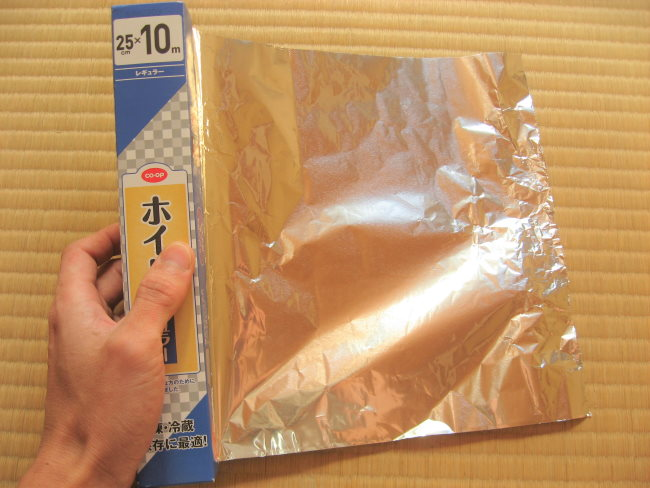
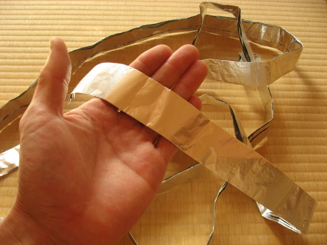
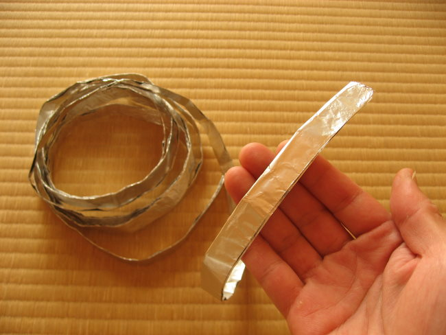
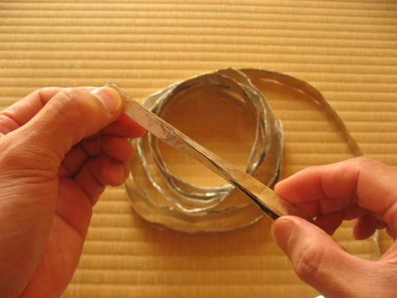
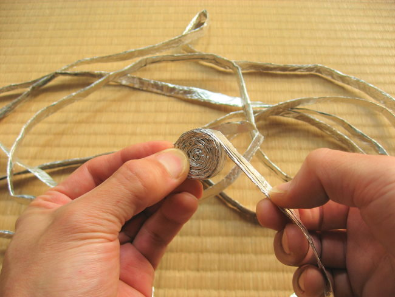
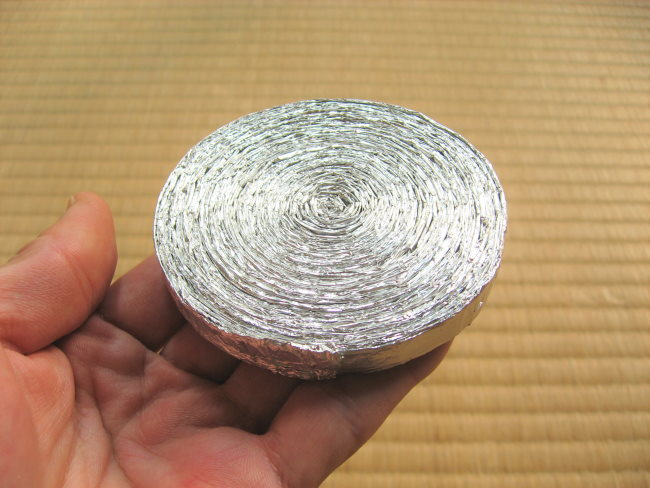
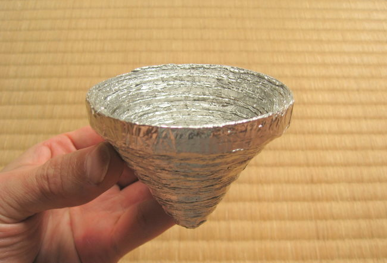
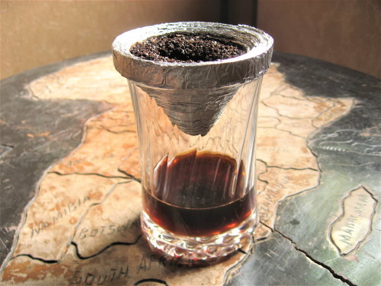
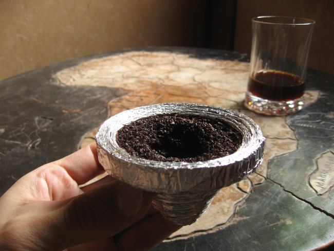

Masaru Nishioka from Japan has created some interesting items on his YouTube channel, but the one that will be the most interesting to us is how he came up with a way to convert aluminum foil into a coffee dripper. Yes, he figured out how to brew coffee with a single sheet of foil. He is going to show us how we can do it as well.

### Checklist

Before we get started, confirm you have everything.

1.  Kettle to heat water
2.  Ground coffee
3.  A mug or glass to collect the coffee
4.  A sheet of aluminum foil

That is it. Let us make some coffee.

### #1 Tear-Off a Sheet of Aluminum Foil

In the photo below, you will see the approximate size of the foil to start with.

### #2 Fold the Foil

Fold the foil (10in x 20ft /11um) five times (10in → approx. 0.45in) and press it to make a smooth surface.  

### #3 Roll the Foil into a Tight Circle

Roll the foil into a circle. When finished, the DIY brewer will be about 3 inches in diameter. Attach the end with food-grade safe superglue.

### #4 Form the Dripper Cone

Press into the rolled foil slowly and gently to create the cone shape. If you press too hard or too far, it will fall apart.

### #5 Make Coffee

Now that the DIY Dripper is finished, we can make some coffee. As you can see from the photo and the video below, the dripper will fit over the glass or mug.

Here you will use the standard brewing instructions common with other pour-over coffee methods such as the [stainless steel pour-over drippers](http://ineedcoffee.com/making-pour-over-coffee/). No paper filters are needed. Start with medium-ground coffee. If the coffee brews too fast and tastes weak, tighten up the grind. If the coffee brews too slowly and becomes over-extracted, use a more coarse grind.

After brewing, you can throw your used coffee grounds into a compost bin. The DIY Dripper can be rinsed and used again, but it should be dried out between uses.

If you decide to make coffee with your brewer in this method, you do so at your own risk. Don’t burn yourself in hot water. You might want to test your brewing out first with cold water to confirm it was folded and rolled correctly.

### Video Tutorial

[*DIY Coffee Dripper (2 minutes)*](https://www.youtube.com/watch?v=vMgpq954-Xg)

### Last Words

Sometimes when we travel or go camping, we need to conserve as much space as possible for our coffee gear. A single sheet of aluminum foil takes up no space. Thank you, Masaru, for sharing your coffee brewer with INeedCoffee.

Masaru is also using the same technique to make an aluminum sake cup with URUSHI (Japanese lacquer), aluminum foil, and an aluminum closure forsake. This technique is called “Kentai” in Japan.

### Resources

[Aluminum Foil](https://en.wikipedia.org/wiki/Aluminium_foil) – Wikipedia page, which covers the thickness measurements of different types of foil.

[Hairbrush](https://www.youtube.com/channel/UCFkuI-o7-bcZK0TTIYc6isg) – The YouTube channel for Masaru Nishioka, which includes many innovative projects.

[Making a Glass from Rice Straw and Rice](https://www.youtube.com/watch?v=2QqRwbvBtBE) – A 3-minute YouTube video by Masaru.

[Coffee Brewing Guide](http://ineedcoffee.com/coffee-brewing-guide/) – A collection of coffee brewing tutorials on INeedCoffee.