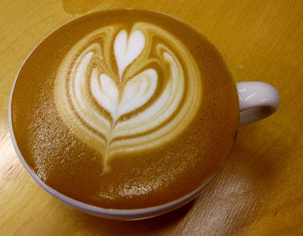

Coffee rarely seems to wind up on lists of aphrodisiac beverages, yet it seems to play a significant role in the love lives of many people. Although there is little written about the subject, it should come as no surprise that a beverage that is incorporated into many a daily ritual can leave its mark on a romance – for better or for worse. In honor of Valentine’s Day, we at INeedCoffee believe it is appropriate to tell four coffee-related tales of romance.

### The Last Refuge for the Faint of Heart

Not that I’ve been looking or anything, but after reading the Washington D.C. alternative weekly City Paper for several years, I began noticing a frequent pattern in the “I Saw You” section of the City Paper personals. Different from the more conventional permutations of Men/Women Seeking Women/Men one usually finds in the classifieds, the “I Saw You” section is the last refuge for the faint of heart, those who never summoned up the nerve to speak to the attractive stranger who smiled at them on the subway or brushed against them on the dance floor. The man taking out the classic “I Saw You” ad (for, indeed, it usually seems to be a man) describes how he still can’t forget the stranger’s beautiful smile, how he’s been kicking himself ever since for not having the nerve to talk to her and extends an invite to coffee. Until this week, though, I’d never subjected my “I Saw You” stereotype to any amount of scientific scrutiny. Instead, I would like to permit you, the reader to judge for yourself after reviewing these three “I Saw You” ads from a recent City Paper:

> Red Line to Farragut North. BW, hoop earrings, brown coat, grey \[sic, this is the U.S.\] slacks reading about “Development.” Are you a teacher? I’ll teach you about music if you teach me about love. Coffee?

> You: Gorgeous, tall, Eastern European girl, maybe Russian. Me: tall Latino in black leather jacket. I was with a friend. Saw you at small gift shop in Dupont Circle. You asked for a price of Matrioshka ($48!). I later saw you at Starbucks. We exchanged glances and a smile. I’d love to meet you for coffee and to discuss the Martioshka and other interesting things.

> 1/25, Don Juan carry out, Mt. Pleasant. We exchanged appalled looks and conversation over a rude customer while waiting for take-out. Me: shortish blonde hair, blue eyes, red scarf, kicking myself for not talking more. You: dark hair, reading a book. Coffee at Dos Gringos? A beer at the Raven?

What is it about the coffee date that appeals to those seeking a second chance for an icebreaker? Lacking Gallup polling technology and handcuffed by the anonymity of the City Paper ads, we at INeedCoffee are forced to rely upon any common sense available to us. A low-stakes, inexpensive rendezvous at Starbucks seems like the safest bet if you’re trying to convince the attractive stranger to give you a second chance. Playing it cool is no longer an option if major eye contact has moved you to take out a personal ad, but there’s little reason to look even more overanxious. Since you’re already asking the stranger to make the leap of faith that you are something better than a future stalker, a coffeehouse seems like a more attractive atmosphere than a bar, as a caffeine rush is less likely to impair somebody’s judgment than a beer buzz. It should be noted, however, that on the coffee-versus-alcohol dilemma, the above Don Juan customer with a crush on the dark-haired bookworm is willing to hedge his or her bets.

  
*Heart Latte Art*

### Starting at Starbucks

In contrast to those who lost their nerve, there are those for whom Cupid’s arrow first struck over coffee. Jack and Diane are two who met in Starbucks, and their common interest in coffee not only brought them together, it has been part of the glue that has bound them as a couple for over a year and a half. It began when Jack made an uncharacteristic trip to Starbucks to make a coffee-related purchase.

“Normally, I don’t even go to Starbucks, but I was there this one time to buy the ultimate grinder,” says Jack. “If I had not been buying the ultimate grinder, I would never have been there, and we probably would not have ever met. We made eye contact in line, and she came up and started talking, and the rest is history.”

The history to which Jack refers consistently involves an appreciation for coffee. While Diane once preferred going out for coffee, Jack roasted his own. It was not long before Diane was sold on the virtues of Jack’s do-it-yourself coffee habits.

“She knows home roasting is pretty important to me,” says Jack. “Now, she is a somewhat avid home roaster, and he always has beans at her place. Recently, she has even taken to spreading the ‘gospel’ at her workplace where she sometimes gives her goods to co-workers who enjoy good coffee and can’t get it at work.”

A chain coffee shop set the stage for Jack and Diane to meet in a way that almost seems fated, and with their mutual fondness for coffee and home roasting, it is safe to say that coffee is a major component of Jack’s and Diane’s relationship.

### A Relationship’s Growth, Not Stunted by Coffee

Cecilia and Alan did not meet at a coffeehouse, but the subject was bound to come up eventually. Alan had a longstanding taste for fine coffee, whereas Cecilia, though fond of coffee in her own right, was more of a tea drinker. As their relationship has developed, Cecilia and Alan have each enhanced the other’s appreciation for their favorite beverages.

“As a part of the initial interview process for the position of girlfriend, Alan asked me what type of coffee I liked,” says Cecilia. “I explained that I liked tea better than coffee and that I was a tea snob. Intrigued, he wanted to know more.”

They met each other more or less halfway, with Alan becoming increasingly fond of tea as Cecilia elevated her coffee tastes and grew ever more dependent on coffee.

“I have grown to need coffee,” says Cecilia. “It was easy for me to move from an appreciation of fine tea to high-quality coffee.”

There is plenty of truth to the cliche that a relationship is an investment, and it did not take Cecilia and Alan long to realize that theirs was a romance worth investing in. Worth noting is the coffeehouse atmosphere and multiple espressos that brought their relationship to the next level. As Cecilia tells the story:

> “Over the course of two espresso-based drinks at a coffee house, Alan began relaying his goals and dreams to me. He had such enthusiasm that it was exhilarating and endearing. I pulled out a dollar bill and wrote on it “Investing in You” in purple marker. I handed the bill to him and said “I don’t have any money to put in the stock market, but I’ll invest in you today. When your ideas make you rich, it will pay off.” He took the bill and said “Marry me and you can have all of my money.” Flabbergasted, I took another sip of latte and smiled inside. To this day, that dollar bill is in his wallet.”

The investment that Alan and Cecilia made in their relationship has had high returns, and they can both feel thankful for the role that coffee has played in its steady growth.

### Bridging the Great Coffee Divide

Unlike the couples profiled above, David and Maria do not drink coffee together. Indeed, their situation is just the opposite: David is a coffee junkie and aficionado, while Maria drinks no coffee at all. With coffee such a cherished and necessary part of David’s life and such a non-factor in Maria’s, does this dissimilarity pose an obstacle to their relationship?

“If coffee is what keeps him happy, I think we can manage,” says Maria with a laugh. “I have faith we can overcome it.”

It’s not as though they haven’t tried to reconcile the gap. But despite an open mind, Maria simply can’t will herself into liking coffee, and it has been a long time since she had a fondness for anything coffee-based.

“I used to love coffee ice cream when I was a kid,” says Maria. “I loved the smell of coffee ice cream, but I don’t recall having it since I was about five years old or so. I just don’t like the taste or the smell of coffee now.”

David, who drinks four or five large cups of coffee a day, is unlikely to give up coffee anytime soon. Maria takes these habits in stride and makes the occasional concession such as a Dunkin’ Donuts pit stop on a road trip where David can get the requisite large coffee to go. When the two recently traveled to Boston’s heavily Italian North End, Maria found that an after-dinner trip to a cafe could be enjoyable for both coffee-drinker and non-coffee-drinker alike.

“I think a cafe can be fun,” Maria says. “I can always get a hot chocolate beverage; I don’t think I’d feel obligated to get coffee.”

### Candy, Flowers… and Coffee?

Coffee and Valentine’s Day may make a much better fit than it would first seem. In all sorts of romantic relationships, coffee seems to have either a central or peripheral role to play. Your valentine may not be willing to forsake more traditional Valentine’s Day customs for a cup of coffee, but if the above scenarios are any indication, the coffee probably won’t hurt your cause on V-Day.
