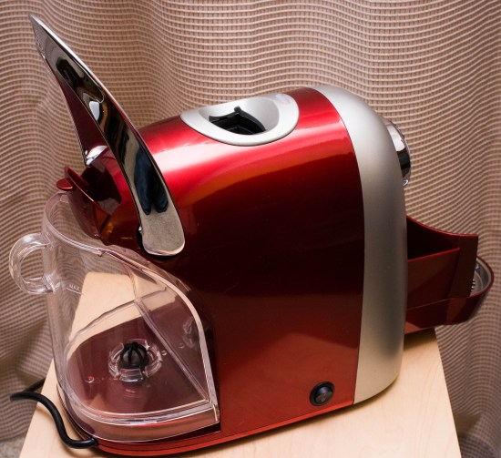
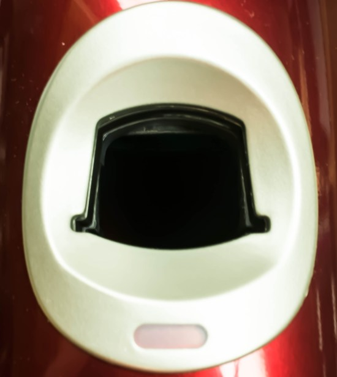

***UPDATE September 2020:** The CBTL Kaldi Single Cup Brewer is no longer available for purchase.*

Coffeemaker manufacturers more and more are promising a quicker, easier, and more delicious “Personalized Hot Beverage”. You have likely heard of Keurig or Tassimo. Maybe even Nespresso. Well, make room for another one. The Coffee Bean & Tea Leaf has decided to join the game with its own proprietary capsule system. They don’t have any marketing name for it, but the capsules are made for them by *Caffitaly*. It looks very much like a cross between a Keurig K-Cup and a Nespresso Capsule. The retail price is $179.99 USD.

They offer not only coffee and tea but also espresso as part of their system. The unit we are looking at is called the Coffee Bean & Tea Leaf Kaldi. Here is their marketing blurb about what they claim sets their capsule system apart from the rest.

> Each capsule contains The Coffee Bean & Tea Leaf hand-selected premium coffees and hand-plucked whole leaf teas grown on the world’s best coffee and tea estates. To lock in these delicate aroma and flavor characteristics, every serving of espresso, coffee and tea is freshness-sealed. And each espresso capsule, coffee capsule and tea capsule features an internal two-filter system to ensure evenly balanced extraction and optimal flavor.

I like Coffee Bean & Tea Leaf coffee and espresso. I hope their claims are true. Let’s find out.

### What’s In the Box?

The kit I received included the CBTL Kaldi machine, a sampler pack of espresso, coffee & tea, as well as a few printed materials.

  
*CBTL Kaldi and Sampler Pack*

### Instructional Material

The printed material is clear, concise, and does not overwhelm. The main user manual has several nice illustrations and is about 20 pages. I was able to get up and running pretty quickly just by reading the Quick Reference Guide (only 2 pages). Good job.

I did have a problem with the initial priming procedure, and the printed troubleshooting info did not provide a solution. However, a call to tech support got it solved within a few minutes.

### Looks and Build Quality

The machine has a small footprint, which is nice. Though mostly plastic, it has a fairly solid feel. Mine was sort of candy apple red, and might be considered stylish by some. They are available in other colors besides red. If the machine were to be made with fewer curves and rounded parts, they could have expanded things like the small water container, small drip tray, and small spent capsule tray without increasing the footprint much.

### User Interface / User Experience (UI/UX)

The machine has a big, heavy feeling lever that you use to engage and disengage the pods, depending on whether you pull or push it. It also serves as part of the factory reset function.

Once the Lever is opened, there is a capsule-shaped opening at the top of the machine. The capsule goes in “sideways”, so it takes some getting used to, but seems to work well enough.

There is a small drip tray that is removable. That is attached to a larger tray that fits into the body of the machine, which is used to capture spent capsules. Both are very small, and you will need to empty them often. Somehow, the way the two fit together is not only weird but also messy. A bad design that also seems to spill water outside of the tray, inside of the machine, and ultimately onto your counter. They clearly never used this themselves. This is a design disaster.

There are three main backlit buttons on the front, each with a different size cup; they call them “Espresso”, “Long Espresso & Tea Latte”, and “Brewed Coffee/Tea”. There is one light on either side, one orange and one red, as well as an audible beeper. The combination of backlit buttons, lights, and sounds will do different things depending on the situation. There is no way to memorize it all; you need to refer to the manual. I am a fan of single LEDs that have different colors (like red, orange, and blue) for different functions or feedback. CBTL chose poorly.

### Espresso Quality

I tried all of the included espresso samplers. The crema was thin to non-existent. The flavor was bitter in some cases and flat in others. It tasted like the coffee was ground too coarse, was too old, or both.

### Coffee Quality

I tried all of the included brewed coffee samplers. The flavor was mostly flat. Below par against a typical Keurig K-Cup machine. Again, tasted like there wasn’t enough coffee, was too old, or both.

### Tea Quality

I tried all 4 of the included tea samplers. The flavor was not bad. I am not a huge tea drinker, but I would say it is a step above a teabag and a step below loose-leaf tea.

### Other

The machine has a pre-infusion cycle for espresso, and while this is a great idea, the reality is that when doing one cup after another, sometimes spits some regular water into your cup first, which is not good. I was also disappointed when I did one cup of coffee, followed by a cup of tea, and the tea got a bunch of leftover coffee grounds in the cup. It seems you need to purge it a few times to clear out the old grounds. Also, the tea itself puts a **lot** of particulate matter of its own into the cup. See Photo.

The water container is about 32 ounces (about 1 liter) if filled to the “Max” line. Though this seems like a lot, it really isn’t in practice, and you will find yourself refilling often. Luckily, the water container can be removed or filled in place.

You can customize the amount of water that comes out for each of the buttons, and easily reset them to defaults.

Although the paperwork doesn’t specifically mention it, you can use any of the buttons as an ad-hoc Hot Water function.

### Pros

-   Coffee, Tea, and Espresso are all available in a single machine.
-   Tea is a step up from tea bags.
-   The power power-saving feature is nice and can be disabled/enabled easily.
-   The descale feature with a reminder is nice and keeps your machine running longer.
-   The cup holder can be adjusted for different cup sizes by turning it over.

### Cons

-   The espresso is underwhelming.
-   Coffee is underwhelming.
-   You must buy proprietary, harder-to-find capsules. Though the price per serving is on par with other systems at about $0.75 per serving, others like Keurig K-Cups can be found anywhere (like your local Costco). Also, variety is limited vs. other systems. K-Cups have dozens and dozens of manufacturers and variations.
-   The water tank is not dishwasher safe.
-   No Hot Chocolate capsules are offered.
-   The drip tray and Capsule tray are a design disaster and make a mess.

### Conclusion

I was excited at the promise of a new coffee system, especially with the mention of espresso (which some other systems do not have). As an espresso fan, I was also excited to read the marketing material, setting them apart by promising the same experience as your local Coffee Bean and Tea Leaf.

Unfortunately, the espresso and coffee are underwhelming at best.

If you want no-fuss, decent espresso, get a Nespresso. It is the closest thing to real espresso in a single-serve machine.

If you want brewed coffee, go with a Keurig. The machines are cheaper, and the quality is just as good, if not better.

If you want a quick way to make tea that is a step up from tea bags, the Coffee Bean & Tea Leaf Kaldi is the machine for you.

### Resources

*CBTL Kaldi S04 Single Cup Brewer (no longer available)*