*Only after an Italian puts their hands on a craft could it gain worldwide fame and be considered an art.*

We coffee lovers might connect this statement to the art of coffee roasting and making espresso, but, quoted from *virtualitalia.com* (site down – MAY 2011), it refers to the ceramic style Majolica (maiolica) that flourished in Italy since the Renaissance.

We will soon meet Fulvio Taccini, a Majolica artist from the Tuscan town of Vinci, who has created a set of Ceramic urns that expresses the deep connection he feels between his craft and coffee.

But first, here is a little background about Majolica.

### Majolica enters Europe through Italy

Majolica, like the “arts” of coffee, is not Italian in origin. Like coffee, it was imported from the Eastern world to become highly developed by the Italians.

Early examples of this type of ceramic are found in archeological sites of Mesopotamia dating from the ninth or tenth century. During the middle ages, traders brought a later version of this pottery to Italy from the port city of Majorca. So, Italians began referring to this tin-glazed earthenware as Majorca or Majolica. Tuscany was a center of this type of ceramics as the clay-rich riverbeds of the Tiber and the Arno drew artisans to the region. When Moors were expelled from Spain, refugee potters set up small factories in Italy near these river banks.

The Italians perfected techniques, developed new glazes and colors, and introduced local themes and designs that literally revolutionized this type of pottery production.

From Italy, Majolica spread throughout Europe, giving us such ceramics as Delftware, and Faience-(named after the Italian town of Faenza)

This pretty much parallels the path coffee took as it also entered Europe through Italy (via Venice). As Italy developed the arts of roasting and brewing it became known as the cradle of coffee culture.

As a family with a long Tuscan tradition, it was natural for the Slitti family, coffee roasters and producers of high-quality chocolates, to turn to Majolica artists Fulvio and Allesandro Taccini with an idea for a project. They wanted to decorate their shop (Slitti Cioccolata e Caffe in the town of Monsummano Terme), with six large Coffee bean dispensers.

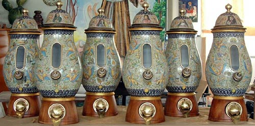  
*Six dispensers are topped with portraits of “Coffee Achievers”.* 

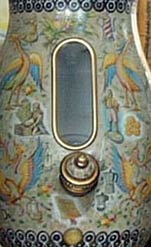

*Detail showing Coffee related images*

These richly painted vases line the wall behind the counter at the Slitti Coffee and Chocolate shop. Beans are dispensed through a hole in the wooden base and, after weighing, extra beans are returned as the dispensing “shovel” fits into a protruding orifice at the bottom of the urn.

Fulvio recalls:

> When asked to produce the coffee dispensers I suggested that in the ceramic design we integrate the topic of coffee itself.

> I knew I would use Raphaelesque decorations as a base. These have been passed down to me by generations of ceramic artists in my family. But I also wanted to tell the story of coffee and its relationship to Slitti and their family craft.

The Slittis wanted to commission six traditionally decorated vases, but Fulvio’s drive to go one step further gave birth to the idea of painting a miniature illustrated history of coffee and coffee culture. That initiative put Fulvio on a journey that lasted for two years!

Fulvio studied the history of coffee from bean to cup and its journey around the world. Like many other Italians, his love of coffee did not mean he was previously occupied with the historical issues behind the cup. He just had a natural fondness for a well-prepared coffee that used well-prepared beans. (Always appreciating the traditional care taken in preparing coffee in Italy, Fulvio was a little embarrassed by the fact that his family brought an automatic pod espresso machine into the studio. On the other hand, he was quite proud of the pasta he carefully prepared that included tomatoes fondly homegrown)

> I started reading the literature and preparing numerous drawings of various coffee machines. I learned about local customs in Ethiopia, about the French love of technological exploration and about the various stages in the evolution of the modern espresso machine in Italy. For the final versions of the vases I finally chose what I thought are the milestones in the story and history of coffee.

Between the traditional Raphaelesque motives of “grotesque” dragons, griffins, and flowing vines. He interlaced images depicting different aspects of the coffee myth and history. These include vignettes such as the discovery of the coffee tree by the goats of the Ethiopian shepherd Khaldi, or the opening of Lloyd’s coffee shop in London that later became the famous insurance company.

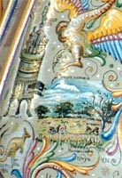 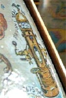 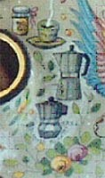 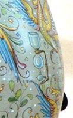  
*(From Left to Right) 1-Kenya Landscape/Coffee server. 2-La Pavoni 1920. 3-Original and Classic Bialetti Moka Pot. 4-Glass Vacuum Brewer.*

Besides the historical scenes, many apparatuses used for preparing coffee are pictured: roasters, grinders, and various brewers. The latter, in particular, are rich in variety, portraying historical brewers such as the Vienna Incomparable, the Balance, the original Moka Express, and the first Gaggia pump-driven Espresso machine.

Countries important to the cultivation and spread of coffee are represented in miniature landscapes, such as a sunset in Jamaica, a steppe in Kenya, and the minarets of Istanbul.

Historically accurate drawings of old-time sea vessels and the “ship of the desert”, the camel, represent the international routes used to move the coffee from lands of origin to your cup.

Each vase is capped with a cover adorned with a portrait of a personality who symbolizes that “coffee is a drink that wakes both body and mind” (Fulvio Taccini):

### 6 Ceramic Portraits

**Voltaire**: who claimed that his 40 cups a day made it able for him to “stay wide awake-to think, think, and think how to combat the tyrants and imbeciles.”

**JS Bach**: who wrote the *Coffee Cantata*.

**Beethoven**: who played at the Berk al Pater coffee house (and who used to religiously count 60 beans per cup).

**Montesquieu**: represents the democratic aspect of coffee and coffee houses where social classes mix.

**Carlo Goldoni**: Italian playwright who wrote a comedy about the *Coffeehouse in Venice* in 1750.

**Napoleon**: frequent coffee house visitor (where he tried his hand at chess).

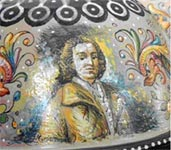 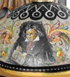 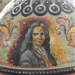  
*(From Left to Right) 1-Goldoni. 2-Beethoven. 3-Voltaire*

The six large vases, each one meter high and 40 cm in diameter, have a stately look sitting on the wall in the coffee shop. While the surface is full of what could have been incongruous materials, I found myself drawn into the detailed tapestry finding image after image. They were more impressive and coherent when viewed in person than when I had previously seen them in photos at the studio.

### Fulvio’s Tells His Story

> On our father’s side, work in ceramic art goes back to the 18th century. But the tradition goes back even farther in my mother’s family.

> Just like coffee, in the field of ceramics, every region in Italy develops its own distinctive style. We Italians remain faithful to our soil, the air, sun and atmosphere of our region. We let these aspects penetrate our daily life and style. You know, each area in Italy prefers different roasts in their coffee and different hues in their ceramics.

> Our family unites all aspects of ceramic work. When we take on a project we cover all phases, working together organically,-combining design, modeling and painting. We are dedicated to detailed and conscientious work. This type of attitude is what has made the crafts of ceramic and coffee develop to such heights in Italy.

> The love of coffee, like the love of everything in life, is in the details, in grasping the unique ingredients and personal commitment that goes into the human endeavor. The common denominator is commitment to tradition and the will to continually improve, at times to innovate.

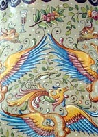 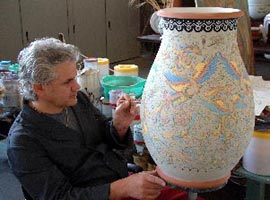 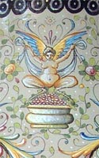  
*(From Left to Right) 1-Traditional design with Coffee branch. 2-Fulvio Taccini painting a vase. 3-The term “Kahve” connects coffee and wine.*

> In our studio, we have learnt the antique techniques of producing ceramics from my late father, Orlando. From there we have gone forth studying new solutions for new works. Every day is new-but every day grows from our history, culture and environment. The air, the water, the oil, wine and country-side makes Tuscany and us, the inhabitants of Tuscany unique. Just like coffee, in our field there has been a slow evolution; constant change and growth as new people confronted the same raw material. In the area of coffee roasting techniques and brewing methods were perfected. At times new methods were invented. In the area of ceramic new designs get added to old, colors and glazing techniques progress on the basis of the old traditions.

> In short, coffee fascinates me: Its history, its aromas and the innumerable ways it can be prepared. A good cup of coffee, like a good ceramic, depends on many factors: good raw material, the quality of water, the method of preparation, the care of the artist and your mood at the time you confront the product.

> I took pleasure as Mr. Slitti became actively involved in the work. He was no longer merely a patron paying for a ceramic piece. He became a partner as we learned together and spoke about our crafts. I consider this work to be extremely personal and a milestone for me but it has also become Slitti’s work as he joined me in the creation. You see, like coffee, ceramics can bring people together.

This article is dedicated to the memory of Orlando Taccini, patriarch of the Taccini Brothers, Alessandro Vittorio, and Fulvio, who passed away on March 5, 2003. One can get a sense of the man and his character when meeting his progeny.

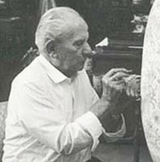  
*Orlando Taccini (1914-2003)*

###  Resources

Slitti Cioccolata e Caffe