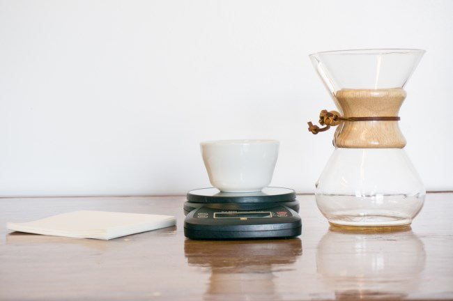
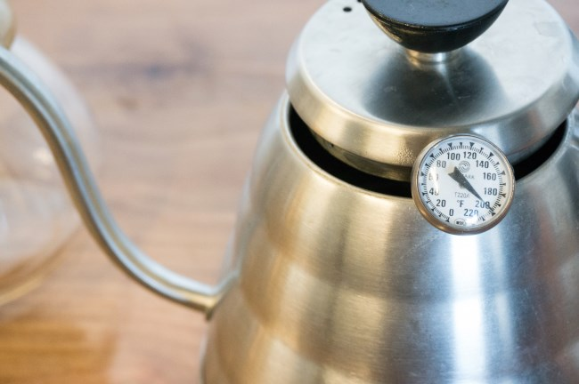
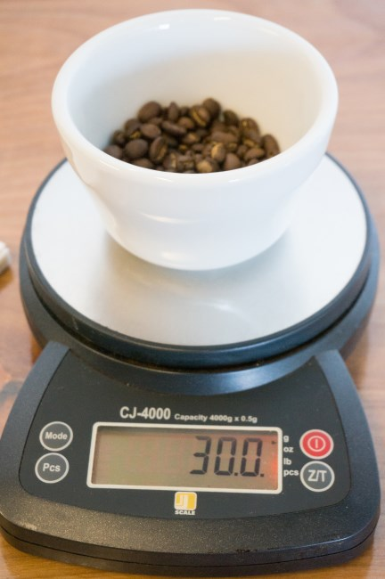
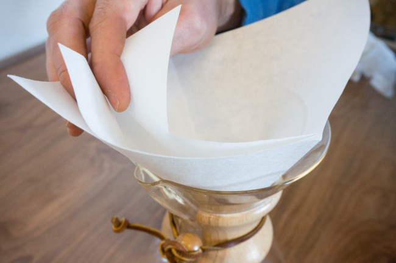
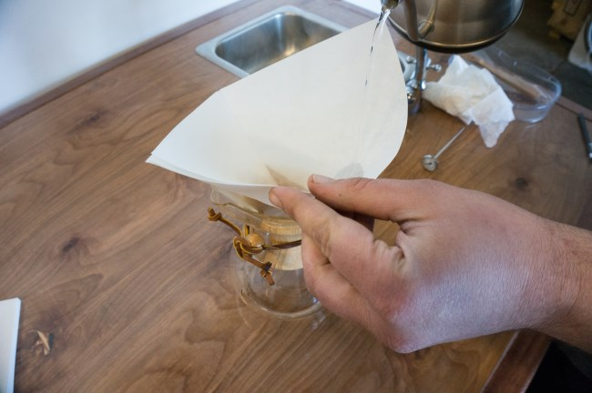
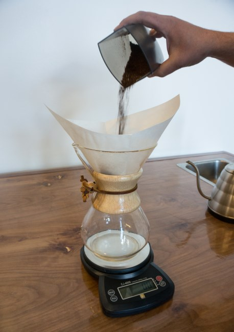
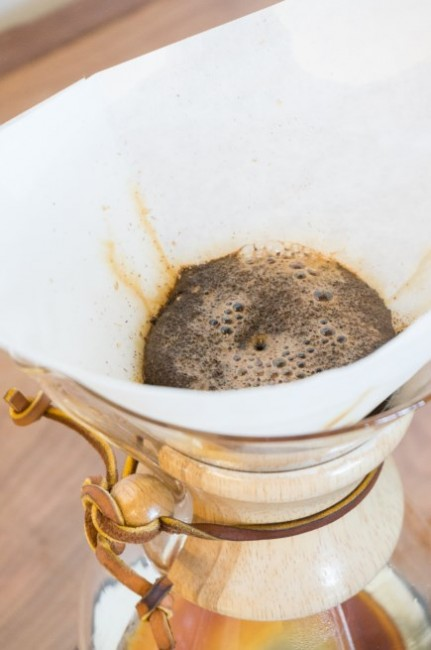
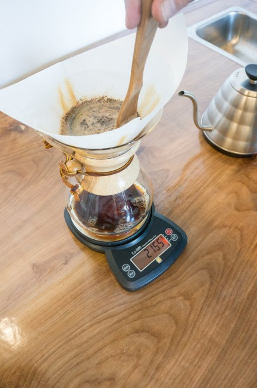
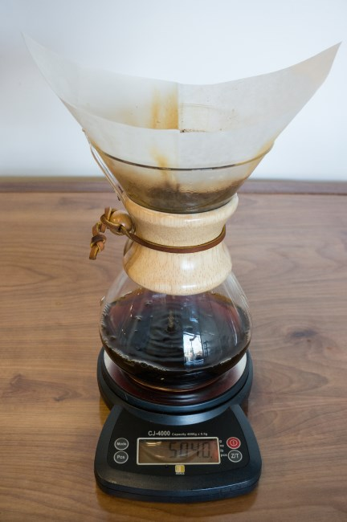
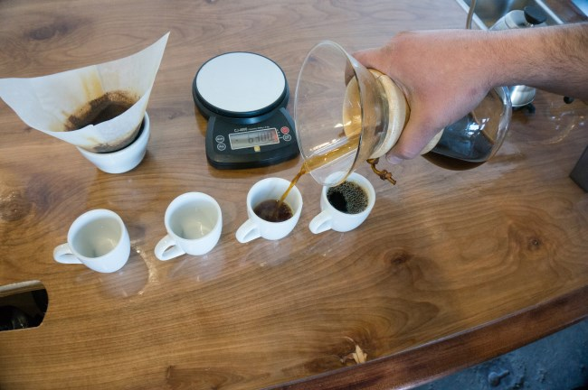

The first time I saw a Chemex was in December 2002. It wasn’t in a coffee shop but in an art museum. The Chemex was part of the *Vital Forms* exhibit at the San Diego Museum of Art. The gallery focused on American Art during the Atomic Age of 1940 through 1960. After the art exhibition, I ordered one and began brewing with it. It has been more than a decade since that visit.

Since the early 2000s, the Chemex has had a resurgence in popularity. You can find the Chemex in many coffee shops. While some use it for decoration, an increasing number are using it as part of their slow brew bar. This is where the customer gets a handmade brewed coffee, much like they already get for espresso-based drinks.

The Chemex brews coffee using the infusion method, which makes it most similar to drip coffee in terms of body and taste. Chemex filters are 20-30% thicker than those used by other pourover methods, such as the [Hario](/how-hard-is-a-hario-pour-over/). The result is a slower brew and a richer cup of coffee. Although not as rich as the French Press, the Chemex does produce a sediment-free cup of coffee that will impress anyone used to the weaker taste of most auto-drip coffee machines.

### Chemex History

American chemist Peter Schlumbohm (1896-1962) invented the Chemex brewer, and the Chemex Corporation released it in 1942. This was when 64% of all household coffee was made using a percolator. Mark Pendergrast, in the book Uncommon Grounds, writes about the popularity of Chemex, saying:

> It never challenged the percolator, except among highbrows and purists.

International Housewares of Pittsfield, MA, manufactures the Chemex brewer and its accessories.

### Grinding and Dosage

For dosage, Chemex advises:

> Using Regular or Automatic Grind coffee only, put one rounded tablespoon of coffee per 5 oz. cup into the filter cone

A regular grind is a bit more coarse than a drip grind. Some online tutorials say to use drip fineness, whereas others say to use French press coarseness. A good starting point is to be in between those points. If the coffee brews too fast and tastes weak, you could grind it a little finer. On the flip side, if the coffee gets “clogged,” coarsen up the grind.

A digital scale will help with dosage consistency. Using a 17 to 1 brewing ratio (17 parts water to one part coffee), a Chemex will have 510 grams of water for every 30 grams of ground coffee. For math, use 500 grams of water. Once you know you have the correct amount of coffee and water, you can focus on perfecting your grind.

### Step by Step Chemex Brewing

*For this tutorial, we will be brewing 18 ounces of coffee. To brew more, use multiplication.*

### #1 Heat Water

You will need the 510 grams of water used for the brew and some extra water to rinse the filter.

### #2 Grind Coffee

Grind 30 grams of coffee. What grind is best? Start with something a little coarser than drip but finer than a French press. See our [Coffee Grind Chart](/coffee-grind-chart/) for visual guidance.

### #3 Insert Filter

Place the square filter inside the Chemex. The side with the three sections should be just over the Chemex lip used for pouring.

Once the water is warm, rinse the filter and discard the water from the rinse. This also serves to pre-heat the carafe.

### #4 Add Coffee

Place the ground coffee inside the filter.

### #5 Pour Water

Once the water reaches a boil, remove it from the heat source and let it cool for 20-30 seconds before pouring.

The initial pour is very important. Instead of pouring all the water onto the grounds as you would with a press pot, only pour enough water to saturate the beans. Chemex states that wetting the grounds allows them to *bloom*. This step is essential to get all the coffee in contact with water. After you wet the grounds, wait 20-40 seconds. During this time trapped carbon dioxide (CO2) escapes from the grounds.

### #6 Stir (optional)

At this point, you can stir the coffee with a wooden spoon.

### #7 Add the Rest of the Water

Continue adding water gradually. Do not fill it to the very top. Always allow at least an inch of room at the top. Stop pouring the water when you’ve reached your desired amount of coffee. Using a digital scale will prevent you from using too much water.

### #8 Serve

Once the water has passed through the filter, remove the filter and serve.

### Post Brew

Like other manual coffee brewing methods, you must keep any extra coffee warm. Besides chugging the remaining coffee quickly, two ideas come to mind. The first is to transfer any extra coffee to a thermal carafe. The other is to get in the habit of brewing only the amount of coffee you plan to drink.

The original version of this article suggested using the wire grid sold by Chemex to place over your stovetop. This probably is not a good idea, as heating coffee post-brew can harm the flavor. Plus, it is not necessary to dedicate a hot burner to keeping coffee warm when an insulated carafe works just fine without affecting the flavor.

### Reusable Filters

In addition to the popular paper filters, you can now purchase reusable filters for the Chemex. The Able Brewing Kone Coffee Filter is a stainless steel insert that you rinse between brews. Some people have a strong preference for paper versus metal filters. I like them both equally. The cleanup is more manageable with paper filters, but with reusable filters, you’ll never wake up to discover you are out of filters.

While putting this article together, I saw that Amazon is also selling a CoffeeSock, a reusable cotton filter for the Chemex. If you don’t mind the clean-up, this might be worth checking out.

### Cleaning

In the book *Uncommon Grounds*, author Mark Pendergrast stated the Chemex was *difficult to clean*. I beg to differ. It’s a piece of glass. Rinse it out with hot, soapy water. Even just hot water without the soap is enough to keep it clean. And if, for some reason, you need extra cleaning, the glass carafe is dishwasher safe. Just be sure to remove the handle. Untie the leather knot, and the handle will fall right off.

Another option for cleaning is to fill the Chemex with ice and add salt. Add some ice and a tablespoon of salt, and spin it. Dump, rinse and you are ready to go for the next brew. Thanks to [Jesse of Conduit Coffee](/meet-the-roaster-interview-with-jesse-nelson-of-conduit-coffee/) for that idea.

### Last Words

So, does the Chemex make good coffee? Absolutely. Many people’s favorite pour-over coffee brewing method is the Chemex, which can be used with an electric kettle and a digital scale.

There are four Chemex models: 3-cup, 6-cup, 8-cup, and 10-cup. The 3-cup one uses a different-sized filter and cannot use the Able Kone.

### Resources

[Chemex Coffee History](https://chemexcoffeemaker.com/pages/about-us) – More on the history of the Chemex from the corporate site.

*This article was first written in January 2003. It was completely rewritten in 2014 and updated in 2017.*

*Brewing photos by Joseph Robertson of Extracted Magazine, a digital coffee magazine published for iOS and Android.  
*
