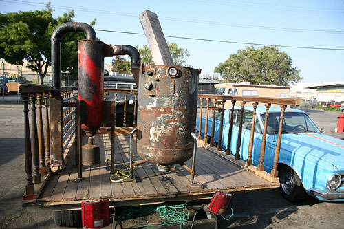

Chicken John Rinaldi may wind up leaving San Francisco soon. Nearly everybody he knows in town is moving out. To paraphrase Chicken John, the billionaires are kicking the millionaires out, turning the once-eclectic city into an unaffordable, corporate, NIMBY suburb.

But Chicken John won’t leave until he’s made his stand. In June, he announced his candidacy for Mayor of San Francisco; he is one of 13 candidates running against incumbent Mayor Gavin Newsom. If Chicken John is fated to leave the town where he has become something of a local legend, he wants San Franciscans to take a good, hard look at his Cafe Racer – a 1975 GMC pickup truck that can run on coffee grounds.

  
*Chicken John Rinaldi For Mayor Poster from Scott Beale of [Laughing Squid](https://laughingsquid.com/)*

This may sound sci-fi and incomprehensible, but Chicken John insists on the opposite. The process that fuels the Cafe Racer is not new – it’s called gasification or woodgas, and during World War II, due to petroleum shortages throughout Europe, nearly a million vehicles on the continent were powered by woodgas.

What’s more, said Chicken John, woodgas is not a difficult concept to grasp, or even to put into action.

“Anyone could do it,” Chicken John said. “You could do it. …This is an unlikely, weird niche thing that I’ve done, and I’m telling you that if you wanted to, you could do this.”

Can you make a fire in a garbage can? Can you operate a cigarette? Then, Chicken John says, you could build a gasifier.

### ‘A Beauty Only A Geek Could Appreciate’

In March 2007, a group of 15 “gasification geeks” converted Chicken John’s truck into the Cafe Racer. Using only material that is readily available at most junkyards, the crew installed a gasifier unit on the truck in just over a weekend. “The finished rig is \[admittedly\] a bit of a carnival of gasification,” said Jim Mason, one of the leaders of the Cafe Racer Crew, on his website on the truck’s conversion. “No attempt was made to have it small, tight, and discrete. On the contrary, the goal was to have all the systems exposed and exploded for easy teaching and \[demonstration\]. It is likely a beauty that only a gasification geek can appreciate.”

  
*Cafe Racer by Scott Beale of [Laughing Squid](https://laughingsquid.com/)*

There are different ways to build and fuel a gasifier, Chicken John said. There’s woodgas, there’s coffee gas, there’s biogas. “You could do it this way or that way. …You don’t have to do it my way; you can come up with your own way,” Chicken John said. “In the end, it’s just the exhaust of a fire.”

There is hydrogen in the exhaust of fire – that’s the constant. The density of hydrogen and gasoline in its gaseous state is similar, Chicken John said. Although we put liquid gasoline into the fuel tanks of our cars, what goes into the combustion chamber of a car is gaseous; hydrogen gas can also fuel the engine at this stage.

“We’re swapping hydrogen gas for gasoline gas. … The vehicle doesn’t know the difference,” Chicken John said. “You’re actually tricking the vehicle into just running. The vehicle doesn’t know that there’s anything funky going on.”

### Biofuel for the Fire

Wood chips can fuel the Cafe Racer, and so can coffee grounds – anything, as long as it has biomass. “The best fuel that we’ve found so far is walnut shells,” Chicken John said. “Those are hard. The harder it is, the better.”

Coffee, Chicken John pointed out, is the second-most highly traded commodity on earth – second, of course, to petroleum. So why on earth shouldn’t somebody develop an efficient way to get a vehicle to run on coffee – for that matter, a byproduct of coffee that is otherwise bound for a landfill?

At the moment, coffee is probably middle-of-the-road on a practicality scale as a woodgas fuel. About 15 pounds of coffee grounds make up one gallon of gasoline-equivalent (gge), Chicken John said. Getting enough of it wasn’t too tough. Chicken John and some other crew members went to Ritual Coffee Roasters to get the grounds. “We use a shovel, and we spread it out on a big tarp and dry it out. That’s it,” Chicken John said.

  
*Cafe Racer Setup by Scott Beale of [Laughing Squid](https://laughingsquid.com/)*

The primary drawback with coffee grounds, said Chicken John, is that they tend to get clumped. While the truck ran fine with coffee in the gasifier, a crew member had to get into the back of the Cafe Racer, stick a shovel into the gasifier and move the grounds around every once in a while, Chicken John said.

“If you want the thing to be just turn-the-key, and you want to be able to operate the entire … thing from the driver’s seat without getting in the back of your truck with shovels and gloves and tools and stuff, then yeah, there’s more research and work that has to be done.”

In all likelihood, that means converting the coffee grounds into pellet form, a project that will take longer than building the gasifier took.

It’s the 80/20 concept, Chicken John said – they’ve gotten 80 percent of the way there easily, and the toughest part will be getting the remaining 20 percent of the way there. The truck already can run on coffee. The challenge now is to make it more practical and convenient than rolling up to a gas station and filling up with fossil fuels at $3 a gallon.

“We did 80 percent of the work in the first two hours. Now it’s going to take five years for the other 20 percent of the work to happen,” Chicken John said. “It’s going to take years to make this perfect. …But, I mean, it works today – like right now, today. You put biomass in it, you light it on fire, and you drive away.”

### ‘Pretty Outrageous’

Chicken John knows that many people can’t wrap their minds around the idea of the Cafe Racer, even as the truck makes the rounds. The Cafe Racer crew took it around San Francisco this summer to collect signatures for Chicken John’s mayoral campaign.

“This is a pretty outrageous statement to make … that your car can run on garbage instead of gasoline. That’s kind of a lot for people to swallow,” Chicken John said. “They didn’t wake up this morning and expect that they were going to get that information.”

That’s what motivated Chicken John to convert his truck in the first place.

“When I found out that no one else knew, I knew I had to build it, just to show everybody,” Chicken John said. “This whole oil company thing, it’s a scam. I mean, they’ve got us so well-trained.”

Not everybody who sees the Cafe Racer is convinced it’s the real deal. “There’s people that don’t believe it – even when they see the truck running, they have a hard time believing that that truck is running on biofuel,” Chicken John said. People sometimes wonder if there’s a hidden hose pumping in gasoline.

For others, the Cafe Racer is a wake-up call, even if it’s only a temporary one.

“People are angry,” Chicken John said. “People are like, ‘Huh, you mean all this time, we could have been solving all these problems?”

Not only can the truck run on junk, but there are hardly any emissions – “certainly no chain of hydrocarbons that stink,” Chicken John said. “It smells like a campfire, really, or food – it’s hard to put your nose on what it smells like,” Chicken John said.

While woodgas has a bit of a cult following, Chicken John doesn’t think that it’s growing much, or that “converts” are coming aboard in any significant numbers.

“People are like, ‘Oh, that’s really neat.’ And then they go back home and watch television,” Chicken John said. “No one’s like, ‘Wow, how can I get involved?’ or ‘Wow, here’s 20 bucks.'”

### Conclusion

“In life, many things that are unlikely are things that we do indeed do,” Chicken John said. “And one of the unlikely things that I’ve done in my life is that I’ve made my car run on wood.”

And coffee, too. It’s a novel thought for most coffee drinkers, that the grounds have potential usefulness even after they’ve been used to brew a beverage. Chicken John is not the inventor of woodgas power, but he’s one of the few Americans to convert his vehicle to operate on it. Just as coffee fuels many human beings, it can fuel a truck as well. That is why, win lose or draw in the San Francisco mayoral race, and wherever he may be living in the years to come, INeedCoffee salutes Chicken John as a coffee achiever.

### Election Results

UPDATE: Chicken John earned 1.75% of the popular vote and did not win the Mayoral election.

[Flickr Gallery for Woodgas Pickup Truck by LaughingSquid](http://www.flickr.com/photos/laughingsquid/sets/72157600218339882/)
