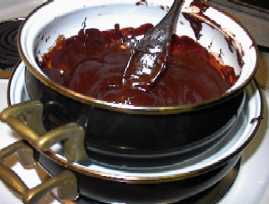

The ultimate accompaniment for espresso and cappuccino is biscotti. This dessert is surprisingly easy to make and it can make a wonderful impression on guests or customers.

### Ingredients for the biscotti (Makes approx. 27 biscotti)

-   1 cup sugar
-   1/2 tsp. baking soda
-   1/2 tsp baking powder
-   1/8 tsp salt
-   2 cups of all-purpose flour
-   1 cup sliced almonds
-   1 egg + 1 egg yolk
-   1 tsp. heavy cream or milk
-   1 shot of espresso
-   1 tsp. vanilla extract

### Ingredients for the ganache (chocolate dip)

-   1 1/2 cups chocolate chips
-   1/4 cup heavy cream or milk

### You’ll need

-   an electric mixer (not a hand mixer)
-   one large cookie sheet
-   wax paper
-   a double boiler (or two pots that will stack safely)

### Step-by-step, with pictures

Pull the shot of espresso. Then put the shot in the freezer for a few minutes so that it cools down. Cover a cookie sheet with wax paper. Measure out the almonds and spread them onto the cookie sheet. Try to keep the almonds in one layer. Put the almonds in a 325-degree oven for 10 minutes, or until golden brown.

### Make the dough

Put the dry ingredients in the mixing bowl (the flour, sugar, baking soda, baking powder, and salt.) In a separate bowl, mix the wet ingredients (chilled espresso, egg, egg yolk, cream, and vanilla.) Stir the wet ingredients briskly. Slowly add the wet ingredients to the dry ingredients while mixing at a low speed.

When the almonds are golden brown, take them out of the oven and let them cool for a few minutes. After removing the almonds, readjust the oven temperature to 350F for the biscotti. Add the almonds to the dough, while continuing to mix on a low speed.

When the almonds are broken into small pieces and are equally distributed through the dough, turn off the mixer and remove the dough. Knead the dough on a lightly floured surface with lightly floured hands for about 5 turns.

Cut the dough in half, then form it into 2 logs about 10 inches long and about 3 inches thick.

### Baking

Put new wax paper on the cookie tray. Place the logs onto the cookie tray, three inches apart. Bake the logs for 35 minutes in a 350-degree oven. The logs should have spread and cracked at the top. Remove the biscotti logs from the oven and let them cool for 10 minutes (until you can comfortably handle them.) Meanwhile, lower the oven temperature to 300 degrees.

Place the biscotti logs on a cutting surface. Cut the biscotti with a serrated knife. The biscotti should be cut on a diagonal about three inches apart.

Put new wax paper on the cookie tray. Place the cut biscotti onto the cookie sheet. Bake the biscotti for 5 minutes in a 300-degree oven. Then turn the biscotti and bake the other side for 5 minutes or until it reaches a light, golden-brown color. When they are done baking, take them out of the oven and let them cool for 5 minutes (until you can comfortably handle them.)

### Prepare the Ganache

While the biscotti are baking for the second round, boil water in the bottom level of the double boiler pot, and bring it to a rolling boil. Add chocolate chips to the top level, then slowly stir in the cream. Stir until the mixture is smooth and thin. Lower the heat and stir occasionally until it is time to use the chocolate.

### Garnish

Dip one side of the biscotti into the chocolate, then place the biscotti on a cooling tray or cookie sheet.

### Conclusion

Not too bad, right? I told you that it was a relatively simple dessert, now go and enjoy your biscotti with coffee, espresso, or a cappuccino.
