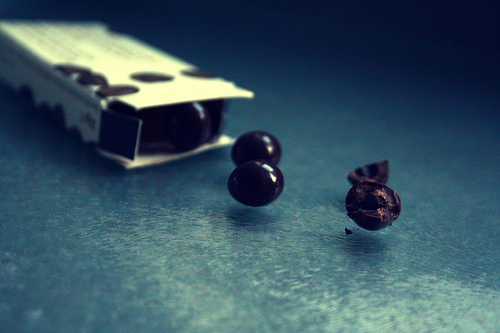

What would be the perfect coffee confection to give to your valentine? Chocolate-covered coffee beans of course. Delectable chocolate on the outside and a crunchy, caffeine-filled, exquisite coffee bean on the inside. Mmmmm. They’re also great for those long road trips, providing some quick energy along the way. What is better than buying a gift for your Valentine? Making something special just for him or her. Here is a quick and easy way to make your own chocolate-covered coffee beans at home.

First, you must choose some freshly roasted coffee beans. A medium to dark roast is great, but a light roast would be too acidic. Then you must choose your chocolate. I am a huge fan of dark chocolate, especially Ghirardelli, but semi-sweet, milk, or even white chocolate would be tasty. You can use chocolate chips, squares, or special dipping chocolate. You might also want to have on hand some powdered sugar or cocoa powder for decoration.

  
*[Photo](http://www.flickr.com/photos/shereen84/2487154213/in/photostream/) by Shereen M*

### Ingredients

-   1/2 cup of chocolate chips
-   1/3 cup of roasted coffee beans

### Directions

#### Step #1 – Melt Chocolate

Melt 1/2 cup chocolate chips in a double boiler over low heat to keep from burning the chocolate. You can also melt it in the microwave, but remember to stir it every 15-30 seconds.

#### Step #2 – Cool and Mix

After it is smooth, turn off the heat and let it cool for a minute, then mix in about 1/3 cup of the roasted coffee beans and stir.

#### Step #3 – Spread the Coffee Beans

With a spoon or fork, lay the coffee beans out on some wax paper on a tray, making sure they are all separated from each other.

#### Step #4 – Chill

Let them cool there, or put them in the freezer to speed things up. If you would like more chocolate on them, or just for looks, drizzle some white or other chocolate over them. Let them cool completely.

#### Step #5 – Finishing Moves

Separate them into a bowl or bag, and then dust them with powdered sugar or cocoa powder if you chose.

### Last Words

Chocolate-covered coffee beans are a quick way to melt your valentine’s heart. Find a cute heart-shaped tin or some lovely red ribbon to tie up a bag and you are well on your way to the perfect gift. Whip up a batch and indulge yourself.

### Resources

[How to Make Chocolate Covered Coffee Beans](http://ineedcoffee.com/how-to-make-chocolate-covered-coffee-beans/) – This recipe uses 3 different types of chocolate.