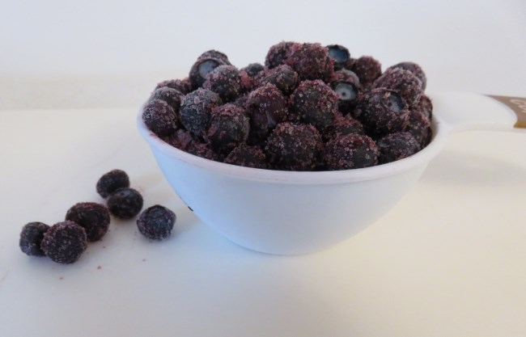
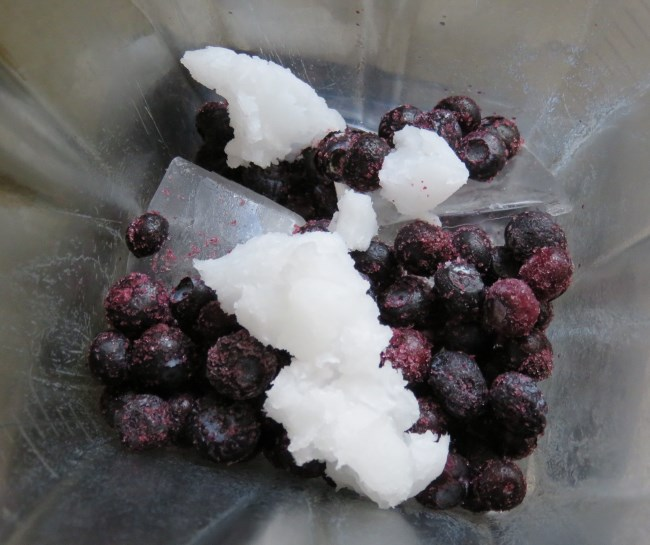
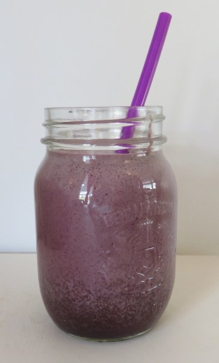

This is a breakfast smoothie recipe that is perfect for us coffee fans.

### Ingredients

-   1-2 cups of brewed coffee
-   3 ice cubes
-   1 cup blueberries
-   1 scoop vanilla or chocolate protein powder
-   1 tbsp organic coconut oil
-   1 tbsp flax powder
-   1 tbsp cocoa powder (more or less depending on how chocolaty one likes it)
-   1 scoop of chocolate greens powder (or original greens)

*Use fresh or frozen blueberries.*

### Directions

I used a countertop blender for this recipe. Add everything into the mason jar and blend for those with an immersion blender.

1.  Combine all dry ingredients in a flexible cup (and set it aside) so that you can add them to the hole in the top of the blender.
2.  Add ice cubes and blueberries to the blender.
3.  Add coffee
4.  Turn on the blender, and after the ice and blueberries are blended, slowly add the powders through the top hole in the blender.
5.  When all is blended, stop and add to a mason jar. Enjoy!

This is a healthy breakfast shake…protein, some carbs from fruit, very healthy fats…oh, and a HIT of caffeine! 🙂

### Resources

[The Coffee Avocado Shake](/the-coffee-avocado-shake/) – Another smoothie-type recipe.
