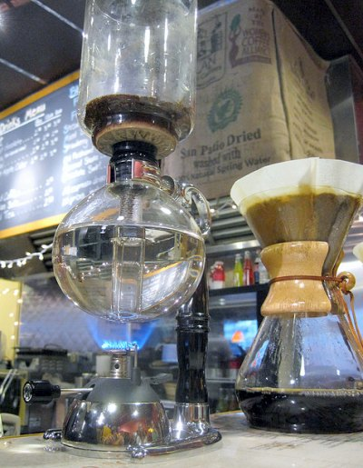
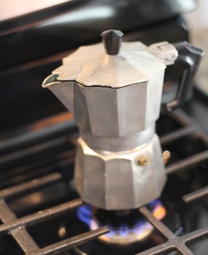

This coffee brewer guide is meant to assist buyers to choose the ideal single cup coffee brewer for individual use. All coffee brewers are capable of making good coffee but not all of them are designed for single cup brewing.

There are several brewing methods since the discovery of coffee, and the method chosen is a matter of personal preference, based on the:

-   Taste and quality of coffee produced using the method
-   Ease of use
-   Ease of cleaning and maintenance
-   Price of the equipment
-   Esthetic value

For now, the most popular method of making coffee is the drip method, where water is poured over the coffee grounds in a filter above the carafe. This method offers convenience, the ability to make many cups at the same time and keep them warm if the carafe comes with a hot plate or warmer.

Next in popularity is the [French press](http://ineedcoffee.com/troubleshooting-french-press-coffee/), where hot water poured over coffee grounds is set to steep for 3 to 5 minutes before the filter is pressed down to separate the grounds from the coffee, depending on the preferred strength of the coffee brewed. As this method uses meshed metal filter instead of a paper filter used in the drip method, it is able to keep the essential oils in the brew, making one of the strongest coffee among the brewing methods, especially when the steeping time is long. Note that most drip brewers today come with a plastic filter to do away with the paper type.

The [vacuum pot](http://ineedcoffee.com/vacuum-pot-brewing/) method of making coffee carries the most esthetic values, attributed to the beautiful design of the brewer and the brewing process which is both entertaining and fascinating. The brewer is made up of two glass “bulbs” placed on top of each other with a rubber seal and filter in the connection. Water is filled in the lower bulb while the coffee grounds are poured into the upper bulb. The setup is then placed over a heat source where heated water will flow upwards to mix with the grounds in the upper bulb until a vacuum is created in the lower bulb. During this time, the mixture will be stirred to maximize the extraction. When the heat source is removed, the vacuum will suck the brewed coffee down into the lower bulk, thus ending the brew. Coffee brewed using this method is usually rich and clean of sediments as compared to the French press method. This is the most commonly used method in cafes and restaurants.

  
*Vac-Pot and Chemex*

The [stove-top Moka brewer](http://ineedcoffee.com/moka-pot-stove/) works similar to the vacuum method except that the coffee grounds are packed in a filter compartment in between the top and bottom metal chambers whereby heated water will force through the grounds via steam pressure for extraction. The brewed coffee will reach the top chamber and pour out through the spout on top. This method is commonly used to make the traditional espresso since extraction is achieved through steam pressure.

  
*Stovetop Espresso Maker*

The Neapolitan flip-drip brewer is quite similar to the Moka method but stops short when the water is boiled. Instead of relying on steam pressure to force extraction, the brewer is flipped upside down and hot water will drip through the coffee grounds and the final coffee is collected in the bottom chamber.

The pour-over method is one of the simplest methods of making coffee. Hot water is poured directly over coffee grounds in a filter slowly to maximize extraction. Though simple, it requires skill in order to make a good cup of coffee.

The last method of brewing, the cold-water method, defies the normal procedure whereby cold water is slowly dripped into a large number of coffee grounds such that the resulting brew takes around 8 to 12 hours to extract. The strength of the brew depends on the dripping rate, grind size of the grounds, and the ground amount to control the rate of the water flowing through the grounds. The [cold water coffee brewer](http://ineedcoffee.com/cold-brew-coffee-with-the-toddy-coffee-maker/) looks similar to the vacuum brewer but no heating is required and the chamber containing the grounds tends to be bigger to accommodate much more grounds than the vacuum method. The coffee brewed in this method is concentrated so it is normally served either in a mixture with water or ice-blended with milk.

The above brewing methods are commonly used in the home environment, while in a commercial setup, coffee is usually brewed in batches using the drip method or if individually brewed, then the vacuum brewer is used for its esthetic appeal and cleaner cup. Except for the espresso brewing method where the machine is differently built for home and commercial requirements, there is really no difference in quality for coffee brewed at home and in cafes using the same method, assuming proper skill or procedure is followed.

Even with the advent of new brewing technology and methods, such as the Clover commercial single-cup brewer for business and the [Aeropress](http://ineedcoffee.com/aeropress-coffee-maker-tutorial/) for a home setup, the basic principle of brewing remains the same, thus it is possible to make a great cup of coffee at home. The difference or the main advantage of the commercial brewer lies in the control, consistency, and repeatability capabilities of the Clover in making consistently good coffee with the same taste profile cup after cup, and this is a major milestone in commercial brewing. And another key differentiator of Clover is its single-cup brewing approach that allows brew-on-demand, just like making espresso.

With the above short explanation of each brewing method, the following table attempts to summarize the pros and cons of these methods in relation to making a single cup, to our best knowledge and unbiased evaluation. Note that the [Turkish brewing method](http://ineedcoffee.com/preparing-a-traditional-turkish-coffee/) using an Ibrik is not mentioned here because it is a rarely used method, except for its Ibrik pots that are more of a collectors’ item among coffee lovers.

Method

Pros

Cons

Drip

– Easy to use & clean  
– Can make multiple cups at one go

– Generally not designed for 1-cup brewing. The water flow rate is constant regardless of the number of cups  
– Water too hot for the grounds  
– Home brewer’s showerhead typically directs water to the center of the grounds, resulting in uneven extraction and wastage. Exception: Technivorm brewer.  
– Cup warmer spoils the flavor instead of keeping coffee warm. Wrong concept.  
– Slow brew leads to a more bitter cup.

French press

– Suitable for 1-cup brewing – Produces a strong cup  
– Easy to use & clean  
– Cheapest brewer & method

– Substantial amount of sediments at bottom of the cup, which adds more body to the coffee. Wrong perception.  
– Coffee cools down faster due to glass-made brewer  
– Long brewing duration leads to more caffeine in the cup

Vacuum

– Most beautiful brewer and brewing method. High esthetic value  
– Clean cup with true flavor

– Difficult to clean. Easy to break the glass parts.  
– Requires skill to make a good cup  
– Expensive

Moka-pot, Neapolitan flip-flop

– High esthetic value with various designs – Stove-top heat source tends to boil the water too fast

– Not easy to make a good cup due to control over the heat transfer rate  
– Water too hot tends to burn the coffee oil, thus affecting the flavor

Pourover, Swiss Gold filter, & equivalents

– Similar concept to drip method except that it is manual  
– Full control over water flow rate and grounds coverage  
– Easier to make a good brew  
– Suitable for 1-cup brewing

– Non-uniform extraction due to relatively long-brewing that cools down the brew along the way  
– Pinch of sediments noticeable in the case of metal or plastic filter. Paper filters do not have this problem.

Aeropress

– Fast extraction with espresso grinds & pump pressure through a micro-filter minimizes caffeine content while maximizing flavors  
– Easiest to clean among all brewers  
– Use of manual pump pressure compensates for the low brewing temperature that does not burn away flavor. Instead more flavors are being extracted.  
– Full control over brewing variables  
– Produces better quality coffee than most methods, & flavor compared to much more expensive commercial brewers such as the Clover.

– No esthetic value due to a more laboratory apparatus looking parts  
– Borrows concept from espresso brewing method but does not produce espresso  
– Full control over brewing variables also leads to inconsistency in brew quality

At the end of the day, appreciating a good cup of coffee does not require a big crowd. Coffee is a personal thing that requires peace of mind and the environment to sieve out the nuances and delicate flavors of the blends and origins. A demitasse or a tasse at most is all that will make your day complete and satisfying.

### Resources

[Buying a French Press – Picking the Right One](http://ineedcoffee.com/buying-a-french-press-picking-the-right-one/) – Guide for purchasing a French Press coffee maker.

[AeroPress Coffee Maker Tutorial](http://ineedcoffee.com/aeropress-coffee-maker-tutorial/) – Penny for penny, one of the best coffee brewing methods available.