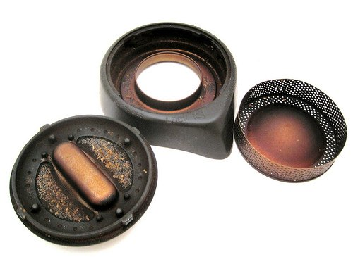
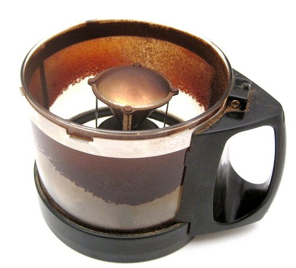
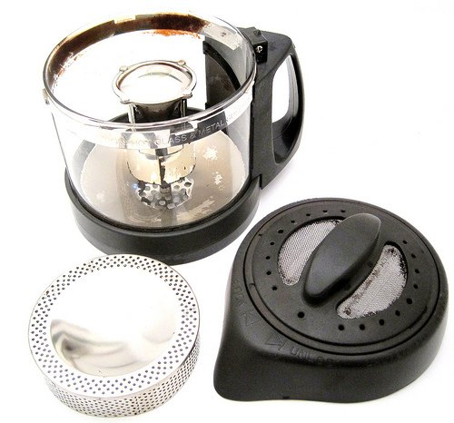

I had delayed cleaning my I-Roast 2 coffee roaster until I noticed about 5% of the beans were still yellow and had not roasted. A seasoned roaster is good, but a home coffee roaster needs to be thoroughly cleaned at a certain point. Although I used an I-Roast 2, the following information applies to the original I-Roast Coffee roaster.

Before we go through the cleaning methods, let me break down the I-Roast 2 into its components. From top to bottom:

1.  Chaff collector lid – the top part
2.  Chaff filter mesh – circular ring under the lid
3.  Chaff collector base – fits on top of the roasting pot
4.  Glass roasting pot – where the beans go
5.  Power base assembly – the guts of the roaster that plugs into the wall

The power base assembly (#5) can be cleaned with a paper towel or wet wipe. Nothing more. **Do NOT soak the power base assembly in water or put it in the dishwasher.** The rest of this article will focus on cleaning the other parts (#1-4).

  
*From left to right: Chaff collector lid (#1), Chaff collector base (#3), Chaff filter mesh (#2)*

  
*The I-Roast 2 glass roasting pot (#4) before the cleaning.*

As you can see from the photos, my coffee roaster was a mess. I ended up using three different cleaning methods to bring back the shine. All three methods are valid. Use one or a combination—whatever works.

### #1 Puro Caff or Espresso Machine Cleaner

I soaked the parts in a bucket of hot water, poured in some Puro Caff, and waited twenty minutes. With a rag, I was able to get them somewhat clean, but not clean enough. It was time to bring out the big gun.

### #2 Oven Cleaner

At this point, I sprayed the parts with an oven cleaner. After letting it sit for 20 minutes, I could remove almost everything. It just needed a tiny bit more cleaning.

### #3 Dishwasher

I placed all the parts on the top rack of the dishwasher and ran a cycle. That was all it needed to regain its “almost new” look.

  
*Almost new! It’s time to start the seasoning process all over.*

Having a roaster that is too clean or too dirty is not ideal. The best results come from the middle ground, where the roaster is seasoned. This is why I waited until I started getting uneven roasts before I did the three-stage cleaning.

### Resources

[I-Roast 2 Coffee Roasting Guide](/roasting-coffee-in-a-popcorn-popper/) – INeedCoffee article by Chris Arnold.
