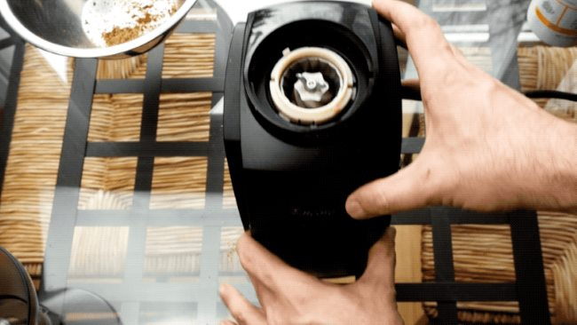
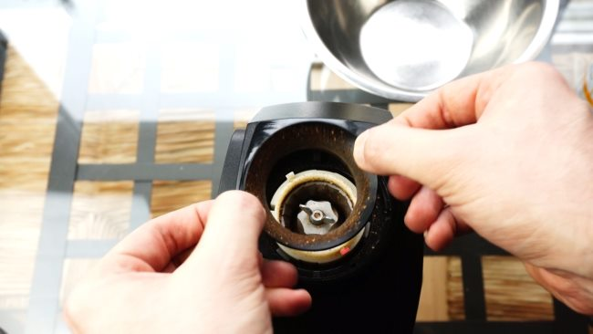
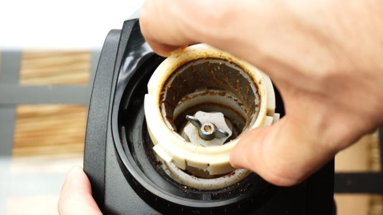
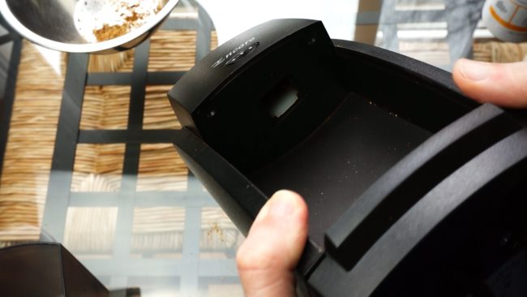
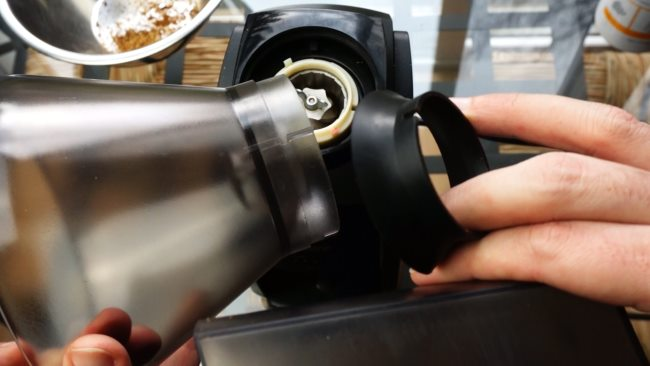
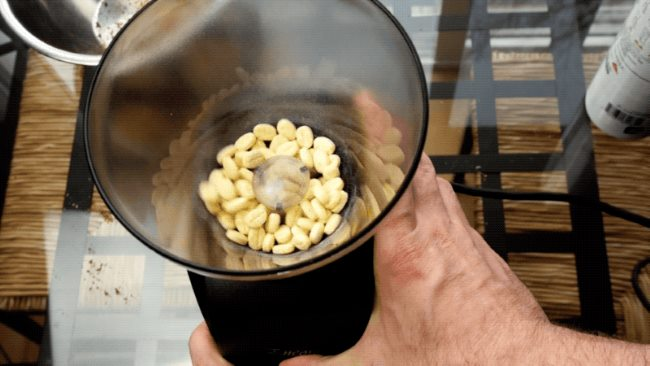
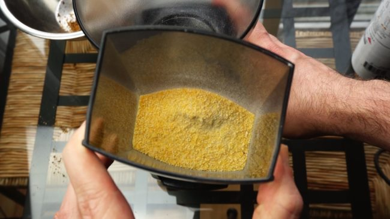

“I have a confession to make. I’ve had my coffee grinder for 10 years…and never once have I cleaned it.” – Someone you might know.

I think the idea of regularly cleaning your coffee grinder – or even any coffee machine equipment – is not something most home brewers consider. It seems alright. You only use it for coffee, right? And you purge the grinder whenever you switch coffees, so that’s fine, right?

You will probably be disgusted, then, to find all of the oils, chaff, and random coffee grounds stuck in places in your grinder that you didn’t even consider. This stuff inevitably builds over time. Whether you think you can’t tell or not is somewhat irrelevant. You’ve got old organic matter caking itself to parts of a machine you think is helping you make the freshest coffee possible.

The good news is that cleaning your coffee grinder can be a relatively simple task. In this guide, I’m going to show you how to do a pretty thorough and regular cleaning of your electric burr coffee grinder, which will only take you 5-10 minutes once you get the hang of it.

We will not be taking apart anything that can’t be very easily put back together with minimal knowledge/skill/experience.

In this guide, I’ll be showing you the steps using an OXO Barista Brain Grinder and a Baratza Encore. Both of these are higher-end ‘entry-level’ electric burr grinders. Most conical burr coffee grinders will be quite similar to these two, so you can follow along.

### You will need

-   Your Grinder
-   Urnex Grindz
-   A somewhat stiff-bristled brush (either a grinder cleaning brush or a toothbrush)
-   A microfiber cloth
-   (Optional) canned compressed air
-   (Optional) shop vac

There are two goals here – remove any loose grounds that are relatively easily accessible and clean off as many built-up oils as possible. We are going to do this without disassembling the grinders past a certain point. We are just going to remove the easily removable parts so we don’t have to worry about disturbing some of the more delicate bits of the grinder.

We finish the whole process using Urnex Grindz, which will completely clean the burrs for us.

### #1 Remove the hopper

Any decent electric burr grinder will allow you to easily remove the hopper. On the Baratza Encore, you turn it all the way to the right (pointing just past the largest number). On the OXO grinder, there is a push-release button on the back.

You can then wash your hopper with soap and water. Be sure to do so, as these easily build up oils. The Encore also has a rubber gasket you can simply lift straight out – this can be washed just with water (or a little bit of soap/water).

### #2 Remove remaining loose pieces

In the case of the OXO grinder, the bin that catches the coffee grounds and the metal plate it sits on (if you have the built-in scale version) both sit loosely. For cleaning, you will want to remove those and set them aside, or they’ll fly everywhere.

With the Encore, remove the grounds bin and set it aside. You’ll also need to remove the rubber gasket on top of the outer burr.

### #3 Remove the outer burr

In the case of the OXO and the Baratza, the outer burr is easily removable. With the Baratza, simply lift the burr straight out. With the OXO, you need to use the metal handle and give it a little turn counter-clockwise until you hear and feel a click, then you can lift it out.

### #4 Clean the outer burr

For this step, it’s helpful to have a brush. You can do this simply with a cheap toothbrush, but you might get yourself an actual grinder cleaning brush as they often have extra parts that aid with accessibility.  
Your outer burr probably has some area with caked coffee grounds. This is just a part of the grinder where coffee dust and oils have collected and is one of the primary reasons we take apart the grinder like this to clean.

Just brush these areas down, and you will be good to go.

Do NOT use water with the burr. It’s unnecessary and can lead to water damage pretty easily.

### #5 Clean the inside of the grinder

This part gets progressively more possible with the more tools you have at your disposal. You can start simply by using a brush to knock loose any grounds that are floating around, and then shake as much out as you can.

Before turning your grinder upside down, make sure you’ve removed any loose-fitting parts that might fall out – if you are following along with the Baratza Encore or the OXO grinder, you’ve done that at this point.

Canned air can be really helpful in getting loose coffee grounds and chaff out of otherwise impossible-to-reach places. Another tool you can use in this case is a shop vac, which will do quick work in completely removing all of the loose stuff from the inside of your grinder.

If you don’t have a shop vac, you’ll get most of the way there with these steps.

### #6 Clean the coffee grounds output area

I would like to give the coffee grounds an output chute and area that is a bit clean as well. The final step is going to involve running Grindz through the grinder, which will aid in cleaning out coffee oils and any remaining grounds/chaff from the burrs and output chute, but since we’re here the extra steps in cleaning can’t hurt.

In the case of the OXO, it tends to hold on to a surprising amount of grounds and chaff. I find it necessary to knock the side of the grinder a few times, trying to dump as many grounds as possible out of the grinding chamber. You’ll also notice chaff tends to stick to the outside due to static. Wiping down the outside of the OXO with a cloth is the last step, and it is easy.

The Encore does not hold on to many grounds – there’s a much shorter and more direct distance from the grinder burrs into the bin. But you can easily collect loose grounds and chaff in the bin area, which can be annoying to clean up. This is where canned air or a shop vac makes the process super easy. If you don’t have those, try to brush loose as much as possible, and wipe down with a microfiber cloth the rest of the outside.

### #7 Clean the coffee grounds bin

The bin which collects the coffee grounds during the grinding process is something you can clean on a regular basis with simple soap and water.

In the case of the OXO, it’s simply a cup that sits below the output. Take off the top and wash both with soap/water.

The Encore’s bin is simple and you can wash it with soap/water. There will be oil buildup on the bin walls in both cases, so I find a little bit of soap necessary to completely clean.

### #8 Put everything back together

If you washed your hopper/gasket/bin with water, make sure 100% that these are dry. You do not want to introduce moisture to the interior of your grinder.

To put it back together, simply reverse the initial steps.

The most critical part of putting this all back together is the outer burr. In the case of both these grinders (and any grinder you use), there’s going to be one spot where the outer burr sits.

The Encore’s outer burr will slot right into the grinder with no force – but in one specific spot. You should gently try to rotate the burr after fitting it in place. There should be minimal movement from side to side. If the burr easily rotates around, then you either haven’t found the spot to put it in, or some of the tabs on the plastic casing may be broken. In my Encore, one tab has a red marking which I use to guide where the burr should be placed (that red marker is always in one spot).

The OXO works slightly differently, as you need to turn and click the burr back into place. Again, it only fits in one way, so if you aren’t able to get it to click into place, then it’s not sitting quite right for you.

After the burr is in place, you need to add back the hopper. In the case of the Encore, place the rubber gasket back first (again, this only fits in one way – the notches on the rubber gasket will line up with ridges on the outer burr).

### #9 Run Grindz through your grinder

The last step is to simply run Grindz through your grinder. This will completely clean the burrs and pull out any remaining coffee grounds, chaff, and oils that are lingering.

Grindz is made up of cereals and wood – it’s 100% food-safe, so you could even eat it if you wanted to. It’s designed to soak up the coffee oils in the grinder.

For these simple home grinders, one capful or about 35-40g of the Grindz will be sufficient. Run it through like you would any coffee (I just set my burrs in the middle grinds setting, at 20 on the Encore and 15 on the OXO).

Once you run through it, dump the Grindz into the trash.

### #10 Prep to Brew (Optional)

You’ll notice after running Grindz through that white dust remains. This is normal and not something you need to be concerned about – it’s 100% food safe so any possible incidental ingestion isn’t going to affect you.

If you have a concern over its effect on the coffee’s taste, you can run a small batch of coffee through before brewing to purge any remaining Grindz. You can also give the hopper and bin a quick wipe.

Once you get the hang of the above, a quick cleaning can be done in 10 minutes (minus drying time if you wash the removable components). I recommend doing a quick cleaning like this once a month or at the very least once every 3 months, depending on how often you use your grinder.

### Video Tutorials

Check out these two videos by Coffee Lovers TV for comprehensive video guides on cleaning the OXO and Baratza grinders.

*[How To Clean Your Coffee Grinder – Featuring the Oxo Barista Brain Grinder](https://youtu.be/1PacdCirO_Y) – Coffee Lovers TV*

*[Cleaning Your Coffee Grinder – Part 2 – The Baratza Encore](https://youtu.be/aD1etnljg6Y) – Coffee Lovers TV*
