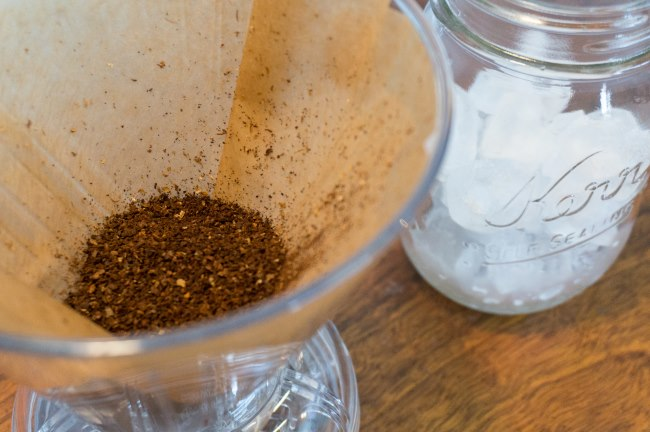
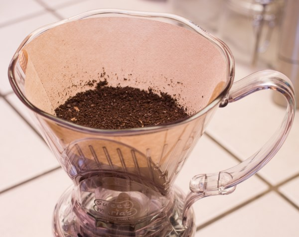

We have several tutorials on INeedCoffee that walk through the steps for making cold brew coffee. But until now, we haven’t written a guide for making iced coffee. The terms cold brew coffee and iced coffee sometimes become interchangeable, but they do have different meanings. And they taste different, too.

### Cold Brew vs Iced Coffee

Cold Brew is coffee brewed at room or cold temperatures for several hours. The most common brew times are between 12 and 24 hours, but you can brew longer. The grounds tend to be coarser. The resulting coffee brew is often a concentrate, which is later cut with water to bring it back to an ideal strength. Fans of cold brew like the low acidity and smooth body. It also tends to be high in caffeine because the brewing period is so long.

Iced coffee, also called Japanese iced coffee, is made by brewing coffee directly over ice. This instantly chills the coffee, while preserving the flavor. To avoid having watery coffee, the amount of water used when brewing is split between the hot water and the ice. Many coffee aficionados prefer iced coffee to cold brew as it tastes like a chilled, refreshing version of that hot coffee. Whatever acidity level or flavor notes the hot version has will remain. And if you get the water ratio right, it won’t taste weak.

Another advantage iced coffee has over cold brew is that it is much faster to make.

### Why Use the Clever Coffee Dripper?

You could brew iced coffee in a number of ways, but the Clever is an ideal choice. It has a paper filter, which results in a cleaner finish. The Clever is also a full immersion brewing method. This means the coffee remains in contact with the water for the majority of the brew cycle. This will allow us to control the brewing time better than we could with a pour-over method, resulting in a richer coffee.

Another excellent choice would be the [AeroPress](/upside-aeropress-coffee-brewing-tutorial/).

### The Math of Iced Coffee

The math of iced coffee is the same as that of hot coffee, with one exception. The water weight we normally use for hot coffee is divided between hot water and ice. When finished, the goal is not to have a jar full of coffee and ice cubes but to just use enough ice to cool the coffee. We can always add more ice later. Our goal is to mimic the taste of hot coffee but chilled.

I experimented with several water to ice ratios and varying brew times. Here is the iced coffee recipe that tasted best:

-   20 grams of medium or medium-fine ground coffee (see the [Coffee Grind Chart](/coffee-grind-chart/))
-   180 grams of hot water
-   120 grams of ice cubes
-   3-4 minute brew time

Use a slightly finer grind than you would for the hot version because you are brewing with less water. This recipe uses a 15-1 ratio. 15 parts water to 1 part coffee. Adjust the ratio to your taste.

For this tutorial, we will combine several steps that we broke down in detail in the article [Step By Step Bonavita Immersion Coffee Dripper](/step-step-bonavita-immersion-coffee-dripper-tutorial/), which operates similarly to the Clever Dripper.

### #1 Prepare the Coffee

Place a #4 coffee filter inside the Clever. Rinse the filter. Add 20 grams of medium or medium-fine ground coffee.

### #2 Prepare the Ice

Weigh out 120 grams of ice cubes and place them in a jar or mug.

### #3 Add Hot Water

Add 180 grams of hot water slowly into the Clever Dripper. After a minute, you can stir slowly if you want. Aim for a total brew time of 3 to 4 minutes.

### #4 Release Coffee into Mug

Place the Clever Dripper over your jar or mug with the ice. The lid will trigger the release of coffee onto the ice, and the coffee should melt most of the ice.

### 

### #5 Serve and Maybe Add More Ice

Take a sip. The coffee should taste as rich as the hot version. You can add more ice now to chill the coffee more. I usually do. It is that simple.

### Troubleshooting

If you use too little ice and your coffee is still warm and all the cubes are melted, don’t add more ice yet. The coffee might start out tasting fine, but as the ice melts, the coffee will taste progressively weaker and more watery. If you’ve brewed a cup with too little ice, place the coffee in the refrigerator to cool.

### Conclusion

Making an iced coffee at home is very simple. Find your ideal brew strength ratio. Divide the brewing water into water and ice cubes. Grind a little finer. Then brew directly onto the ice. The flash cooling will preserve and often highlight the same flavors you enjoy when the beverage is hot.

### References

[Step by Step Bonavita Immersion Coffee Dripper Tutorial](/step-step-bonavita-immersion-coffee-dripper-tutorial/) – INeedCoffee brewing tutorial.

[Clever Coffee Dripper Review](/clever-coffee-dripper-review/) – INeedCoffee article.

Title photo by [Raphael Rychetsky](https://unsplash.com/@raphaelfyi).

*Brewing photos by Joseph Robertson of Extracted Magazine, a digital coffee magazine published for iOS and Android.  
*
