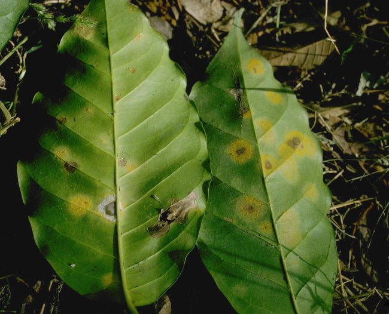
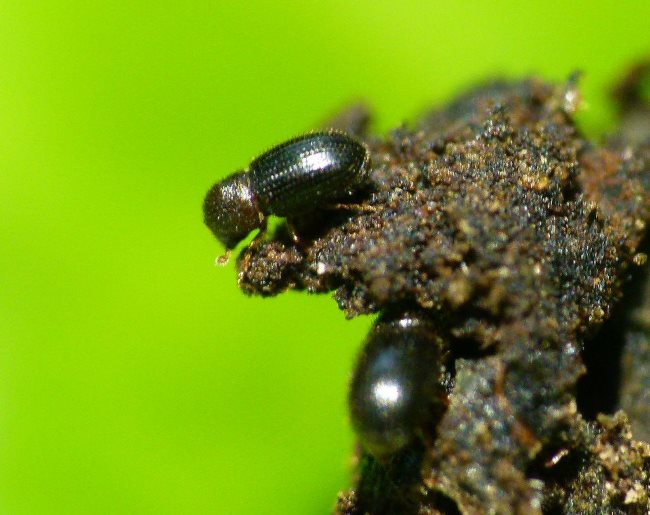
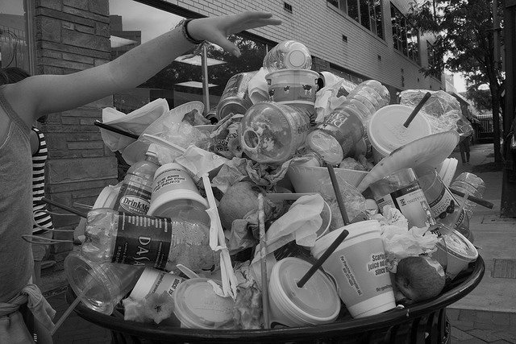

Extreme weather patterns caused by climate change are having a dramatic affect on coffee production throughout the world. Rising temperatures, increased rainfall and the proliferation of pests have all played their part in destroying coffee plantations in almost every coffee-producing nation across the globe.

For many of us living in the western world, the tangible impact of lower coffee yields will be nothing more than an increase in the price of our morning coffee and a potential reduction in the quality of our coffee. Not ideal, but hardly a life changing event that will fundamentally alter the manner in which we live our lives. The 25 million households who rely on the coffee crop to feed their families will not been as fortunate.

A recent report by Oxfam suggests that climate change and its influence on coffee production could be setting the fight against world hunger back by decades. There is news of malnutrition in parts of Nicaragua, with many families struggling to find enough money to pay for food. In a country where a third of the working population relies on a productive coffee harvest, the effects of climate change are being felt now. With so many reports and estimations on the impact of rising CO2 emissions by the year 2050, we can sometimes forget that the impact is already here.

Climate change is particularly problematic for the coffee industry as the plants are susceptible to relatively small environmental changes. Originating from Ethiopia, the plants prefer to grow in the tropical and sub-tropical regions between the tropic of Cancer and Capricorn. For many of the developing countries located within this Goldilocks zone, namely Rwanda, Honduras, Guatemala, Ethiopia and Peru, climatic changes and unpredictable weather has had a devastating effect.

### How Climate Change Affects Coffee Plantations

#### *Loss of habitat*

The two main types of coffee used throughout the world are the Arabica bean and Robusta variety. Arabica is generally considered to be of higher quality, with Robusta used in many instant coffees. Unfortunately the Arabica plant is less resilient that Robusta, and according to research conducted by Kew Gardens in the UK, could be extinct by the year 2080 if climate change continues at its current rate.

A temperature rise of only 3 degrees will see two thirds of the current coffee plantations in Brazil become unsuitable for growing coffee. With an expected global increase of anywhere between two and four degrees over the next hundred years, changes need to occur to reverse this trend.

Educational initiatives have been set up to help teach local farmers more efficient farming and production techniques. Planting new trees, soil management and farming techniques that minimise deforestation, all contribute towards ensuring the coffee plant has the best environment possible for its growth and development.

Further collaboration between the coffee-drinking nations of the world and the coffee-producing countries will be required to further minimize the inequality of climate change. Inequality, where the people producing the least CO2, are affected the most.

#### *Coffee Rust*

Coffee Rust (La Roya) is a fungal parasite and first became a problem as late back as 1870. At the time, Ceylon (now Sri Lanka) was exporting 100 million pounds of coffee a year. In less than 20 years, Coffee Rust had reduced this figure to a mere 5 million pounds of coffee a year. Production had essentially stopped. Quarantine of the fungus was enforced, and for almost a hundred years, it appeared to have worked. In 1970, the fungus was found in Brazil, and since then, it has spread to almost every coffee-growing nation in the world.

In 2012, Colombia lost almost 50% of its coffee yield due to La Roya. The increased rainfall provided more favourable conditions for the fungus, allowing it to spread throughout the plantations. The disease covers the leaves of the plant, reducing photosynthesis and ultimately killing the plants.

Up until 3 years ago the disease wasn’t a major concern in Nicaragua. Since then the warmer conditions have allowed La Roya to multiply, destroying so much of the crop that estimates predict that by 2050, 80% of the coffee harvest will be lost. Where the coffee industry accounted for 20% of the countries GDP, now many workers and farmers have resorted to picking fallen beans from the ground in an attempt to earn enough money for a meal.

*Coffee rust – Source: Howard F. Schwartz, Colorado State University, Bugwood.org*

#### *Berry Borer Beetle*

As if local farmers didn’t have enough to deal with, the Berry Borer Beetle is compounding the problem by laying their eggs in the coffee berries that either, destroy the coffee bean, or lowers the value and quality of coffee produced.

Until the 1980s, the pest was exposed to a few small pockets throughout the world, but with the increase in temperature, the beetle has spread at a remarkable rate. Scientists have found that the beetle can’t reproduce at temperatures below 68 degrees. Historically, the mountainsides, with their rich volcanic soil, were too cool for the Berry Borer Beetle. As temperatures have risen, the pest has spread up the mountainside, causing widespread devastation to coffee yields.

Without the economic resources to support communities, educate farmers, take out crop insurance, and adapt to new farming technologies, climate change is a problem that needs a collaborative approach. Governments, farmers, consumers, and companies all have a responsibility to ensure that we’re doing all we can to try and minimise and hopefully reverse its impact.

*[Coffee borer beetle](https://en.wikipedia.org/wiki/Coffee_borer_beetle) by L. Shyamal*

### What can we do?

While the topic of climate change is diverse and complex, there are simple things we, as consumers, can do to help. In the US, 25 billion disposable cups of coffee are thrown away every year, and in the UK, it’s 2.5 billion. The cups with their polymer lining will never degrade and all form part of an extensive manufacturing process responsible for the production of CO2. Simple gestures that can actually save us money (many coffee shops offer a discount to people who use reusable cups) all contribute towards the global effort of reducing CO2 emissions and their impact on the environment.

*[Trash Mountain](https://flic.kr/p/3ikBKy) by woodleywonderworks*

If you’re the owner of a coffee shop then it may be worthwhile investigating how your used coffee grounds can be recycled. One company in the UK, Bio-Bean, is taking the leftover coffee waste and using it to create bio-fuel. The more we can recycle leftover materials the better it will be for the environment.

Another intriguing solution to the problem is looking at how DNA research is being used to uncover the genetic diversity of the coffee plant. After four years of research, the University of Buffalo has succeeded in sequencing the DNA of the coffee bean that could be used to breed more disease-resistant variations of the plant.

What scientists have shown is that if we all do nothing, then orange juice may be the drink of choice for many of us in the morning.

### Resources

[How will climate change affect what we eat?](https://www.oxfamamerica.org/explore/stories/how-will-climate-change-affect-what-we-eat/) – Report by Oxfam

[EcoFriendlyCoffee.org](https://ecofriendlycoffee.org/) – INeedCoffee’s sister site focuses on the environmental side of coffee.
