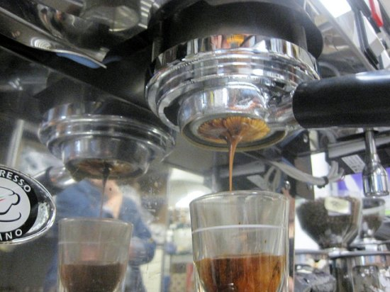
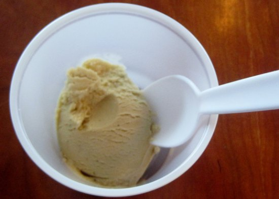

Coconut milk is one of the best substitutes for dairy when you need something with enough fat to do the job of cream. I have been eating coconut milk-based ice cream for several years now and find that it does satisfy when I need that ice cream fix without any dairy. It is a good base for many flavors, especially coffee.

In my neck of the woods, this brilliant idea is no secret: a few grocery stores in my area sell coconut milk ice cream, and a local ice cream parlor, Full Tilt, always carries a few flavors. I have the fortune of having my own ice cream maker, so I like to make my own so I can use the sweeteners I like best and experiment with my own flavors.

Here is a recipe for coconut milk coffee ice cream. I find that espresso’s intense flavor is best, but you could also make about 2oz of concentrated drip coffee or use instant granules. Adding a sweetener in syrup form will help this not freeze up quite so hard in the freezer the next day. This recipe makes ~4 half-cup servings.

  
*Use espresso or concentrated drip coffee for the ice cream.*

### What You Need

-   1 15oz can of coconut milk
-   1/3-1/2 cup (sugar or brown rice syrup)
-   2 shots of espresso (regular or decaf)
-   small saucepan
-   ice cream machine

### Step By Step Directions

1.  Pour coffee and coconut milk into the saucepan. Warm over medium heat.
2.  Add sugar and stir until dissolved.
3.  Remove from heat and refrigerate for several hours to overnight. The ice cream machine will not completely freeze the liquid enough if it is still warm.
4.  Pour into the ice cream machine and let mix for 20-30 minutes until scoopable.
5.  Store the remainder in the freezer if you manage to have leftovers.

  
*Coconut Milk Coffee Ice Cream*

### Resources

[Homemade Coffee Ice Cream Recipe](/homemade-coffee-ice-cream-recipe/) – Our milk-based coffee ice cream recipe.

[Coffee Brewing Guide](/coffee-brewing-guide/) – The INeedCoffee guide is a collection of coffee brewing tutorials.
