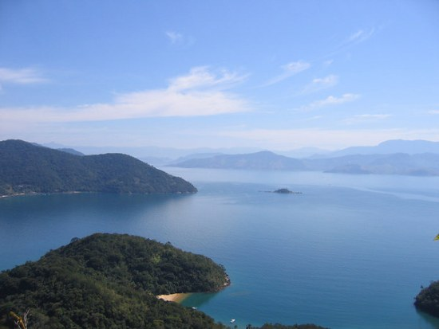

When Brazil was discovered in 1500 by the Portuguese, the country was inhabited by Indians only. Several new beverages were introduced to the Europeans, such as juices of several fruits, teas of several plants, and even an alcoholic drink made out of manioc. Just a few decades later, Brazil was importing thousands of black slaves from Africa; the slaves were used as manpower in the sugar-cane farms. The slaves were the first appreciators of a drink made out of the leftovers from the sugar production; that drink would later become known as cachaca.

It was only in 1727 that the first coffee bush was planted in Brazil. Rumors go that the military Francisco de Melo Palheta used his personal attractions to persuade a Lady in French Guiana to give him samples of the coffee seed, which were then smuggled into Brazil.

  
*Brazil Coffee Beans*

Those seeds would change the History of the country. The Brazilian economy was based on the production of sugar in the States of the Northeast, using slave labor. Slavery continued, but the production shifted to coffee, now in the States of the South, where the seeds adapted better.

Favorable natural conditions and a cheap labor force helped Brazil become the largest exporter of coffee in the World; during the last decades of the 19th Century and the first decades of the 20th Century, Brazil was a near monopolist of the international coffee market. The Economy of Brazil became entirely dependent upon coffee (and coffee farmers).

  
*Ilha Grande, Brazil*

It was around the middle of the 19th Century that, for Humanitarian and Economic reasons, the Brazilian coffee farmers realized that slavery would not last much longer. The farmers pressed the Government to stimulate the immigration of people who could help in the coffee plantations.

For several decades, many immigrants came to Brazil, with the specific purpose of working on coffee farms. The most numerous were the Italians, but there were also significant numbers of Germans, Spaniards, Polish, Arabians, Japanese, and many others.

The State of Sao Paulo, with ample areas of purple land (proper for coffee), became the main producer and main Economic and Political center in the country. Later on, the profits from the coffee (and the labor skills of the immigrants) would be used to fund the industrialization of the State. This explains why Sao Paulo is still the largest and richest state in the country.

So, looking at the rich and diversified culture of Brazil today, one may say that much of it is thanks to coffee.