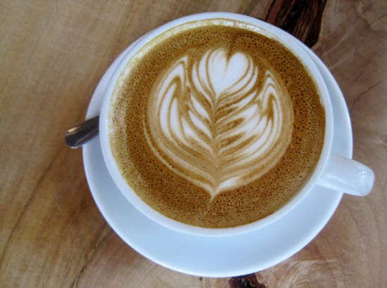

*NOTE: The intended audience for this article is the average coffee drinker who happens to be overweight. This is not intended as medical advice. This article is not geared toward athletes who are already lean and are trying to reduce body fat levels further. The author is a fitness-conscious coffee drinker- not a doctor, nutritionist, or dietary expert. Specific dieting questions should be directed at health professionals, not the author.*

When it comes to losing fat, there are many diets to choose from. There are thousands of diets that combine food choices in such a way as to reduce caloric intake and cause fat loss. Most diets work; however, not every diet works for every person. One of the goals of dieting is to find a diet you can follow. Hopefully, you’ll find a lifestyle diet that will be easy to stick to once the excess fat is gone. Picking a diet that restricts you too much will be difficult to follow and increase your chances of failure.

Here at INeedCoffee, we believe that any diet without coffee will be a miserable disaster. I’d rather be 20 pounds overweight sipping on a hot mug of freshly roasted coffee than lean with only memories of coffees consumed long ago. That said, I decided to seek a diet that puts coffee first. To my knowledge, none exists. It is our duty to create a diet or modify an existing one so we coffee drinkers can lose the fat and not abandon our favorite beverage. Although we strive to drink coffee in our diets, coffee alone shouldn’t be the basis of that diet. Most of our energy should still come from food.

### Caffeine as a Fat-Loss Supplement

In addition to coffee’s role in the most popular diets, let’s briefly address how caffeine can be used to lose fat. There are many fat loss supplements at the nutrition store where the primary ingredient is caffeine. Supplements such as Metabolife, Ripped Fuel, and Beta Lean HP combine caffeine and ephedra (Ma Huang). This combination has been effective at promoting fat loss while preserving muscle. Although there are some critics of ephedra-based supplements regarding safety, this article isn’t going to go into that debate. For more information, read [Muscle Growth and Fat Loss by Stimulating the B-Agonist System – The Role of Ephedrine, Caffeine, and Aspirin by Michael C. Prevost Ph.D.](http://web.archive.org/web/20151105033501/http://www11.netrition.com:80/eca-article.html)

  
*Depending upon your diet, this latte may or may not be OK to consume.*

### The Role of Coffee in Other Diets

Before we build or modify our diet, let’s divide the major diets into three groups and examine how they feel about coffee. There are other diets. This overview is not meant to be complete and is intended to serve as a starting point for building a coffee-friendly diet.

1.  Low-Fat/High-Carb Diet
2.  Isocaloric Diet
3.  Low-Carb Diet

The low-fat/high-carb diet includes the Pritkin Diet, Dean Ornish’s diet, and countless others. Because coffee is fat-free, this diet is the most coffee-friendly. However, one of the reasons fat-free diets sometimes fail is the belief that removing the fat makes one immune to excess calories. A mocha made with fat-free milk may be without fat, but it is calorically dense and loaded with sugars. If you like sweeter coffee choices, be aware that although the drink may be fat-free, you can jeopardize your diet by consuming too many empty calories.

By far, the most popular isocaloric diet is The Zone. An isocaloric diet is one where the calories from fat, protein, and carbs are equal or close to equal. In the case of The Zone, that ratio is 40-30-30 (40% carbs, 30% protein, and 30% fat). Isocaloric diets pay very close attention to the quality of carbohydrates. One of the key elements of this diet is to avoid sugars. A simplistic overview is that avoiding sugars can make the body more effective at burning stored body fat. But does Dr. Sears like coffee? No. Caffeine, even in the absence of calories, can affect blood sugar. More on this later.

The low-carb diet made famous by Dr. Atkins restricts carbohydrate intake to the point where the body goes into a state known as *ketosis*. Without carbs, the body becomes very efficient at burning fat. Like the Zone diet, this diet concerns blood sugar and insulin levels; therefore, coffee is forbidden.

### Coffee and Insulin

Both The Zone and Dr. Atkins frown on coffee because it can negatively affect blood sugar, affecting the body’s ability to burn fat. How can a zero-calorie beverage affect blood sugar? According to the *Canadian Diabetes Association*:

> Drinking caffeine in large amounts as coffee over a short period of time has been shown to raise blood sugar. Caffeine does this by enhancing the effect of two hormones (adrenaline and glucagon). These two hormones release stored sugar from the liver resulting in high blood sugar.

And what happens when blood sugar levels are increased?

From the Running Planet article *The Glycemic Index – How to use it to Increase Your Energy And Lose Weight*:

> This results in large amounts of insulin being dumped into your blood stream. Remember that the job of insulin is to regulate your blood sugar. It needs to do something with the excess glucose (sugar). The easiest thing for insulin to do with it is to store it in your body as fat.

Simply put, coffee can affect your blood sugar, which could interfere with your body’s ability to burn fat.

These fears of coffee may be over-stated. Even though the authors of these two diets do not favor coffee, there is plenty of anecdotal evidence to suggest that either can be successful despite the continued consumption of coffee. Some non-anecdotal research indicates that exercise helps stabilize blood sugar after ingesting caffeine. Our goal, as defined above, is to get lean while continuing to enjoy coffee. So let’s address the problems coffee could pose to a diet, and find a solution.

### Step 1 – Clean Up Your Coffee

Coffee by itself is perfect. It has zero calories, zero carbs, and zero fat. It even has properties that assist with fat loss. Coffee by itself isn’t the problem. Lattes, mochas, iced espresso blended with sugar, whipped cream, ice cream, flavored syrups, alcohol, and caramel are just a few things we add to our coffee. Coffee is derived from the old Arabic word “qahwah” which means “gives strength”. Consuming popular coffee drinks today that are as calorically dense as desserts gives coffee a bad name, and changing the meaning of coffee from *gives strength* to *gives girth*.

To succeed in our diet, we must get back to basics. Regular coffee and straight shots of espresso are fine. As for milk, that depends upon your specific diet. An Atkins diet may allow half and half, whereas a low-fat diet insists on skim milk. If you must use sweeteners, at least try to cut down: go from 2 packets to 1 packet.

### Step 2 – Reduce Your Coffee Intake

If too much coffee can affect blood sugar, reducing your caffeine intake only makes sense. However, you don’t want to reduce your coffee intake at the same time you are reducing your caloric intake unless you have super willpower. Fewer calories and less caffeine usually mean an energy reduction, which could lead to binge eating. A smarter move is to reduce your coffee intake for a week before the diet. Once the diet starts, you can slightly increase your coffee levels. Having a clear head is good when you’ve got an empty stomach.

Another idea is to space out your coffee intake. Instead of drinking four mugs of coffee back to back, consider spreading those four mugs throughout the day: one at 6 a.m., 10 a.m., 1 p.m., and 5 p.m. Caffeine can be an appetite suppressant as long as you don’t consume too much.

Reducing your coffee intake is important, but it can be painful. Cutting back on caffeine can cause headaches and constipation. Accelerated Detox by Rachel Elliot is a good article on reducing caffeine intake.

### Step 3 – Avoid Eating Simple Carbs with Coffee

Now, if you’re on a low-carb diet, you’ll want to avoid simple carbs altogether. However, it may not be a wise idea not to eat simple carbs on any diet while drinking your coffee. You know the simple carbs I’m referring to. They would be the bagels, croissants, and scones you see in every coffee shop. Going back to the insulin argument: if caffeine *could* affect blood sugar negatively, then the last thing you want to do is combine it with something certain to cause an insulin spike.

The insulin argument is highly debated. Many do not view lowering insulin as the key to fat loss. For that explanation, search for the article “Insulin…An Undeserved Bad Reputation.”

### Step 4 – Exercise

It’s common sense that exercise helps one lose fat on almost any diet. In the words of The Illinois Department of Human Services exercise *…helps the body use insulin more efficiently, and this lowers blood sugar.* If exercising can help us stabilize our blood sugar, then maybe we don’t have to get rid of our coffee to be lean. So, lift some weights, do some aerobic activity, and drink coffee. If you don’t have access to a gym, you can perform body-weight exercises such as the push-up and the Hindu Squat.

### The 3 Diets Revisited

People are often more fanatical about their diet choices than their religion. So, be it from me to slam or endorse any particular diet. Each of the four groups mentioned restricts food selection, and the result is often a caloric reduction, which translates to fat loss. What happens behind the curtains may be different, but a combination of healthy eating and exercise has always been the secret to getting lean. Using the above steps, we can maintain our relationship with coffee while dieting.

### Everybody Is Different

It is possible to try the above steps with your chosen diet and not succeed. If you must decide between coffee and getting lean, that’s a personal decision you should discuss with your doctor and roaster. In addition to weight training and power walking, this author followed a modified Zone Diet using the above four steps. The result was a body fat reduction from 18% to 9% in 4 months.
