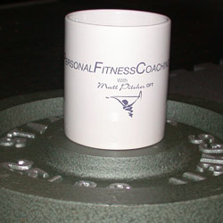

*Matt Pitcher is a Certified Fitness Trainer (CFT)*

Although I’m a firm believer that the only true and healthy path to sustained energy levels is through the combination of adequate amounts of exercise and rest while eating a balanced amount of real whole foods, sometimes our fast-paced lifestyles don’t make that very practical and require us to use ‘alternative’ means to temporarily boost our energy levels. And, since the readers of this article are coffee lovers, I’m assuming that I won’t be convincing anyone to retire their coffee mug to the pantry forever anytime soon. So, allow me to explain how coffee can impact your health and fitness so that you can utilize your love of coffee in the healthiest way possible.

  
*Coffee and Fitness*

### Coffee and Health

Aside from tasting good (and smelling even better), coffee is believed to have a number of health benefits. You may not need a man in a white coat to tell you that your daily dose of caffeine counteracts fatigue and improves alertness and concentration, but did you know that research suggests coffee can lessen the risk of heart disease, Parkinson’s disease, and gallstones as well as act as a powerful antioxidant? So, is caffeine a health booster that actually tastes good? Well, not necessarily. For every researcher or health expert downing a double latte, there’s another ordering green tea. What are we to think?

### Physiology

Coffee gets its kick from caffeine, one of a group of naturally occurring plant-derived compounds called methylxanthines. Caffeine is a drug, pure and simple. It’s addictive. Too much can be toxic. Withdrawal causes side effects such as headaches and dizziness. When ingested, caffeine has a ‘global’ effect, meaning it influences all body tissues, including muscle.

> *‘Drinking a cup of coffee stimulates the central nervous system and prompts the adrenal glands to release adrenaline, one of two hormones released in response to stress. Your heart beats faster, glucose is released into the blood stream and you feel energized,’ explains Anthony Haynes, a nutritionist at the Nutrition Clinic in London’s Harley Street. ‘In the short-term you feel revived, but over time this repeated stress response frazzles the adrenal glands, while the liver becomes conditioned to metabolize caffeine more quickly, meaning you’ll need even more cups of coffee to get the same lift.’*

### The Dark Side

In fact, even if you drink only one cup early in the day, caffeine is still at work in your system hours later. A recent study at the Duke University Medical Center found that levels of adrenalin and noradrenaline remained elevated at night even when subjects had slurped their last cup of coffee at lunchtime – in effect, mimicking 24-hour stress. And that’s not the only charge Haynes levels at the world’s second-favorite drink, after tea. ‘Coffee is an anti-nutrient,’ he says. ‘It hampers the absorption of essential minerals including iron, magnesium, zinc, and potassium, as well as the B vitamins.’ For example, drinking a cup of coffee while eating a hamburger can reduce the amount of iron you absorb by 40 percent, while zinc absorption is reduced if coffee is drunk within an hour after a meal.

Even more sinister links have been made between coffee and ill health. Various studies have concluded that avid coffee drinkers are more at risk of miscarriage and birth defects, osteoporosis, arthritis, and heart disease. So, is our daily cup doing more harm than good?

### The Jury is Still Out

> *‘The findings thus far on coffee intake and health are inconsistent,’ says Dr. Wendy Doyle from the British Dietetic Association. ‘In my mind, the evidence against coffee drinking is poor, unless you’re talking about an exceptionally high consumption. In moderation, coffee doesn’t appear to cause health problems.’*

This was the same conclusion as the authors of the [Nurses’ Health Study](https://www.nurseshealthstudy.org/), an epic 25-year study of disease and women’s health and lifestyle habits. They reported that *drinking coffee in moderation appears to have few if any, adverse consequences.* The study also failed to find evidence to support the link between coffee and increased risk of heart disease and cancer, as well as any difference in the risk of heart disease among women who drank six cups a day compared to those who totally abstained.

But experts like Anthony Haynes are highly skeptical about many of the recent positive findings. And in spite of unfounded evidence on the negative effects of coffee, the Nurses’ Health Study did note that coffee’s effect on calcium absorption could make excessive caffeine intake a bad idea for post-menopausal women at risk of osteoporosis. In fact, nutritionist and best-selling author, Carol Simontacchi has stated that caffeine ‘bleaches’ the bones of calcium over time.

Dr. Doyle agrees that the evidence relating to a high caffeine intake and miscarriage is worrying. ‘It’s wise to keep caffeine from coffee and other sources – such as tea, energy drinks and chocolate – to a minimum if you’re pregnant,’ she says.

So, despite being one of the most researched beverages around, no one has come up with a definitive ‘yes’ or ‘no’ answer to the question of coffee and health. Dr. Doyle and Anthony Haynes agree on one thing, however. Smoking, lack of exercise, and excess alcohol are more serious issues than having a few cups of coffee. ‘A daily cup isn’t going to do you much harm, but if you want optimum energy and health, you’ll be better off without it,’ says Haynes. While Haynes might be adamant about the detrimental effects of coffee, the rest of the jury is still out – most likely getting a nice, frothy cappuccino.

### Coffee and Exercise

So, having said all this, can coffee improve your fitness? It does seem that the ingestion of caffeine can enhance exercise and sports performance, and this area of research has produced quite compelling results. In a landmark study by American doctor Dave Costill in the 1970s, a group of cyclists were able to ride for 21 minutes longer post-caffeine ingestion.

In fact, caffeine’s efficacy as a performance-enhancing drug has led the International Olympic Committee to consider urinary levels of caffeine exceeding 12 micrograms/ml as worthy of a ban. You’d have to knock back eight cups of coffee to achieve such a target, however. Assuming you’re not competing at the top level, a strong cup of coffee an hour before that fun run or charity bike ride might just help you through. Even if it isn’t physiologically easier, studies have shown that people perceive their effort to be less intense after caffeine ingestion. In other words, you’re trying as hard, but you don’t feel as if you are. However, caffeine can also dehydrate you, so don’t overdo it, and be sure to drink water regularly during your workouts.

So, these previous studies show that caffeine can boost your endurance, particularly during exercise lasting between thirty minutes and two hours. Because of its high caffeine content, many people drink coffee in the belief that it has the same effect. Unfortunately, it doesn’t, according to a recent study.

A Canadian research team compared the effects of coffee and caffeine on run time to exhaustion. A group of nine men took part in five trials. Sixty minutes before each run, the men took one of the following.

-   Placebo (a “dummy” supplement).
-   Caffeine capsules.
-   De-caffeinated coffee.
-   De-caffeinated coffee with caffeine added.
-   Regular coffee.

Performance times were up to 10 minutes longer in subjects using the caffeine capsules. There were no differences in run times among the other trials.

These results are somewhat surprising, especially when you consider that caffeine absorption was similar during all three caffeine trials. The only explanation is that something in the coffee interferes with the effects of caffeine.

This isn’t surprising, especially when you consider there are hundreds of compounds dissolved when coffee beans are roasted, ground, and extracted in hot water. In fact, when one of these compounds was injected into rats, it actually slowed heart rate and lowered blood pressure.

The bottom line, then, is that if you plan to use caffeine to boost your exercise routines (particularly your endurance times), pure caffeine (such as in the form of capsules) might prove to be more beneficial than coffee.

### Conclusion

Clearly, coffee has some health benefits but also very real risks, and its role in improving fitness levels is questionable. So, in light of these facts, I highly recommend being balanced in your approach to coffee ingestion as it relates to your health and fitness. One great way to achieve that balance is to follow the guidelines of the coffee diet and to enjoy your coffee in moderation while following a proper exercise routine. And, if you aren’t sure how to best do that, consult a clinically certified nutritionist and/or fitness expert. After all, the longer we live, the longer we can enjoy coffee!
