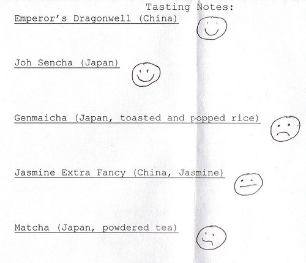
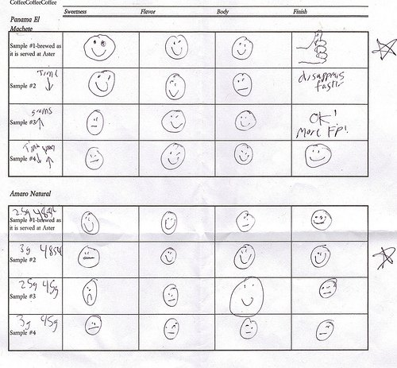
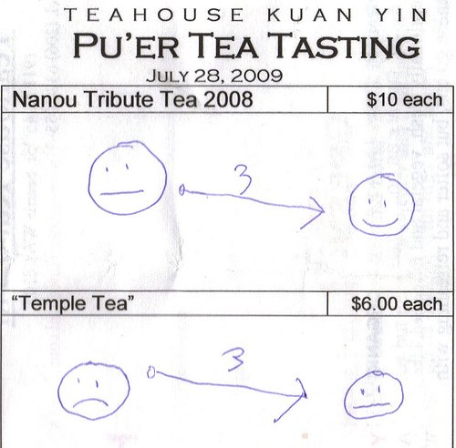

When you attend your first coffee or tea tasting, it can seem overwhelming. **How do you take notes describing flavors that are difficult to detect or that you don’t even have the vocabulary to describe?** Something I’ve noticed about all the coffee and tea tastings is that the flavor descriptions communicated to the group influence taste. Others will also detect green peppers in Kenyan coffee if I state that I detect green peppers in Kenyan coffee. If someone announces that they picked up on cocoa notes in a Brazil, I am more likely to also detect them.

All this raises the question: What am I really tasting, and do I really like it? Last month, I challenged my tea palate and attended a tasting of black tea. Black tea is my least favorite tea. I’d much rather have an oolong, green, white, or even pu’er tea. I had difficulty describing the tea in the tasting notes at the tasting, so I just started drawing smiley faces to match how much I liked the tea. Later, I followed the same procedure for green tea (see below).

  
*Tea Tasting Notes*

At the end of the tasting, I looked over my Smiley Faces and knew I liked the Dragonwell and Sencha. I was neutral on the Jasmine and did not like the Genmaicha. The Matcha started out good and then faded into dislike. This is as simple as it gets and as a customer of tea, it was helpful to me in making a purchase.

At a Clover Coffee tasting, I was given a form with different criteria to judge: sweetness, flavor, body, and finish. Using the Smiley Face method, this is what my tasting notes looked like. From each of the two groups, I was able to pick my favorite coffee setting.

  
*Clover Coffee Tasting Notes*

Most recently, I did a pu’er tea tasting. Pu’er teas tend to develop richer flavors over multiple steeps. The teas I tasted were better on the 3rd steep than the 1st. To communicate this using Smiley Faces, I modified my scoring system slightly.

  
*Puer Tea Tasting*

Feel free to use and extend the Smiley Face scoring system the next time you attend a coffee or tea tasting. My guess is that this could also work for other drinks and food.