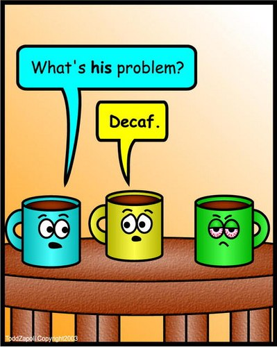

Drinking decaffeinated coffee is, in theory, a way of enjoying the beverage while eliminating the caffeine and preserving the taste. While improvements have been made to the processes, the taste of caffeinated coffee is not preserved perfectly, process completely eliminates all of the caffeine.

To understand decaffeination processes completely, one must consider the function of the caffeine molecule, with specific attention to taste. The caffeine molecule is a bitter alkaloid, so it contributes to acidity as well as the bitter properties of coffee.

Removing this molecule will alter those taste factors. Other flavor compounds are also diminished or removed in the decaffeination process. This means that the taste of decaffeinated coffee is usually inferior to that of caffeinated coffee.

  
*Inanimate Objects – Decaf Coffee Comic by [Todd Zapoli](http://ineedcoffee.com/by/todd-zapoli/)*

### Labeling Practices

It is important to note that the Food and Drug Administration of the United States has no regulatory authority over coffee. Consequently, “decaffeinated” coffee can vary wildly. A product may contain between 2 and 13 milligrams of caffeine and still be labeled “decaffeinated”.

Several studies have shown that store-bought decaf has a higher caffeine ratio, so you should probably purchase your decaffeinated coffee beans from a gourmet roaster.

Furthermore, random samplings of brewed coffee suggest that – surprise – human error exists so that sometimes that cup of decaf is actually just regular coffee in an orange-handled pot. If you are extremely concerned about caffeine or sensitive to its effect, you should buy the beans from a reputable source and brew the coffee yourself.

### Two Types of Decaf Processes

There are two types of decaffeination processes. The first is called the **Swiss Water Process** method. Decaf coffee made with this method can be found at most gourmet coffee shops and organic food grocery stores. The other decaffeination processes use some sort of **chemical solvent**. In this article, I’ll explain the essential aspects of the chemical removal process then I’ll discuss a specific variation of the chemical process termed the **Super Critical Carbon Dioxide** method.

In all of the decaffeination processes, the green coffee beans begin the journey by being steamed and/or soaked in water. This makes the caffeine soluble and primed for extraction.

### The Swiss Water Process Method

The Swiss Water Process is popular among its advocates because it does not use chemicals. Instead, a green coffee extract is used. This green coffee extract is almost caffeine-free. Due to chemical solubility laws, the caffeine will move from an area of higher concentration (the bean itself) to an area of lower concentration (the extract).

Since the extract contains essential oils and other valuable components of the bean, caffeine finds its way into the extract and leaves behind the desirable components of the coffee. Done properly, this organic method successfully removes **94 – 96%** of the caffeine while it retains more of the flavor compounds present in the essential oils than the chemical methods.

Keep in mind that Swiss Water Process coffee beans are generally more expensive than beans treated with a chemical solvent. This is due to the fact that Swiss Water Processing almost always accompanies high-quality arabica beans, while chemical processes are used on both arabica and robusta beans.

### The Chemical Solvent Method

The chemical solvent method is the most commonly used method for removing caffeine from coffee. Chemical methods remove the caffeine better than the Swiss Water Process method because the solvents used can target caffeine most evenly and effectively.

Common solvents include methylene chloride, ethyl acetate, and highly pressurized carbon dioxide. After the green beans are moistened, they are immersed in the solvent. After the solvent performs its action, the beans are rinsed with water. After the beans have been rinsed, they are steamed. Residual solvents evaporate in the steam. The rinsing and evaporation systems collect the solvent for recycling and re-use. Any remaining solvent will be burned off in the roasting process. The chemical caffeine method will remove **96 – 98%** of caffeine.

### The Supercritical Carbon Dioxide Method

The Supercritical Carbon Dioxide method is a chemical method that is somewhat dissimilar to the other chemical methods; therefore it deserves special attention. This method uses carbon dioxide at 250 – 300 times the normal atmospheric pressure.

Carbon dioxide in this form looks like a liquid in terms of density, but it has the viscosity of a gas. It is a very effective solvent at high pressures. When the coffee beans are exposed to the solvent, the caffeine migrates to the solvent. When the caffeine removal is complete, the now caffeine-rich carbon dioxide is passed through either an activated charcoal bed or a bath of water to absorb the caffeine for re-use.

Like other chemical methods, the Supercritical Carbon Dioxide method removes **96 – 98%** of the caffeine. Carbon dioxide is inexpensive to obtain and non-toxic.

### Like an Elvis song

One might compare a naturally mellow (low acidity) cup of caffeinated coffee with a decaffeinated version of a high-acidity coffee. If you prefer a coffee known for bitterness or acidity in the caffeinated version, the coffee in a decaffeinated state will taste “flat”. At the same time, the other characteristics of that coffee will be brighter since they aren’t masked by so much bitterness or acidity.

It is kind of like an Elvis Presley song. Often, brilliant bass lines aren’t noticed until the vocal track has been removed. In these moments, the full complexity of the song is realized. On the flip side, removing the vocals could reveal an uninteresting tune that is better in a complete state.

Until a method is developed that completely eliminates caffeine while preserving other flavor constituents of coffee, we will have to tolerate these imperfect methods. The best thing to do is to try several different brands of decaffeinated coffee until you settle on the one or two that taste the best and have the least amount of caffeine.

*Note: The following addendum on the decaffeination process was written by Donald N. Schoenholt of Gillies Coffee Co.*

> The original article may leave the impression that *Swiss Water* is a process generally available from many decaffeinator sources when in fact it is the patented and branded product of *Kraft*, manufactured in their Nabob plant in Vancouver, BC. No other decaffeinated product is made the same way, nor is any other product *Swiss Water* only theirs.

> Water is a chemical, H2O. It is no more or less a chemical than Carbon Dioxide, CO2. They are both chemicals and they both are found in nature, and decaffeinated coffee made from either can be called *natural*. This is not clear in the article, as the *Nabob* item is listed separately and CO2 is listed with *chemical* decaffeination. By the way, the only CO2 decaf available to specialty roasters in the US is that made by *Hermsen* in Germany and imported by *Excelco Trading LLP*, New York.

> Ethyl Acetate can be found in nature, or can be synthetically produced. It too is a chemical compound and may, when used to decaffeinate, be labeled *natural* should it be from natural sources. The problem is that everybody labels this decaf **natural** and there is almost no way of knowing whether the source of the solvent is natural or synthetic.

> Methylene Chloride is a synthetic chemical solvent. It is not naturally found but must be created by chlorinating methane gas. It sounds terrible but it makes very good tasting decaf.