Andy and Angel Saur make coffee art. They work entirely in coffee – there are no additives, and it’s 100% pure coffee. Andrew Saur and Angel Sarkela have been painting with coffee for almost a year. At first, they tried several techniques, such as using the coffee bean to sketch with and making pastels out of coffee grounds. Finally, they decided to use the coffee as a watercolor. First, they sketch out an idea, then start brewing a really strong pot of coffee. From there, water is added to gain the subtle tones of brown. Finally, a clear coat of acrylic is added to preserve the art.

### Wildlife

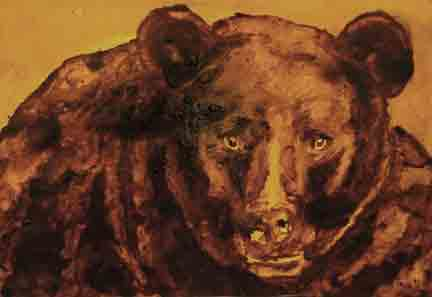

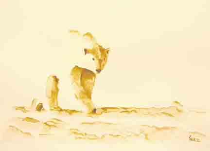

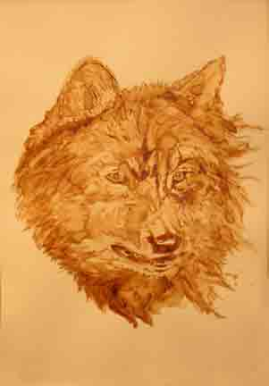

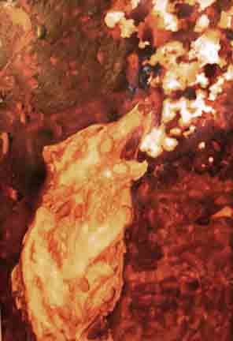

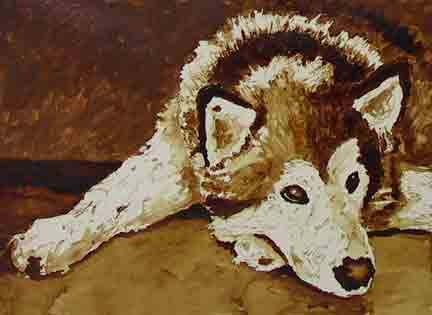

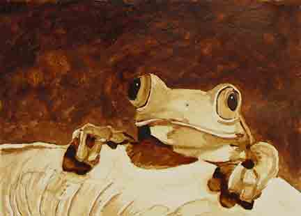

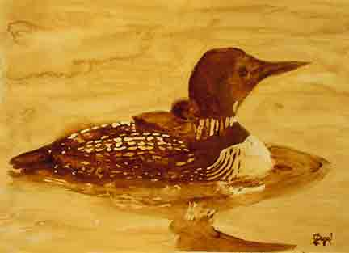

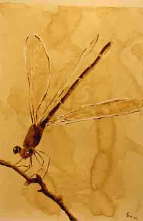

### Nature

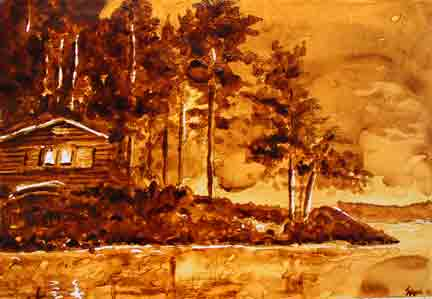

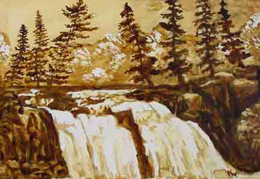

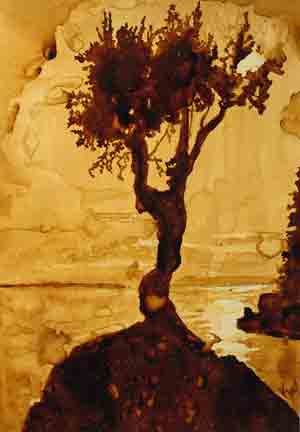

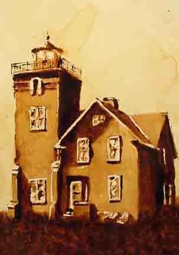

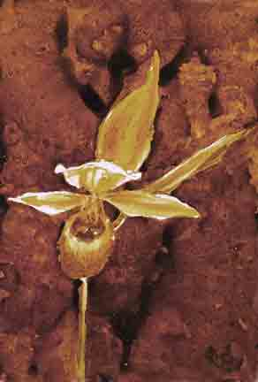

### People

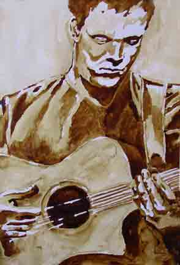

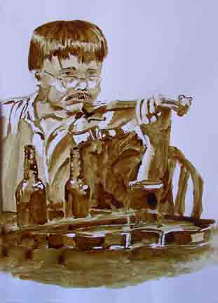

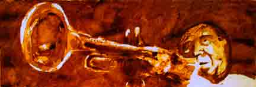

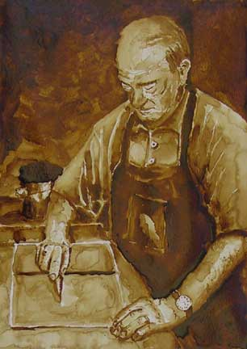

### Resources

[The Coffee Art Corporation](http://ineedcoffee.com/the-coffee-art-corporation/) – INeedCoffee contribution by Ryan L Lewis.

[Coffee on Canvas – Making Art With Coffee](http://ineedcoffee.com/coffee-canvas-making-art-coffee/) – INeedCoffee contribution by Jon Norquist.