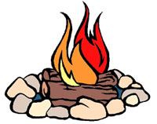

### Coffee at Night

When the sun has set and the dew falls,  
when all is quiet and the whippoorwill calls,  
take your mug of coffee and settle on the porch.

Watch the twinkling stars in the velvet sky,  
and see if all is not well as the night drifts by.

### Campfire & Brew

Campfire twigs grudgingly  
hiss and spit,  
as they flick indignant sparks  
into the chilly dawn.  
And my coffee brews.  
It chortles,  
and flippantly twirls  
its steamy tendrils  
into the crisp, mountain morning.  
I pour,  
from tin pot to tin cup,  
and sup.  
Life is good.

From the chapbook “Rich Flavors” (c)1999 Holland Writing and Publishing
