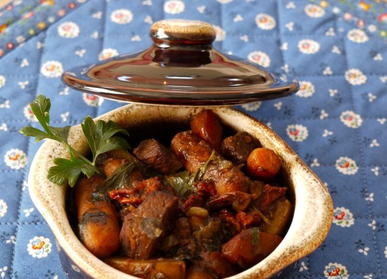

When it comes to COFFEE, especially any leftover nectar, I refuse to waste it. With a culinary degree under my belt, inspiration reigns supreme. I’ve found interesting uses for that dribble of dark stuff left-over in my brew pot. To this day, I seldom throw out any leftover coffee. I usually pour it into a small glass jar and store it in the fridge.

Once when I was making a savory beef stew, I sheepishly threw in that leftover  ¼ – ½ cup coffee. Wow, what a surprise, in lieu of super homemade beef stock, that little bit of coffee added a nice deep richness to my tasty stew, the coffee flavor was unidentifiable. Now, I wouldn’t make beef stew without it.

Recipe: Coffee Beef Stew
------------------------

**Summary**: *Recipe to make a beef stew with a coffee-inspired broth.*

#### Ingredients

-   2 Lbs. Beef Chuck, Cut Into 1 1/2 inch Cubes
-   1 Teaspoon Sugar
-   1/2 Teaspoon Peppercorns (Whole)
-   2 Tablespoons Fat (or Mix Of Fat & Butter), Heated Almost To Smoking
-   1/2 Teaspoon Paprika Dash Allspice Or Cloves 2 Cups Boiling Water, Or 1/2 water and strong leftover coffee or stock
-   1/2 Lb. Carrots, Cut into 1/2 inch pieces
-   2 Potatoes, Cut into 1/2 inch pieces
-   1 Tablespoon Lemon Juice (Optional)
-   1 Each Turnip, Parsnip, Rutabaga, Cut into 1/2 inch pieces
-   1 Teaspoon Worcestershire Sauce
-   2 Celery Stalks, Cut into 1/2 inch pieces
-   1 Tablespoon Soy Sauce
-   1 Sprig Thyme, Fresh If Possible
-   1 Clove of Garlic, Sliced
-   1 Handful Fresh Parsley
-   1 Medium Onion, Sliced In Half Moons
-   **Dumplings: (Optional)**
-   1-2 Bay Leaves
-   2 Cups Biscuit Mix
-   1 Tablespoon Salt, Seasoned Type
-   2/3 Cups Milk

  
*Coffee Beef Stew*

#### Instructions

1.  To season and flour the meat, put the beef and a little seasoned flour in a paper sack or plastic bag; shake until coated in batches, and the job is done! Continue with the recipe. There is one suggestion here: if you opt to cook this in a crockpot rather than on the stovetop, take the time to brown the meat carefully for the reason cited in the next sentence. Brown meat on all sides is in hot fat, turning often and letting a nice fond develop. Fond is the brown bits accumulated on the bottom of a crockpot during the browning process. The liquid is then added to “deglaze” the pan and form a concentrated flavoring. This step enhances the formulation of a great, complex, flavorful final product.
2.  Add water (liquid of your choice, coffee water, stock, to measure 4 cups), lemon juice, Worcestershire sauce, garlic, sliced onion, bay leaves, and seasonings. Cover and simmer, do not boil, for two (2) hours, stirring occasionally to keep the mix from sticking. Remove bay leaves, peppercorns, and any other whole seasonings you’ve included. Add carrots and onions. If carrots are large, halve or quarter. Cubed potatoes may also be added. Cover and cook 30 minutes longer or until vegetables are tender. Remove meat and veggies, and thicken the liquid for gravy, if desired. Garnish with some chopped parsley.
3.  Gravy: Skim most of the fat from the stew liquid. For 3 cups of liquid, put 1 cup of water in a shaker or mason jar with a top, and add 1 cup A.P. flour, shaking until smooth. Add the flour mixture slowly to the meat stock, stirring constantly until gravy bubbles all over. Cook about 5 minutes more, stirring often. Pour over meat and vegetables.

Cooking time (duration): 150 min

Diet (other): High protein

Number of servings (yield): 4

Meal type: dinner

Culinary tradition: USA (Traditional)
