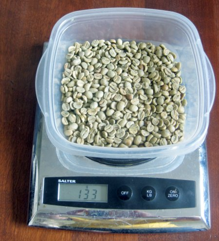

Shortly after you start home-roasting coffee, you’ll encounter a near-empty bag of coffee. You’ll look at it and decide it’s too little for a single batch. At this point, you can either buy more coffee from that same crop, throw it away, or experiment with blending. Blending can be divided into two camps: blending for espresso and blending for non-espresso (regular coffee).

My experience with blending has taught me that coffee blending is far easier and more forgiving than blending for espresso. Building an espresso blend will likely take many attempts before you get your desired flavor profile. Most of my regular coffee blends were successful on the first try. Ultimately, espresso blending is a separate topic. This article will cover blending for regular coffee.

### Home Roasters Are Different From Commercial Roasters

Home coffee roasters face different challenges than commercial coffee roasters. They roast less coffee, roast less frequently, and, with rare exceptions, offer far less control over the temperature profile throughout the roast, especially when roasting outdoors. I have found that coffee blending can mask and overcome some problems home roasters experience.

Now that I’ve been home coffee roasting and blending for ten years, I’ve developed a set of patterns that I’ve used to build coffee blends. Since a home roaster always has different amounts of beans, I tend not to use fixed recipes. I’ve found that fixed recipes work better for espresso. Coffee blending is like art class in school – you see what materials are available in the supply closet and then do your best with what you have.

  
*Weight and measure your coffee blend.*

### Just a Pinch Blend

Often, a blend is forced when you find yourself just an ounce or two short of completing your roast. You didn’t intend on blending, but you ran out of beans. After noticing many commercial roasters were using Guatemalan coffee in their blends, I started keeping a bag handy.

I’ve noticed that Guatemalans never try to dominate the flavor of the beans they blend with. Instead, they highlight the flavor of the other crops in the blend. Thus, my advice for home coffee roasters is to always have some Guatemalan handy.

### Checkerboard Blend (2 Crops)

Anyone who has roasted multiple roasts back-to-back has noticed a trend: the machine gets hotter, and each subsequent roast gets faster. Depending upon what you use to roast and the ambient temperature, you might find the first roast was too slow and the second roast was too fast. Neither batch will taste great on its own, but blended together, they have greater flavor. The “Checkerboard Blend” can be done in two manners.

1.  Same Crop. Find a forgiving bean that tastes good, roasted darker and lighter. Take the first roast lighter and the second roast darker. Recommended beans: Brazil, Colombia, Sumatra.
2.  Two Crops. The same as above, but this time, pick your flavor bean first and the body bean for the second roast. Recommended flavor beans: East Africa (all) and Central America (all). Recommended body beans: Brazil, Colombia, and Sumatra.

### Three-Crop Blend

Many of the great blends I’ve tried had used three different crops. My pattern for this blend is to fill three roles: body, bright flavor, and subtle flavor. Three beans, three roasts.

1.  Bright Flavor (light roast): East Africa (Ethiopia, Kenya, Rwanda)
2.  Subtle Flavor (medium roast): Central America (Panama, Costa Rica, Guatemala, Honduras)
3.  Body (darker roast): Brazil. Colombia, Sumatra

Keep the three roasts in three different containers. Now, experiment with brewing in a [press pot](http://ineedcoffee.com/press-pot-tutorial/) with various ratios. This will enable home roasters to quickly determine what flavors to include and those to change.

### Faking Freshness Blend

Commercial roasters can average the expected intake of all their customers and clients and estimate how much to roast without running out. They can even afford to have some waste; if they notice they will run out sooner, they can do an emergency roast. Home coffee roasters can have wildly varying coffee intake and schedules that prevent always having the optimal amount of coffee handy. Although roasting too little is a problem blending can’t correct, I’ve discovered a hack that corrects over-roasting.

Let us say you still have some coffee starting to lose its freshness, but you don’t want to throw it out yet. I’ve been known to roast a single batch of either the same bean or Guatemalan coffee and add it to the older coffee. I call it “punching up” the blend. Sophisticated palates can detect something is off, but most won’t. Blending older coffee with a small amount of 1-day-old coffee can extend the overall blend by a few more days. I’m sure there are doubters, but I’ve had years of success doing this trick with many people.

### The 7-Day Pre-Blending Trick

I saved the best tip for last. The biggest problem with constructing blends is that different beans roast at different rates. Some are faster and some are slower. So you either under-roast some or over-roast others. Since commercial roasters work with larger volumes, they have the freedom to roast each component of the blend separately to peak and then post blend. We home roasters can’t do that or we end up roasting way too much coffee or constructing blends with just a few equally portioned components.

The solution I learned is to pre-blend the green beans and then let them sit for a week. This will even out the moisture levels, and the beans will roast at the same speed. This single tip has greatly increased the quality of my home-roasted blends, especially espresso, where a single component may only represent 5% of the blend. This especially works well when one of the beans is robusta. However, it does not work when mixing decaf with regular coffee beans.

### When Not to Blend

If I buy a nice single-origin or an island coffee, I will not use it in a blend. Special coffees deserve special attention and shouldn’t be used in regular coffee blends. Blending the expensive special stuff is like pouring cola over a single malt scotch.

### Conclusion

The blending needs of the home coffee roaster are less about designing perfect recipes than establishing patterns for working with limited supplies. I hope my fellow home roasters learned a trick or two to incorporate into their blends.