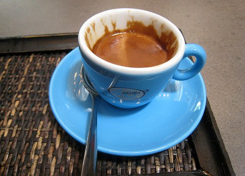

Have you ever noticed that on the supermarket shelves most of what you can buy are coffee blends? If single-origin estate coffees are so fabulous, why would you want a blend? There are many reasons for creating blends, but the two main ones are to make a blend that tastes better than any of its parts individually (the whole is greater than the sum of the parts) or for large roasters to save money by “watering down” the expensive coffee with cheaper, inferior beans.

Assuming you are the coffee connoisseur that is looking for excellence in quality, let me explain the art of blending by using a perfume analogy. When perfumers (affectionately called a “Nez” or Nose) design a fragrance, they generally think of the scent as having three notes, a high, middle, and low.

-   The high note is made of fragrances that are the first impression. They are bright and assertive scents, like citrus and ginger, but evaporate quickly.
-   Then the middle notes shine, which are more mellow and create the “heart” of the perfume, such as rose or lavender.
-   Lastly, as the middle gradually fades, the low notes show through, like musk or plant resin. These are what bring depth and solidness to the perfume and act as fixatives to cause the entire fragrance to last longer.

  
*Epic Espresso from 49th Parallel*

Just like perfume, coffee has different notes that can be combined to create a great overall experience. In the Voice, April 2008, I discussed how the qualities of the coffee are defined, such as aroma, taste, body, acidity, and aftertaste. One coffee might be too assertive in a category to be considered great by itself, but it might be that perfect highlight in a blend. Also, the various coffees in the blend can be roasted to different degrees, allowing each one to shine with its best qualities.

The high notes in coffee would be the bright, acidic, floral, citrus, or cinnamon-type flavors and aromas. Some types of coffee are strong in these high notes by themselves and overpowering, but they work great in a blend. What is great about blending your own coffee is that the possibilities are endless; experiment to find the coffee flavors that you prefer.

-   For a good quality Central American (Guatemala, Panama), Mexican, Yemeni, or Ethiopian coffee, use 25% for the blend.
-   The middle note, or the body, should make up 50% of the blend. The body is the oil content of the coffee determined by its mouthfeel. The good ones to try would be Brazil or Colombian.
-   Lastly, the low note would be the musky, chocolate, nutty, earthy, caramel, or ashy type flavors that make up the remaining 25% of the blend. For more body and sweetness, use an Indonesian like a Sulawesi or a premium Sumatra. For a musty, earthy flavor, try a Monsooned Malabar from India. An aged Sumatra will also provide a unique flavor. Again, the possibilities are endless.

Back in the supermarket, you might also notice ones like breakfast blends, which are made up of a higher percentage of bright, acidic coffees, or Italian roast blends, which are made up of a dark roasted body with earthy notes and hardly any brightness. Also, you can squeeze the coffee bag gently and the scent should tell you whether it is a dark roast or a bright, floral blend.

### Resources

[Coffee Blending For the Home Roaster](/coffee-blending-for-the-home-roaster/) – Tips on creating blends for the home coffee roaster.

[Espresso Blending Techniques](/espresso-blending-techniques/) – How to create an excellent espresso blend.
