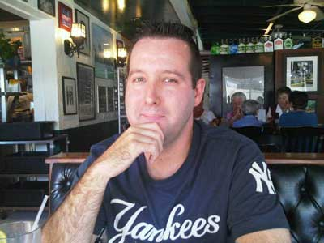

Mike Crimmins was 7 years old when his father gave him coffee to treat a lingering asthma attack. Meds weren’t helping, Mike said, but coffee did the trick. It wasn’t until college, though, that coffee became a daily part of his life. It became an even bigger part of his life when he launched *Daily Shot of Coffee* in March 2009.

A former New Yorker who now lives in the Tampa, Fla. area, Crimmins manages blogs and websites professionally. On the eve of the first game of the baseball postseason, Crimmins, a New York Yankees fan, graciously agreed to do an interview about his blogging approach with yours truly, a Boston Red Sox fan. (He even refrained from talking trash after the Yankees advanced to the American League Championship Series, while the Red Sox were eliminated before I managed to complete this piece.)

  
*Mike Crimmins, Daily Shot of Coffee creator*

**Nourishing Routines**

Crimmins’s day off from the Daily Shot earlier this year was memorable because it was an exception. He gave his readers advance warning that there would be no post on that day, but it didn’t feel quite right. “I took the night off, and it felt weird not to do a post,” he said.

Since he launched the *Daily Shot of Coffee*, Crimmins has been a model of consistency. He posts seven days a week, and the ritual helps spur his writing process. Each day, he reviews other coffee blogs before work. At 7 p.m. he begins writing, a process that usually takes about an hour. “I feel the need to post every day. I like the fact that I have the daily routine,” Crimmins said. “Even days when I’m feeling stuck, I know I’m going to do a post.”

Crimmins is rarely stuck, though. He has a calendar on which he fills future days with post ideas. “I’m always three or four weeks ahead with things I want to post about,” Crimmins said.

On weekends, Crimmins posts but takes it a bit easier. Saturday posts are usually brief, and on Sundays, he does Fresh Brews, a compilation of coffee-related news stories. “That gives me a little bit of a break from the routine,” he said.

### Staying Humble and Grounded

Crimmins’ approach on Daily Shot is to keep elitism to a minimum — he doesn’t profess to be a connoisseur. “I think I have my own point of view,” Crimmins said. “I’ve always considered myself an average coffee drinker.” On the Daily Shot’s inaugural post, Crimmins admitted a fondness for Starbucks and Dunkin’ Donuts coffee, although the latter has since fallen out of favor with him.

One thing is non-negotiable, though — he’ll only brew coffee that’s freshly ground from whole beans. And after reviewing so many coffees on Daily Shot, the bar is inevitably rising. “I’ve tried some amazing coffee since I started,” Crimmins said. Even after experiencing 100% Kona, though, he hasn’t crossed over into SnobLand. “\[I’ll still drink\] grocery store and gas station coffee to keep that balance,” he said.

### Admirable and Accessible

Crimmins aims to keep Daily Shot accessible in tone, and he admires bloggers who are like-minded. He describes Gary Vaynerchuk’s video blog on *Wine Library TV* and Jason on *Coffee Cup News* as major influences. “His video reviews are very down-to-earth and easy for me to watch,” Crimmins said. ” His reviews helped me grasp more of what I was tasting.”

Now Crimmins too does multimedia reviews of the coffees he tastes, with both written and video reviews being Daily Shot staples. He looks forward to his daily posting routine and knew right after launching the site that he was in this for the long haul. “I think the first week I wrote about coffee, I knew it was going to be something I wanted to do for a long time.”

UPDATE 2014: Daily Shot of Coffee is no longer online.