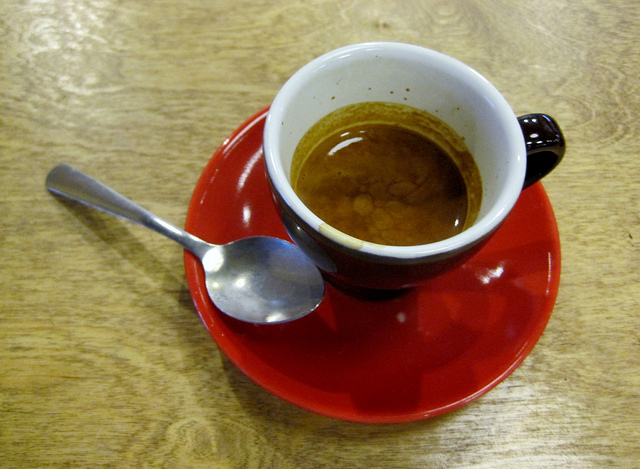

Coffee is a fascinating beverage because it is so interwoven into our culture, our lifestyles, and our ability to achieve our potential as human beings. Now, wait a minute! Isn’t that last claim taking the coffee debate a little too far: coffee as an elixir for human potential? Well, coffee, in and of itself, is not going to help you climb the corporate ladder, write a best-selling novel, or reel in a new client, but for many people, it definitely can help.

### Does Coffee Really Give You a Competitive Advantage?

Everyone reacts differently to caffeine, and some people should just plain stay away from it. However, for those people whose performance is enhanced by a couple of cups of java, it literally can make the difference between success and failure. Two common scenarios in which coffee can help are in a job interview or a sales presentation. In either situation, your prospective employer or customer is going to be judging you on the basis of enthusiasm, energy level, and reaction time. If you come across as remotely lethargic, slow thinking, or lackluster, you might be perceived as someone who lacks confidence or doesn’t genuinely believe in themselves or their products or services. That can be a deal killer.

In a job interview, it’s especially important to have that extra edge because the interviewer will be noticing (to quote Sting) “every breath you take…every move you make”. Interviewers are as ready to disqualify you as they are to invite you back for the next round. Even though the interviewer may not be consciously aware of it, they’re noticing every little nuance of your demeanor-from your posture to the length of time you pause before responding to a question. When you have the advantage of a couple of cups of joe in your system, your ability to pay attention, think more clearly, and respond intelligently can be enhanced. You still need to be qualified for the job, of course, but in most hiring situations, there’s more than one qualified applicant. Very often, it’s the candidate who’s perceived as sharper, enthusiastic, and more energetic who makes the final cut.

  
*Competitive Advantage?*

An article on the topic of “interview demeanor” posted on the Web site of a Salt Lake City TV station (ABC 4) seems to bear this out. According to employer surveys, demeanor is the most influential factor in the hiring decision. The article also offers some specifics on effective demeanor: “During the interview, it’s vital to show enthusiasm. Be responsive, attentive, and remember to smile.” The news feature does caution the reader against being fidgety, which, incidentally, can be a side effect of drinking too much coffee. Caffeine can make you appear jittery, nervous, and overbearing, so, as in all things, moderation and knowing your own personal limits are the keys. Since perception is everything, though, a moderate amount of coffee consumption can make us appear smarter, responsive, and more “on the ball”.

Imagine trying to make it through college without a cup or two of coffee every day. How would we pull those grueling all-nighters, get ourselves to those early-morning classes, or make incisive comments in class-especially when we’re trying to impress an attractive classmate you’d like to ask out? Since people pick up on subtleties in your behavior, coffee can help give you that extra “spark” that can make you a little more animated and exciting.

The use of a moderate amount of caffeine to enhance athletic performance is a controversial issue because, although it doesn’t violate any formal rules or standards, some in the athletic community think it’s unnatural or provides an unfair advantage. Depending on which study you read, however, caffeine can improve an athlete’s performance by 3-5% or more. According to a New York Times article from March 25th, 2009, performance improvement in controlled laboratory settings can be as much as 20% to 25%. The article, entitled “It’s Time to Make a Coffee Run” goes on to say that in the real world, performance improvement fueled by a couple of cups of coffee may only average about 5 percent–which is still significant if you want to achieve your personal best or win a race.

On the other hand, caffeine can potentially cause a racing heart, jitters, and elevated blood pressure, so there can be undesirable side effects. The bottom line is: that everyone needs to do what’s right for their own body, their goals, and their moral compass.

### Resources

Interview demeanor – Interview tips from ABC 4 in Salt Lake City. *The story has been removed from the website.*

[It’s Time to Make a Coffee Run](https://www.nytimes.com/2009/03/26/health/nutrition/26best.html?_r=1) – NY Times article By Gina Kolata.