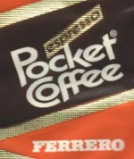
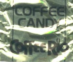
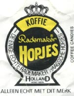
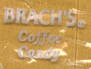
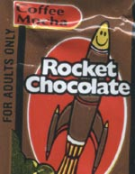

***2017 UPDATE:** We have completely updated this article. Check out [A Coffee Drinker’s Guide to Coffee Candies](http://ineedcoffee.com/coffee-drinkers-guide-coffee-candies/).* 

As a coffee fanatic, I’ve often sought ways to extend my love of coffee and simultaneously placate my sweet tooth. So, I’ve taken to eating coffee-flavored candy. It is worth noting that there is no such thing as a coffee flavoring that is completely man-made. All coffee flavoring is derived from coffee because the taste of coffee is just too complex to be replicated accurately. But just because it is derived from real coffee **does not** mean that all coffee candy is created equal.

### Pocket Coffee

This candy starts with a caramelized sugar pocket for a sweet espresso liquid. The caramelized sugar is coated with European milk chocolate. The manufacturer (Fererro) claims that eating three pieces is equivalent to a shot of espresso, and I have to admit that I got a buzz off of the candy. I brought it to work to share with co-workers. They loved it and asked for more.

  
*Review for Pocket Coffee: Fantastic!*

### Coffee Rio

This candy’s consistency is similar to chewy caramel. It sticks to your molars and tastes like a cup of coffee with lots of cream and sugar. You can purchase it by the bag at specialty grocery stores.

  
*Review for Coffee Rio: Very Good*

### Rademaker’s Hopjes

This is a little hard candy from Holland. It’s pretty tasty. The coffee flavor is evenly distributed throughout the candy and tastes a little like a Frappuccino. Getting this candy can be a little tricky. I stumbled upon it at a local coffee shop.

  
*Review for Rademaker’s Hopjes: Good*

### Brach’s Coffee Candy

This hard candy smells like coffee and is colored like a cup of weak coffee, but it tastes nothing like coffee. It’s so gross that I spit it out before finishing the piece. You can find it at your local supermarket in Brach’s bulk candy display.

  
*Review for Brach’s Coffee Candy: Yucky*

### Rocket Chocolate

This candy is marketed “for adults only” and claims to boost energy like a cup of coffee. It has a gunk-filled center surrounded by low-grade chocolate. It’s lousy; stay away from this brand. Trust me, you don’t want to try this candy, so locating it shouldn’t be a concern.

  
*Review for Rocket Chocolate: Horrible*

### Resources

[A Coffee Drinker’s Guide to Coffee Candies](http://ineedcoffee.com/coffee-drinkers-guide-coffee-candies/) – Our updated guide to Coffee Candies.