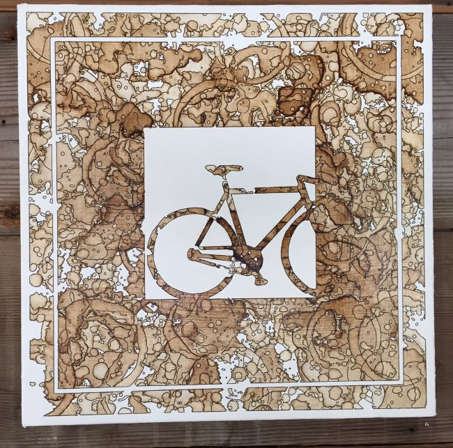
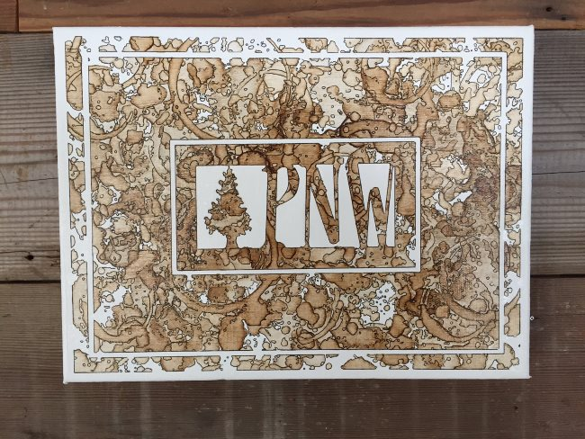
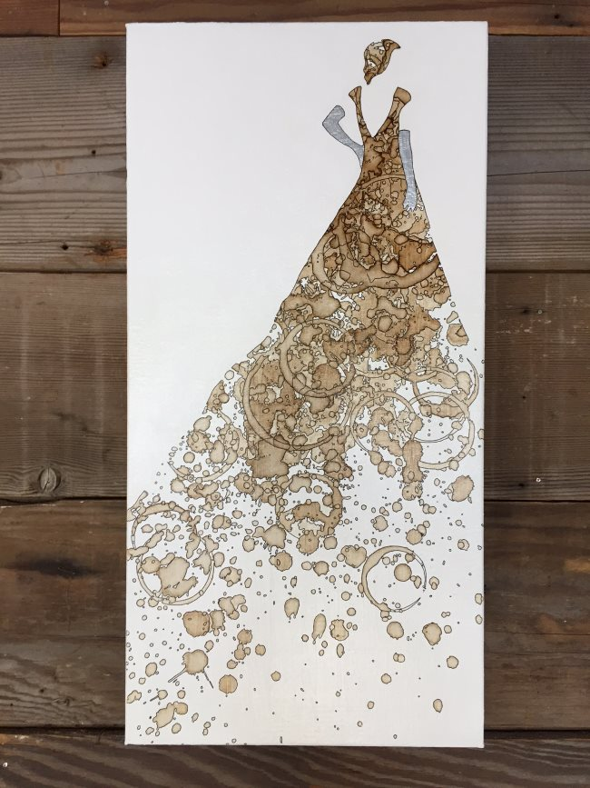

*Coffee on Canvas is a project by Jon Norquist that uses brewed coffee to create drawings.* 

*A Fixie*

### How did you start Coffee on Canvas?

I literally stumbled into this art form about 5 years ago when a family friend bought my wife and I a Black and Decker coffee pot. The carafe was amazingly bad – it spilled coffee every time you made yourself a cup of coffee (which is insane given the fact that the team of humans that designed had one task to do….POUR FLUIDS INTO A CONTAINER, I digress).

Anyway, I had the pot for a few months, and one morning, as I poured scalding hot coffee over the counter, floor, and my feet, I saw the coffee spill and thought it was an interesting design. I immediately had the idea to outline the spill in black ink so that the form of the spill really stood out. In order to capture this accidental beauty, I began by taping the paper to my countertop and allowing the coffee to spill on the paper during my morning coffee routine.

After a month or so of daily coffee brewing, I had a piece of caffeinated art! The problem though is that the paper would always curl as it tends to do when it is wet, so paper soon was replaced with un-curlable canvas, and…..fast forward 5 years…..Coffee on Canvas was born.

*PNW Monogram*

### Tell us about the process.

I start with a blank, gesso primed canvas and I paint it white with a few layers of Titanium White acrylic – I find the brown on white contrast to be pretty striking, so I like the canvas to be as white as possible, the canvas right-out-of-the-wrapper is much too gray. After a few coats of titanium white, I choose my subject and create a template.

The templates are usually made with thick card stock paper or poster board, and what I typically do is sketch the subject until I’m satisfied and then cut out the template. This is useful for a few reasons:

1.  It reduces the pencil/sketch marks on the canvas (something I remove or cover later)
2.  It allows me to keep an inventory of subjects and designs.

One aspect of my art that I pride myself on is that I do not run print editions. Since I have templates for most of my designs, the templates allow me to make a unique piece every time, even if the subject or design is reused.

Once the template is made, I transfer the design to the canvas with a light pencil outline. I then determine if I want the subject to be portrayed in coffee or if the subject will be the negative space – once I decide, I mask the areas I want to protect from coffee stains and then begin spilling coffee.

The coffee spilling is really a very creative process, as the massing of coffee, leaving white space, the direction of spill/spray, layering, and color (lightness to darkness) of the coffee are all considered. As I spill the coffee in layers I become more and more aware of the “feel” or “flow” I want to create with the coffee.

Layering, I’ve learned is key. I usually add about 15-20 layers of coffee, drying each layer after it is spilled, and varying the color with each layer to distinguish it from the last. Since I’ve been doing this for a number of years it’s amazing what you learn about the makeup and flow of coffee. For instance, new coffee is orange while older coffee (1 to 2 days old) is more of a dark brown – I’m not sure the reasoning for this. I’ve also learned that heavy spills tend to coagulate at the edges making a very cool effect. If the layering is done correctly, it creates a marbling effect.

After a number of layers, I remove the masking to reveal the protected area.

Once the masking is peeled I begin outlining the coffee with ink. I outline every spec of coffee I can see on the canvas, usually requiring me to look at the piece throughout the day so I get a few shades and angles of sunlight to reveal more of the smaller flecks. I ensure I outline the marbling and layered coffee as well, and over the years I’ve honed a technique for this to ensure I capture even subtle tonal changes without striking them through with a hard black ink line.

At this point, the piece is essentially done. I apply a few layers of varnish to finish and protect the piece, and lastly, if I’m using silver in my piece it is applied and outlined with ink.

*A Lady*

### Resources

[The Coffee Art Corporation](/the-coffee-art-corporation/) – INeedCoffee contribution by Ryan L Lewis.

[Coffee Art – Painting With Brewed Coffee](/coffee-art/) – INeedCoffee contribution by Andy Saur and Angel Sarkela.
