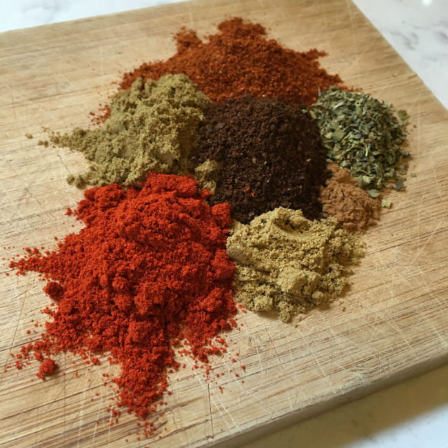
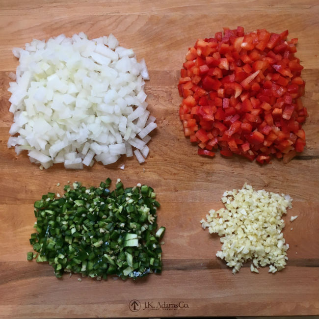
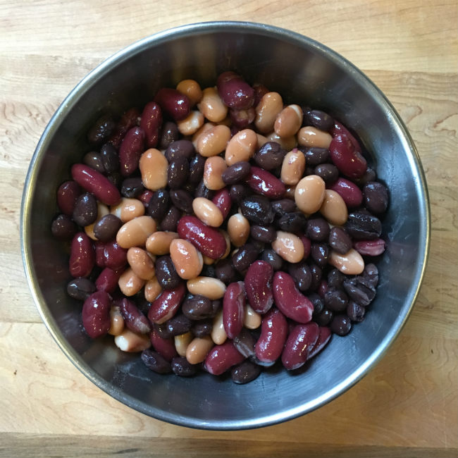
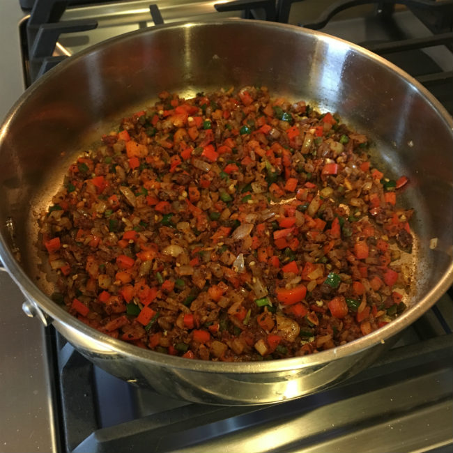
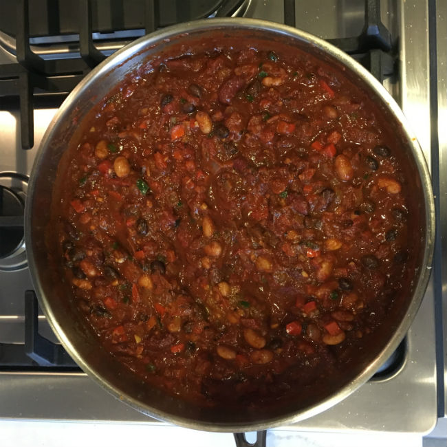

Cincinnati, Ohio, is a city proud of its chili heritage. According to local tradition, Cincinnati chili is uniquely spiced with cinnamon and chocolate, served on pasta, and covered with pillowy cheddar cheese, onions, and beans. It is a favorite, delicious indulgence for Cincinnatians.

We made an improvement to the original by adding ground coffee.

### Overview

-   Serves 4
-   Prep: 10 mins
-   Cook: 25 mins
-   Total time: 35 mins

### Ingredients

-   1, 28 oz can Crushed Fire Roasted Tomatoes
-   ½ medium White Onion, diced
-   1 medium Red Bell Pepper, diced
-   3 medium Jalapenos, diced
-   4 medium cloves of Garlic, minced
-   ½ can of Black Beans
-   ½ can of Pinto Beans
-   ½ can of Red Kidney Beans
-   1 tbsp cooking oil
-   3 squares Dark Chocolate (85%)
-   1 tbsp Chili Powder
-   2 ½ tsp Cumin
-   1 ½ tsp Paprika
-   ½ tsp Coriander
-   ⅛ tsp Cinnamon
-   1 tsp Oregano
-   ¼ tsp fine Sea Salt
-   1 tbsp Molasses
-   1 tbsp finely ground medium roast coffee \*

### Instructions

1.  Heat oil in a saucepan over medium heat. Once hot, add onion and occasionally stir for 1 minute.
2.  Add garlic and occasionally stir for 1 min. Add jalapenos and bell pepper, and occasionally stir for 1 min.
3.  Add all dry spices, except the oregano and salt, and continually stir for about 1 min.
4.  Turn the heat down to medium-low, then add the tomatoes and stir. Once heated, add the chocolate and molasses, stirring until blended. Add the oregano and salt, then finely chop the beans.
5.  Bring the chili to a low simmer for 15 mins uncovered, stirring occasionally.

Serve in a bowl with your favorite fixings: shredded Monterrey or Cheddar cheese, avocado, sour cream, and/or chives.

\* *A single-origin Peru from Atlas Coffee was used.*

*Jared Rosenacker assisted his brother with this recipe.*