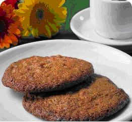

Here is a basic Norway coffee cookie recipe.

### Ingredients

-   5 1/2 oz butter
-   5 oz sugar
-   2 oz chopped hazelnuts
-   1 egg
-   1 teaspoon vanilla
-   1 1/4 cup flour
-   1 teaspoon baking soda
-   1/2 cup coffee or espresso
-   1 square bar or 2 oz of plain dark chocolate

  
*Norway Coffee Cookie*

### Directions

1.  Preheat your oven to 350 F.
2.  Mix suger and butter until smooth in a food processor.
3.  Add additional dry ingedients and mix thoroughly.
4.  Add the egg, flour, vanilla extract and baking soda.
5.  Then add the coffee, nuts, and chocolate.
6.  Drop or put the dough with a spoon onto baking paper or greesed cooking sheet.

Be sure to leave enough room on the cookie sheet, as they tend to spread out. Cool on a cooling rack
