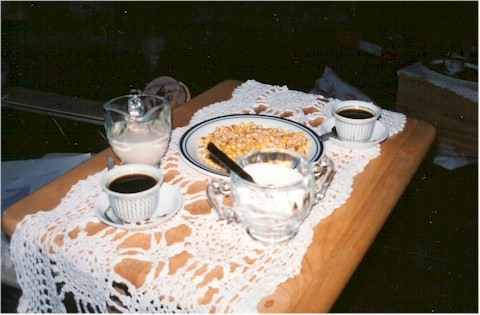
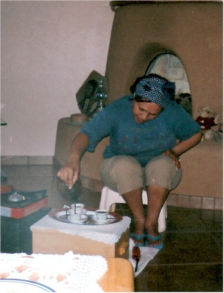
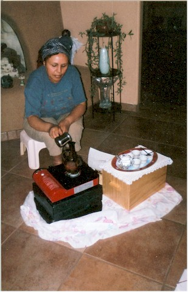
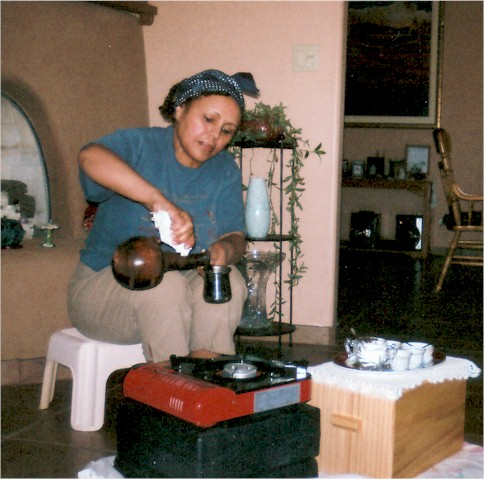

In Eritrea (pronounced er-ih-TRAY-uh), coffee is not merely something that starts on a timer and brews into to-go cups, but it is a ceremony, a ritual, a meaningful time to sit down with friends and family to chat. Many Americans have such fast-paced lives that they miss many important things, like time with friends and family. In this culture, however, they take time to enjoy coffee or tea together.

According to one website, “Ethiopia is the only (coffee) producing country in Africa with a traditional coffee-drinking culture. This tradition is reflected in the Coffee Ceremony, a daily ritual performed by native Ethiopian women. Village women gather in one of the neighbor’s homes to share news and nourish friendships.

More than just a coffee break, the ceremony is an expression of respect to elders and represents a spiritual time of day to give thanks for the blessings of life.” 1 To experience this firsthand, I took a trip to Jim and Elizabeth Martin’s house for a traditional Eritrean coffee ceremony. We were welcomed in and sat around a very low table where Elizabeth had the green, unroasted Sidamo coffee beans waiting for our arrival.

  
*Eritrea coffee ceremony*

Opinions and preferences of whether to use Sidamo or Harar, how to roast it, and what to use to brew in are deep-rooted in the families and vary from region to region. She prefers Sidamo, which is a very well-rounded and exquisite coffee. Next to the table was a portable gas burner; in Ethiopia, they would roast the beans over a charcoal brazier, but we were sitting indoors, and the gas burner worked very well. As she was gathering everything she needed, we enjoyed the sweet and woodsy smell of Frankincense and Myrrh incense burning. In some families, it is absolutely necessary to have this incense; without it, they will not drink their coffee.

All of the preparations are done in front of the guests, so we watched as she roasted the beans using a small, shallow pan with a very long handle, a menkeskesha, to a medium-dark roast, stopping just as the oil began to show on the beans. She immediately poured them on a round woven mat, about 8 inches across, to let them cool. It is customary for everyone to smell the roasted beans by wafting the smoke towards themselves, still hot and so tantalizing.

  
*Eritrea Coffee Preparation*

Traditionally, they would then pound the coffee with a mortar and pestle to a medium-fine consistency, much finer than drip coffee but not quite to an espresso grind. The next step is to brew the coffee using a jebena. It is a small, narrow-spouted earthenware pot that they use in Eritrea. In Ethiopia, they use a slightly different variation, theirs having a separate spout lower on the pot for pouring out the coffee.

In Eritrea, the jebena has only one spout at the top where they pour in the water and grounds and pour out the coffee. Elizabeth then mixed the grounds with a little water and poured them into the jebena, which had some water already in it, and then placed it over the fire. As we waited for it to heat up, we were nibbling on some Dabo Kolo, a type of bread made of flour, sugar, and water that is cut into very small pieces and then fried or baked in a crepe maker. They are crunchy, slightly sweet, and a perfect snack.

  
*Pour Eritrea coffee.*

Another traditional accompaniment is fresh roasted popcorn hot off of the fire. Just as we were chatting away, the coffee began to percolate and bubble out of the top of the pot. She quickly poured some of the coffee mixture out of the pot into a small cup and then back into the pot, setting it again on the fire.

Each time it bubbled up she would do this, maybe five times or so, until she decided it reached the proper temperature and was finished. The wonderful, mouth-watering aroma was filling the room. Then the pot was placed on a special woven holder, since the pot has a round bottom it can not sit on a flat surface by itself. It would need to sit there for a few minutes to cool slightly and let the grounds settle to the bottom.

The small Eritrean cups, finjal, were sitting on a tray on the coffee table. Holding only 2-3 ounces, made of fine china, and without handles, they were each sitting on their respective saucer with a tiny stirring spoon placed beside them. In the middle of the table were the cups holding the sugar and creamer. A little sugar is a usual complement to coffee, but because it is so smooth, it hardly needs anything else. By now, most of the grounds have settled to the bottom, but just to catch any remaining that may be floating, she inserts a tiny coil of horse hair into the top of the spout. Gently pouring into the tiny cups, I could hardly wait.

Savoring the aroma, we tasted the coffee. Oh so smooth! Not bitter, not sour, not too strong, but only the best qualities of coffee you would want in a cup. Excellent! This is only the first round, up to three rounds can be made out of these same grounds. As she adds water and we repeat the brewing process, it leaves more time to fellowship and for enjoying the Dabo Kolo.

  
*Serve Eritrea Coffee*

A sincere thank you to Jim and Elizabeth for letting me experience a coffee ceremony from Eritrea. I truly enjoyed it! For those who would like a bit of the experience for themselves, try an estate-grown Sidamo, Yirgacheffe (in Sidamo), or Harar.
