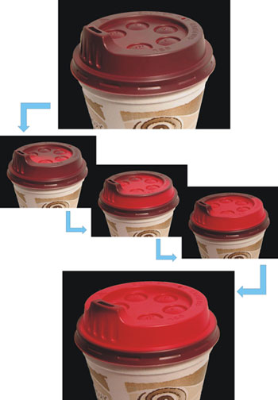
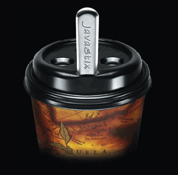

Every year, coffee hobbyists are exposed to many new brewing or home roasting gadgets. Innovation is occurring at the gadget level and with the disposable coffee cup. Until a few weeks ago, I didn’t think there was any way to improve the standard coffee house disposable cup. Let me share with you what I discovered.

### Seeing Temperature

The first problem with the coffee cup lid is that there is no way to tell how hot a drink is without touching your lips and tasting it. We’ve all done that quick-kiss sip. Pull up just the minimal number of coffee droplets to detect if the drink is safe enough not to burn the mouth. It would be so much easier if we could just read the temperature, but who wants to carry a thermometer with them at cafes?

Smart Lid Systems from Sydney, Australia has come up with a solution. The lids change color based on the temperature of the beverage. If the coffee is too hot to drink, the lid is a bright red. And if the coffee is at a safe temperature, the lid turns brown – the color of coffee.

  
*Smart Lid transformation*

The lid has an additional safety feature besides saving you from burning your mouth. If the lid color isn’t solid across the top, it indicates that the lid may not be securely fastened. Secure the lid, and the color should become uniform.

### Ending Spills and Locking in Warmth

The little opening from which we sip our coffee is the coffee escape hatch. Coffee exits that escape hatch either in our direction by lifting the cup and drinking from it or by accident. You may be transporting just one beverage to the drink holder in your car, or maybe you’re bringing back a tray of drinks for the office. A turn or a tap on the breaks, and coffee comes flying out.

Cafes tried to solve this problem for a few years by taping the opening. This idea lost popularity once people realized that the steam from the coffee would loosen the tape, making it functionless. A company called JavaStix has come up with a solution. Using their JavaStix, the coffee opening is closed and secure. When it comes time to drink the coffee, the stick is removed easily without burning your hand.

  
*JavaStix*

### A Cup Sleeve With Style

Many years ago, fans of quality coffee ditched the styrofoam cups in favor of paper. The problem of burning your hand grabbing a hot paper cup was first solved by using two paper cups. This was clearly wasteful, and thus was born the coffee sleeve. Even though this was less paper waste, it was still wasteful. Cardboard cup sleeves are almost always discarded with the empty coffee cup.

WishingFish.com has a stylish solution. They created a line of designer coffee cup sleeves called *Cup Couture*. These cup sleeves are reusable, easy to store, and easy to clean. Some of the styles they offer are Giraffe, Tigress, and Chinchilla.

Imagine strutting out of a coffee house in fur *(faux fur), but the fur covers* your coffee cup, not you. It’s sure to be a conversation starter. WishingFish.com estimates that a coffee drinker can save 6-10 lbs of paper waste a year by substituting the cardboard sleeve with a reusable sleeve. That’s a conversation worth having.