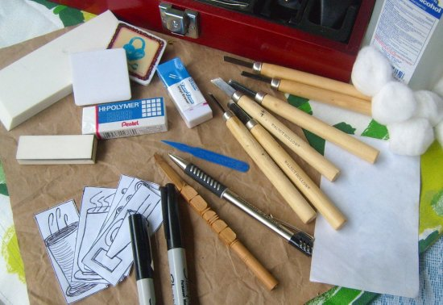
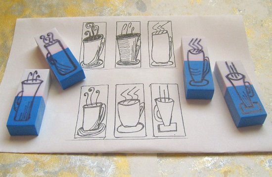
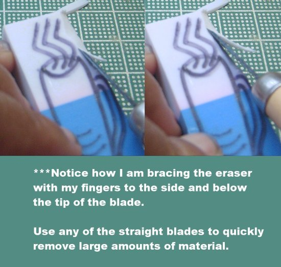
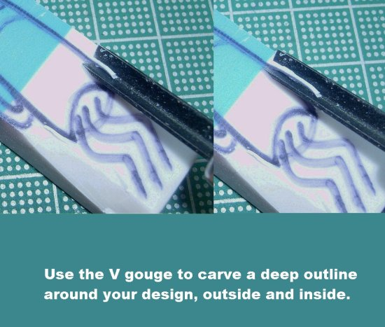
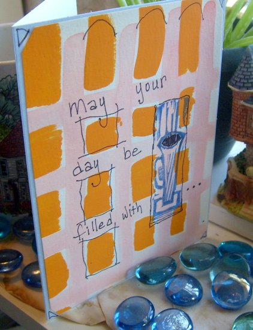
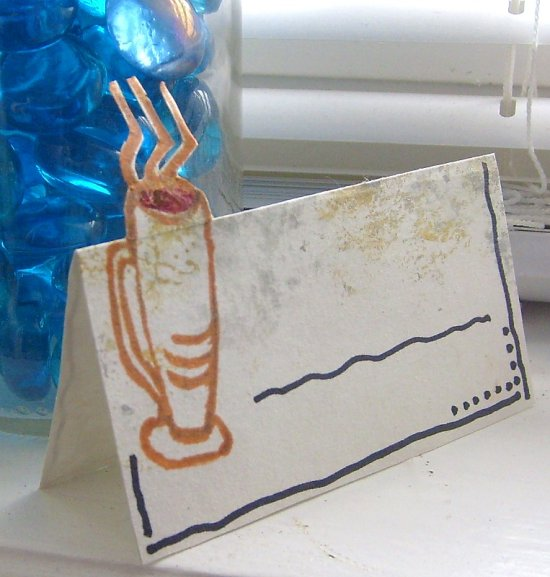
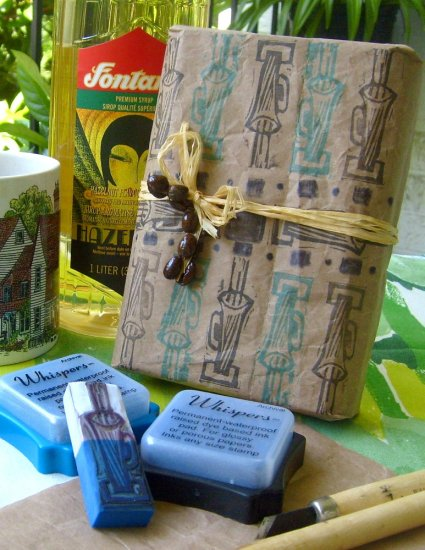
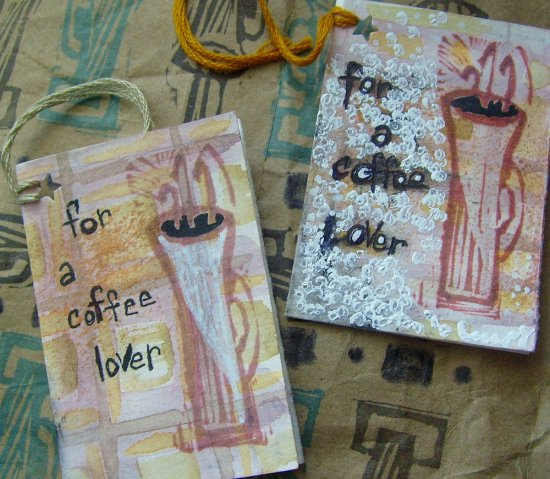
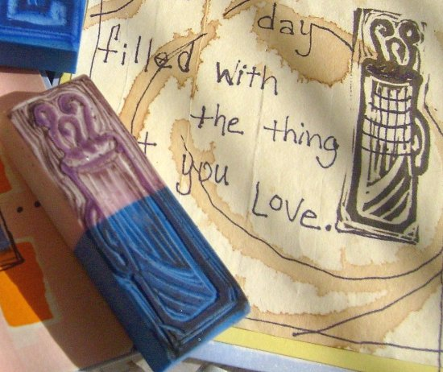

Eraser art stamp carving is a restful and fun craft that can be practiced without a lot of expense. You don’t need much space either, other than a tabletop or a firm board on your lap. Being able to produce unlimited one-off prints, in various colors and layouts, is an additional pleasure. You will enjoy making attractive, handcrafted gifts with your stamp designs. Giving someone the gift of a hand-carved stamp with a stamp pad makes a unique gift that encourages creativity in others.

The first step to hand carving a coffee art stamp is to assemble your supplies.

-   Eraser
-   Coffee drawing (or you can draw freehand)
-   Permanent marker
-   Stamp pad
-   Sheet of paper
-   Alcohol and cotton ball
-   Carving tools

### Types of Erasers

Your carving block will be an inexpensive eraser. I prefer the white or beige colors because they usually have a soft but firm texture that is easy to carve. I have found them in a variety of stores. I’m always elated when I find two or three on a card. I have not yet tried using the red or green erasers because their texture sometimes feels less dense and not as easy to carve.

### Your Stamp Design

If you will be drawing your design onto the eraser, you need to select a permanent marker. I like to use a black Sharpie and chose a medium tip to draw my coffee cups. A fine tip will work better for more elaborate designs. If you are concerned that you may not like your drawing and want to test your skill first, you can use a graphite pencil or soft drawing pencil. If you are not satisfied with your drawing, you may then be able to erase it with another eraser. I wouldn’t spend too much time doing this because the attractiveness of art stamps is their lack of uniformity. You could practice on paper and use your doodles in collages.

If you want to transfer a design onto the eraser, you can use carbon or graphite paper. Lay the coated side of the transfer paper onto the eraser. Lay your drawing on top, face up, and trace it. You can preserve your drawing for use in other tracings by using a non-marking tip, such as an empty ballpoint pen or embossing stylus.

Other miscellaneous tools include a stamp pad and piece of paper for testing your stamp as you carve, cotton swabs, and alcohol to clean your stamp.

### Carvers: The Most Important Tools

Your most important tools are your carvers. My main ones are part of a 6-piece kit from Walnut Hollow. It has two v-gouges, 1-curved gouge, and three flat carvers. This is a good basic variety of blades to remove various amounts of eraser to reveal your design. Though you can use your X-Acto or another blade cutter, it would be more difficult and time-consuming to produce the outlining effect of gouges. I started to like this and was ecstatic when I got my gouges. No more cutting down and in and chopping off pieces of eraser away from the edges of my design.

### Tips For Safe Carving:

-   Have a firm, level surface to work on. A table or a drawing board for your lap will do. It doesn’t have to be a large space, just stable.
-   Use sharp tools. They make your work easier, faster, and safer.
-   Carve away from yourself. This means turning your eraser throughout your carving session so that you are always pushing your knife away from you as you remove material.
-   Relax and carve slowly. No sharp trauma allowed! Slow and restful carving means no accidents.

### Preserve Your Design By Carving Slowly

Whether you are a beginner or an experienced carver, the best practice is to carve slowly. You can always remove more material until you achieve the effect that you desire. You can’t replace material that you accidentally removed because of carving too fast or a slip of the tool.

Begin by pressing gently down and forward until you feel the resistance begin to release and rubber material begins to give at the tip of the blade. With practice, you will feel this pressure and release it through the handle in your hand.

Once you feel that release, you can push forward with more speed. As you near the end of your stroke, begin to lift the tip upward while pushing forward until the tip clears the eraser block at the end of your line of carving. You are lifting away so that you won’t carve through a line in your drawing. With practice, you will be able to gauge, as you carve, when to start lifting away. If you are carving a line that will take you to the edge of the eraser, then you can carve straight through.

### Check Your Progress As You Carve

As you carve, you can check your progress by testing your stamp. When you stamp your image, you can see where you may want to remove more material. You can also see if you have made a mistake in carving, and then decide how you want to correct it. I don’t check my stamp until I feel I am finished, and sometimes I need to carve a little more, but not much. The fun part of carving your design is that it will often not appear exactly as you drew it. You will carve more than you designed on some areas of the stamp and less than you designed in others. And don’t forget the corrections. They will make your original design look different, but you will love it.

### Stamp Useful Clipart Images To Clean Your Stamp

Before cleaning you can sometimes stamp a few images, to clean the stamp, on scrap pieces of paper. These stamped images can be used in a collage and other artwork. When you clean your stamp with a cotton ball and alcohol, the ink will leave a stain. While this is a consideration when selling or giving them as gifts, I like the staining. It adds character to my work, and I like seeing my designs clearly outlined on the stamp.

You can stamp in all types of colors, as I did with this greeting card and the place card.

You can stamp in different layouts, as I did with this wrapping paper.

You can clean your stamps by stamping images onto decorative paper and using it in craft projects. I made these two gift tags by cleaning my stamp onto scraps of my handpainted paper. I then trimmed and folded them, punched holes, and added string. I further embellished them with a black marker and a white paint pen.

Designing and hand-carving coffee art stamps can be just the relaxing project that you need. Enjoying a cup of your favorite rich brew while carving would be even better.

