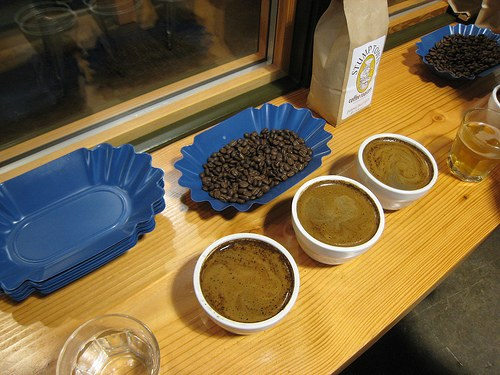
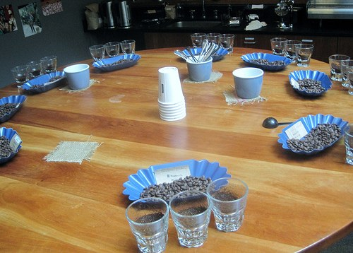
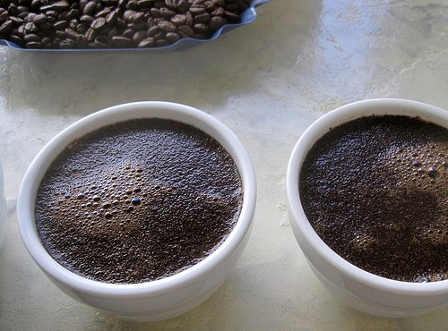

This article is meant to be used as a basic introduction. There are no right or wrong ways of cupping, but this should help the novice who wishes to enjoy the delights of origin coffee.

The aim is to introduce you to what cupping is, why we cup, how we cup and some of the more commonly used terms and evaluation methods.

People in the trade will have you believe that coffee cupping is a science, an exact art requiring a lot of expertise. To some extent, this can be true, but this should not prevent the enthusiast from enjoying it. It can be very simple (and enjoyable), and there are no right or wrong answers. Your palate may pick up hints of a taste that the most seasoned cupper would not, as each person can find different things in the cup.

  
*Coffee Cupping*

### What is cupping?

Cupping is a method of evaluating different characteristics of a particular coffee bean. Cupping allows us to compare and contrast coffees against each other, and allows us to get a better understanding of each coffee.

It is important that you so use the same method each time as this can have an effect on the results, so if cupping is being used as a comparison/evaluation tool then uniformity is key.

### Why cup?

We cup coffees to understand their basic tastes. This can help us understand where different coffees could be slotted into blends, not only for this brewing method but also for all other methods. It also makes us look at coffee in its basic form and appreciate some of its finer points. As already said, it’s a fantastic evaluation tool for something that changes from farm to farm, region to region, country to country, and crop to crop.

### How to cup?

There are no right or wrong ways of cupping coffee. What I will tell you here is the textbook way of doing it. What I suggest is that you always use any method you use. Any deviations will mean you lose many of the tools you can use to compare like with like.

### Preparation

I prefer to roast all my samples to a light roast. This allows the delicacies or the faults to stand out and not get complicated by roast-type tastes. Once again this is a personal choice, not a rule.

For a more professional atmosphere, it is a nice idea to have a sample of the green raw coffee, the roasted coffee, and some ground coffee. Although this is not essential, it allows you to judge the quality of the grade, smell the dry grounds, and see the quality of the greens.

  
*Coffee Tasting Table*

The method I will use here is infusion brewing. Grind up your rested coffee (two days of rest is a minimum in my opinion) to a coarse jug type grind. Place the grounds in a small bowl. Pour over nearly boiling water (195-205 °F, 95 °C). Allow the grinds to infuse for around 3-4 minutes.

A point quite often missed by some cupping sessions I have been to is that breaking the crust of the bowl will give you a great deal of insight into what is about to come. Take time to smell the coffee at this stage as it will give hints of the kind of things to be looking out for, come the tasting.

Once the crust has been broken start to stir the bowl gently allowing some of the grinds to sink to the bottom. Any left on top of the bowl should be scooped away with spoons.

Once the surface of the coffee infusion is clear of grinds, the slurping may commence. Don’t be afraid to sound a little silly whilst doing this: everyone does. When at cupping events, I try to make the silliest noise I can without getting spotted by others. It’s a great game, and everyone should play along with it. Take a deep spoon (a soup spoon is a good substitute for the traditional cupping spoon) and fill it with your infusion. Bring the spoon up to your mouth, and *inhale* (well suck powerfully anyway!), drawing the coffee to the roof of the mouth to tickle the tongue and then fall into the back of the mouth. This creates a coffee *vapour* to stimulate that part of your sense of taste which is actually your sense of smell. Then roll the coffee around the mouth and begin to look for tastes that you can compare it to.

It’s really easy once you’re here, and don’t be afraid to say what you can taste. I’ve found things in coffee that others haven’t, and I’ve also found things that everyone noticed. There are no wrongs or rights, just opinions. Now, this again is a choice, but I prefer to spit out the coffee. It seems a waste, but after 12-18 coffees, even a die-hard caffeine addict like myself can start to feel a little funny from the effects. Also, it’s hard work on the taste buds if you’re swallowing it all, and you’re being unfair to the later coffees.

Anyway, coffee should be drunk, not slurped!

It’s always a good idea to keep notes whilst doing all this.

### So what are you looking for?

**The fragrance of dry grounds**

Does it smell fresh? Does it smell stale? Over-roasted? Under-roasted? This is a great place to find out.

*Examples:*

-   Sweet
-   Spicy
-   Roasty
-   Nutty
-   Malty
-   Carbony
-   Stale
-   Fresh

**The fragrance of wet grounds**

Aroma: what’s there? The water mixing with the coffee and oxygen will produce a more intense smell than with the dry grounds.

*Examples:*

-   Smooth
-   Fresh
-   Lively
-   Creamy
-   Sharp

**Acidity / Liveliness**

Acidity in a coffee can be a welcome attribute, or it can be a most unwelcome one. In one form it can give liveliness and freshness to the flavour. In another form, it can appear as sourness. Coffee without acidity is lifeless. Coffee with too much or the wrong *sort* of acidity can be unpleasant, even sour. If the acidity is unpleasant, pleasant, fresh, sour, or whatever – make a note.

*Examples*

-   Nippy
-   Neutral
-   Soft
-   Tangy
-   Tart
-   Rough
-   Mild
-   Delicate
-   Smooth
-   Winey

**Body**

*Body* is a description of the fullness and richness of the feel of the coffee in your mouth.

*Examples*

-   Full
-   Rich
-   Fat
-   Thin

**Flavour / Depth**

What’s there? This is the fun part. Is there chocolate? Fruit?

*Examples*

-   Fruity
-   Winey
-   Buttery
-   Caramel
-   Chocolate
-   Blackcurrant
-   Woody
-   Grassy
-   Honey
-   Licorice
-   Malty
-   Nutty
-   Spicy (and what kind of spice?)

**Finish**

What does the coffee leave in your mouth when you have finished? The aftertaste is a very important part of the cup.

*Examples*

-   Sweet
-   Sour
-   Bitter
-   Sharp
-   Smooth
-   Full
-   Silky
-   Burnt
-   Dry

  
*Wet fragrance*

### Comments

How would you summarise the coffee? Is there anything you want to say about it that you haven’t been able to express in any of the specific sections of the cupping form?

### Conclusion

In conclusion, I hope that this guide is helpful. I am by no means an expert on cupping but I am a great believer in its utility in the evaluation of fine coffees.

This is just a set of guidelines and there are no hard and fast rules Everyone from the beginner to the expert can gain a great deal from the experience of cupping.

### Resources

[Coffee Cupping – A Sensory Experience](/coffee-cupping-a-sensory-experience/) – INeedCoffee article by John Carrier.

[Espresso Blending Techniques](/espresso-blending-techniques/) – Use your cupping skills to develop an espresso blend.

[Cupping: The Elements of Quality Coffee](/cupping-the-elements-of-quality-coffee/) – INeedCoffee article by Christopher Schaefer.

[Coffee Grind Chart](/coffee-grind-chart/) – A visual chart demonstrating the different grind sizes for coffee.

*This article originally appeared on [Too Much Coffee](http://www.toomuchcoffee.com "A meeting place for European coffee enthusiasts") Copyright 2004 and is reproduced with permission. The photos are by INeedCoffee and are available for unrestricted use with attribution under the Creative Commons license.*
