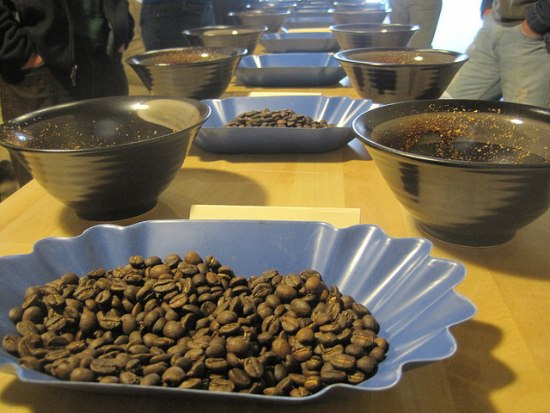
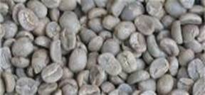
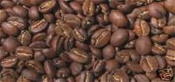

If you’ve tried freshly roasted coffee, you probably have a decent idea of how palate-pleasing it can be. But how good is it really? Moving beyond the basic qualitative levels of judging a cup of coffee (good/not good) to a true critique of your coffee involves a process known as cupping.

Cupping is a systematic method used to evaluate different aspects of a sample of coffee, and ultimately to differentiate coffees from one another. There are articles in the archives of INeedCoffee that discuss the steps involved in carrying out the cupping process. However, the purpose of this article is to highlight some things to consider when performing a cupping analysis.

Perhaps the first thing to realize is that coffee is something to be experienced, rather than just the taste. A sincere evaluation of your coffee through a cupping session will involve a variety of senses – taste, smell, and feel. It is the interaction of those senses that can create a unique experience.

Here’s the basic layout of the main points in a typical cupping review. Note that some items have preference ratings that tend to be judged qualitatively, while others have intensity rankings that are normally judged quantitatively.

  
*Coffee Cupping*

Dry Fragrance

-   the evaluation of gasses emitted from freshly ground coffee
-   preference rating from 1 to 5

Wet Aroma

-   the evaluation of vapors emitted from brewed coffee in the cup and once it is taken into the mouth and aerated across the surface of the tongue
-   preference rating from 1 to 5

Acidity

-   the perceived brightness and zest of the coffee
-   intensity ranging from 1 to 10

Taste/Flavor

-   the evaluation of taste sensations and flavor descriptors
-   preference rating from 1 to 10

Body/Mouthfeel

-   the evaluation of the fluid for fat content (oils) and heft (sediment/colloids)
-   intensity ranging from 1 to 10

Aftertaste

-   the evaluation of sensations after swallowing (duration and descriptors)
-   preference rating from 1 to 10

Balance

-   overall liking of the integration of all sensory attributes and how well it all comes together
    -   Sometimes, this is used to provide “cupper’s points” – additional points to correct for certain scores for a variety of reasons.
-   Preference rating from -5 to +5
    -   The overall correlation between sensory attributes – must be significantly better than average to get any additional points. For example, “above average” on our scale gets zero additional points, while “very good” will get one point.

The scores are summed and then an arbitrary 50 points are added to arrive at a total in order to have scores be relative to an approximate 100-point maximum for easier comparisons.

Even though we’re not entirely comfortable even including an overall number because it is the individual sensory inputs that often have the most memorable impact (i.e. very high acidity, strong winey aftertaste, or a bold single taste like maple syrup), the total score still serves as a decent, widely accepted high-level view of how impressive a particular coffee is. The coffee plant is an amazing creation in that hundreds of different chemical compounds can interact in such a way that together, they make for a truly impressive experience. Quantitatively, that impressive experience amounts to high-scoring coffees – particularly ones with high “balance” scores – and a high score will be evidence of an impressive interaction of the compounds that make the coffee what it is.

It is very important to realize that the highest-scoring coffees may not necessarily be the best choice for you depending on your personal preferences. For example, a coffee might have a particular characteristic that significantly contributes to an overall higher score (like a high score for acidity) even though it might at the same time be somewhat disagreeable to your own palate (if you don’t care for a cup that scores high on acidity). Part of the benefit of a cupping analysis is to highlight the aspects of different coffees so that people can more effectively find coffees that match up with their preferences.

It’s also important to realize that the roast level will affect the resulting cup qualities, sometimes to a large degree. Typically we try to highlight the roast level that brings out the optimal experience of brewed coffee, and quite often that is a lighter roast.

 

So, the roast level is important. Here is the list of terms that we will most commonly refer to in our own cupping reviews.

-   **City:** this is what you’ll typically get just after the first crack has finished; the lightest level we’re comfortable with when it comes to typical cuppings
-   **City +:** about one-third of the way between first and second crack; probably the most often used roast level for cupping
-   **Full City:** about two-thirds of the way between first and second crack which might be quickly approaching; a medium roast level
-   **Full City +:** the second crack has just begun (and it will accelerate quickly so use caution or your beans might soon be an oily, charred disappointment)
-   **Full City ++ /Light French:** the second crack is underway, and rolling.

The different flavor characteristics, whether aromas or tastes, can come from a variety of sources and are identified through several different wonders of human anatomy and physiology. We’ll spare you the serious science but here’s a bit of background to help you get a handle on some of the typical descriptors that tend to come up in our cuppings.

The **aromas** that coffees give off can be classified based on their source.

-   Enzymatic reactions that occurred while the coffee bean was still growing often make their presence known via gas coming off freshly ground coffee. Typically these aromas are considered to be flowery, fruity, or herby.
    -   Flowery aromas are further classified as either floral (sweetly floral like lavender, or sweetly herbal like wintergreen) or fragrant (most often sweetly spicy like cardamom or cinnamon)
    -   Fruity aromas are further classified as citrus-like or berry-like
    -   Herby aromas can be further broken down into alliaceous (onion or garlic) or leguminous (vegetable or parsley-like)
-   Caramelization (sugar browning) reactions from the roasting process result in some additional aromas that tend to be picked up after the wet grounds give off vapors full of flavor packets. This is why making note of the roast level is an important point in the cupping routine. These aromas are usually considered either nutty, caramelly, or chocolatey.
    -   Nutty aromas are more common in coffees that are roasted lighter (City level) and tend to resemble roasted nuts or something more malty (reminiscent of toasted cereal or grain)
    -   Caramelly aromas are more common in medium roast coffees (Full City level) and tend to be more candy types (toffee, licorice) or syrup types (molasses, maple syrup, honey)
    -   Chocolaty aromas tend to come out in darker roasts (Full City + and further) and also carry additional adjectives to describe what kind of chocolate the aroma more closely resembles or how much of a butter smell the aroma carries
-   Dry distillation by-products are more characteristic of a darker roast because they come from the burning of the actual bean fibers. These aromas will rarely come up in our cuppings because we very rarely take our roasts to such a level that would result in an overpowering of the other more delicate aromas.

The **taste** of a coffee comes about from the interaction between the soluble chemical compounds in the brewed coffee and the taste receptors in the mouth. You might remember from grade school science class that the four main taste sensations the tongue can identify are sweet, salty, sour, and bitter.

The sweet, sour, and salt sensations interact to form a variety of more specific tastes depending on their respective concentrations. It is these more specific tastes that end up being used to classify certain coffee origins. You might see these terms show up in our reviews so here’s some guidance on what they mean.

Hopefully, repeat experiences will help you develop your own taste memory. These three tastes will be the ones that come up with specialty-grade coffees as they are more desirable than some other taste descriptors that tend to accompany lower quality coffees and much darker roast levels.

-   **Acidy** – perceived on the tip of the tongue; related to the presence of sweet-tasting compounds; has nippy (sweeter) and piquant (sourer) as related descriptions
-   **Winey** – perceived on the sides of the tongue; related to the presence of sour-tasting (not bitter!) compounds; has tangy (sweeter) and tart (sourer) as related descriptions
-   **Mellow** – also perceived on the tip of the tongue like acidy; generally related to the presence of sweet-tasting compounds, but tamed down from the acidy descriptors; has mild (sweeter) and delicate (less sweet)

Finally, with all these aroma and taste descriptors there can be additional adjectives. Gathering up some seasonings from your kitchen or the supermarket can help you train your brain to recognize some traits and may help you become more aware of what is in your cup. Truly, experiencing coffee is an ongoing learning experience and cupping is one way to help with that experience.

### Resources

[Coffee Cupping: A Basic Introduction](/coffee-cupping-a-basic-introduction/) – Introduction to the basics of coffee cupping.

[Espresso Blending Techniques](/espresso-blending-techniques/) – Use your cupping skills to develop an espresso blend.

[Cupping: The Elements of Quality Coffee](/cupping-the-elements-of-quality-coffee/) – INeedCoffee article by Christopher Schaefer.

[Coffee Grind Chart](/coffee-grind-chart/) – A visual chart demonstrating the different grind sizes for coffee.
