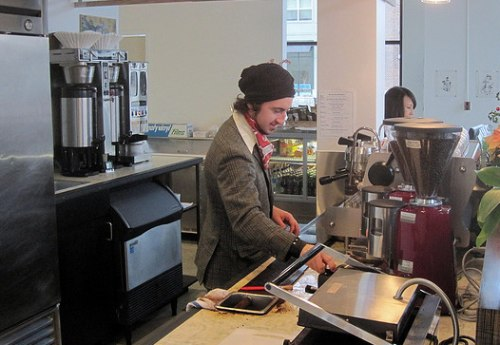
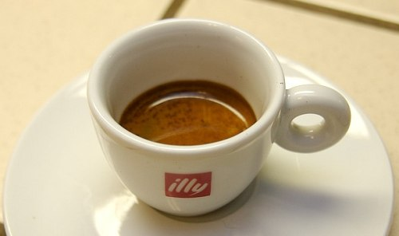
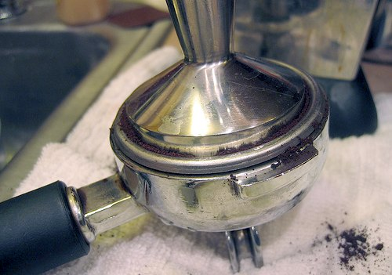

Here is a quick list of coffee terms and their meanings. This isn’t an all-encompassing list, but it should be enough to give your education a jump start.

**Acidity**: Acidity refers to coffee’s mouthfeel, which corresponds to the amount of time a particular coffee’s flavor lingers on the palate. Typically, the higher the acidity, the quicker the flavor leaves the palate.

**Baba Budan**: Baba Budan is the coffee hero who smuggled coffee out of Ethiopia and paved the way for its journey to the rest of the world.

**Barista**: A barista is a coffee professional who prepares espresso-based drinks.

  
*Barista*

**Blade Grinder**: This type of grinder grinds coffee using a spinning blade. While effective, it results in unevenly ground coffee, which will yield inconsistently brewed coffee.

**Blending** is the art of using multiple coffee beans/roast styles to achieve a satisfying cup. In addition to creating wonderfully unique coffee, it can sometimes allow roasters to maintain low costs and a consistent flavor profile.

**Body**: Refers to the mouthfeel of coffee on the palate corresponding to the perceived ‘weight’ of the beverage.

**Burr Grinder**: This type of grinder precisely crushes coffee to uniform size depending on the setting it is given. The advantage of this is consistency in the brewing.

**Doppio**: Italian for double. As in “Espresso Doppio” or just “doppio”. Translates into a double espresso.

**French Press**: Coffee brewing method. Also known as the ‘plunge pot’, ‘press pot’ or ‘cafetiere’. This method requires a coarsely ground coffee, hot water, a french press pot. See [Troubleshooting French Press Coffee](/troubleshooting-french-press-coffee/).

**French Roast**: Darkly roasted coffee with high amounts of oil on the surface of the bean

**Grande**: Italian for tall, big, heavyset, large, great

**Green Beans**: Coffee that has made it to all levels of processing except the actual roasting. Green Beans will store well for years without loss in quality.

**Java Jacket**: Device used to wrap around paper coffee cups to prevent you from burning your hand on the thin cup.

**Kaldi**: Legend has it that this goat herder discovered coffee. He was led to it by noticing his goats frolicking around a particular tree.

**Lungo**: Italian for long. Used to describe the method of pulling a shot of espresso. Results in more ounces of the beverage.

**Pull**: 1. The act of preparing espresso. 2. Part of the espresso machine includes the filter basket and handle.

**Ristretto**: [Ristretto](/ristretto-rant/) is Italian for restrain. Used to describe method of pulling a shot of espresso resulting in less fluid in the beverage.

  
*Ristretto*

**Second Crack**: This is the point in the roasting process where steam builds up in the bean and oils begin to come to the surface. At this stage, ‘tipping’ occurs, and little black chips come off the bean.

**Shade Grown**: Organic method of growing coffee which is good for the environment and good for the coffee. It employs the use of growing trees which provide natural habitats for birds. The birds, in turn, eat the insects and this eliminates the need for pesticides. See [Primer on Shade Grown Coffee](/primer-on-shade-grown-coffee/).

**Skinny**: Ordering a coffee beverage requesting the use of skim milk.

**Tamp**: Action of packing espresso into the espresso pull.

  
*Tamp espresso*

**Tamper**: Device used for packing espresso uniformly into the ‘pull’.

**Venti**: Italian for twenty. As in twenty ounces of coffee at some coffee chains.

**Viennese** **Roast**: Very dark roasted coffee with high amounts of oil on the bean’s surface.
