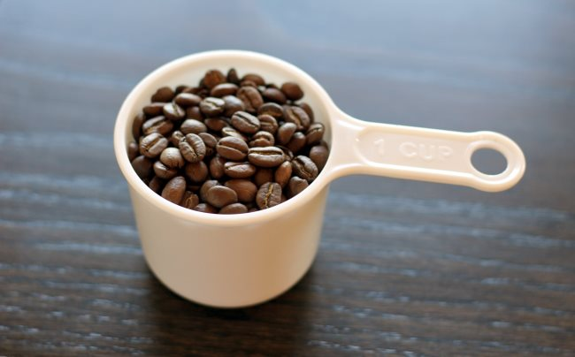
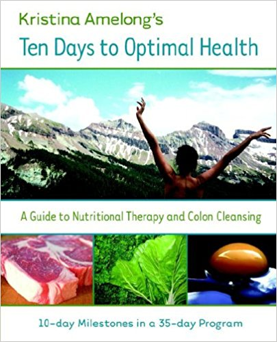

Every activity – especially those concerning your health – has risks and coffee enemas are not free from risks. However, many of us are willing to assume risks in our lives because of the benefits. For example, when skiing, we run the risk of severe injuries but are willing to ski anyway because, throughout the entire process, we do everything possible to minimize risk. Then, when we are as safe as we can possibly be, we are able to reap the benefits of an activity in a relatively safe manner. Coffee enemas are no different.

Let’s examine a list of potential risks as stated by Tom Mossey in the article [Top 10 Dangers of the Coffee Enema](/coffee-enema-benefits-vs-dangers/). These are all valid concerns and throughout the process of using coffee enemas, we must continually try to avoid danger and maximize benefits. Let me speak to each concern in detail.

> *1 – Adding ingredients to the enema recipe (such as coffee, green tea, vinegar, baking soda, bath/Epsom salt, or minerals) is not proven to do anything superior to the effects of plain saline.*

There have been literally thousands of studies on the dangers of cell phones, and yet the results are inconclusive. Studies take years and sometimes decades to have a conclusive result, and, while what they tell us is valuable, sometimes we must take our own and others’ observations as evidence enough in the meantime. Many people find coffee enemas to be more useful than water-only enemas.

> *2 – Inserting anything into the anus may result in anal tearing.*

Of course, caution should be taken when inserting anything into the anus. Lubricant and caution should always be used. That said, this risk is not significant.

> *3 – Re-used (instead of single use) enema kits may carry bacteria, which could result in an infection.*

Obviously, make sure to thoroughly clean any enema equipment before and after each use. Having done that, the risk for infection is minimal.

> *4 – Use of hot liquid in the rectum could result in serious internal burns.*

Just like when we need to pay attention to how hot our morning coffee is before we drink it, make sure that any liquids used for enemas are of a comfortable but not overly hot temperature.

> *5 – Extensive use of enemas could result in dehydration.*

Most people don’t drink enough water as it is, but if you decide to take enemas frequently, make sure you’re not forgetting your fluids!

> *6 – Overuse of coffee enemas could result in electrolyte imbalances.*

Electrolytes are essential to our body’s functioning and as such are lost in any sort of discharge. Sweating, bowel movements, and urination all carry electrolytes from our bodies. Electrolyte drinks like coconut water are great for replacing electrolytes, or simply eating some sea-salted food. Regardless of the exchange of electrolytes, the kidneys do a good job of maintaining necessary electrolyte levels as long as you have a generally healthy diet.

> *7 – The caffeine in the coffee or tea enema may lead to caffeine addiction.*

While caffeine addiction is an important consideration, taking coffee enemas does not present a greater risk for caffeine addiction than simply drinking coffee. All things in moderation.

> *8 – Caffeine enemas must be avoided by pregnant women and people with caffeine sensitivity.*

Pregnant women should consult a health care professional before undergoing a coffee enema due to certain risks, but should not rule them out since there can be great benefits especially when pregnant women are experiencing constipation. People with caffeine sensitivity should avoid coffee enemas.

> *9 – Overuse of any type of device designed to temporarily excite the nerves of the colon (such as an enema, colonic, or suppository) could result in decreased function of the bowels.*

Enemas, particularly coffee enemas, are useful tools, but like anything, should not be overused. As long as you practice them in moderation, they are generally healthy and safe.

> *10 – The colonic does not magically remove cancer-causing toxins. It will create watery stool and stimulate the release of fecal matter from the last few inches of the lower bowel. Do not forgo licensed medical attention in favor of this dangerous alternative.*

Coffee enemas are not an end-all healthcare treatment, but rather a tool to be used as part of a comprehensive healthcare plan.

I appreciate Mr. Mossey for raising these concerns. Coffee enemas are not something that you learn by doing and I would counsel everyone to seek thorough instruction before attempting one. In general, if you know what you’re doing and you use coffee enemas in moderation, you have an exceptional tool to improve your health that has minimal risk.

*Ten Days to Optimal Health by Kristina Amelong*

### Resources

[Top 10 Dangers of the Coffee Enema](/top-10-dangers-of-the-coffee-enema/) – Article by Tom Mossey outlining potential risks of the coffee enema.

[How to Perform a Coffee Enema](/coffee-enema/) – An overview of the coffee enema topic along with instructions.

*Photo by [Anastasia Zhenina](https://unsplash.com/@disguise_truth)*
