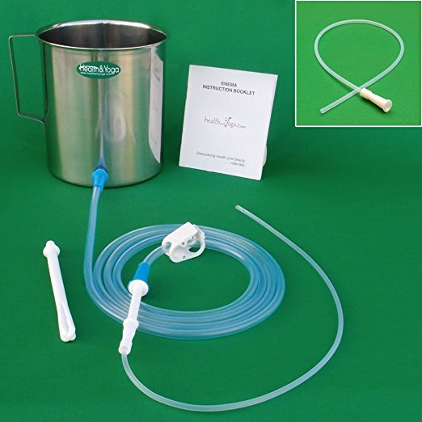

*Warning: The following piece is for informational purposes only and is not intended to be medical advice. Some medical authorities consider this a dangerous procedure, which INeedCoffee.com does not endorse.*

The use of coffee in enemas for detoxification purposes is well known. It is a common herbological remedy suggested by holistic and alternative medicine professionals for many years.

### Why Coffee Enema Cleansing Works

The effects of a coffee enema are different than a saline enema. The most important difference between a saline enema and a coffee enema is the presence of caffeine in the coffee. Caffeine, theophylline, and theobromine combine to stimulate the relaxation of smooth muscles, causing the dilatation of blood vessels and bile ducts. The effects of having a coffee enema are not the same as drinking coffee. The veins of the anus are very close to the surface of the tissue. The caffeine is absorbed more quickly (and in higher concentration) than when coffee is drunk.

### Benefits of Enemas and Colonics with Coffee

Enemas and Colonics have been used for centuries and are generally considered safe. Additionally, coffee cleansing enemas have a chemical makeup that is stimulative. The enzymes in coffee, known as palmitates, help the liver carry away the toxins in bile acid. The coffee is absorbed into the hemorrhoidal vein, then taken up to the liver by the portal vein. With the bile ducts dilated, bile carries toxins away to the gastrointestinal tract. Simultaneously, peristaltic activity is encouraged because of the flooding of the lower colon. Thus, when the colon is evacuated, the toxins and bile are carried out of the body.

### Enema and Colonic Supplies and kits

-   You will need to buy a reusable enema kit. Enema products are available at most pharmacies. They are usually disposable (although they can be cleaned and reused for several months) and inexpensive.
-   Distilled water.
-   Organic coffee, at any roasting level, will do.
-   French Press pot.

### Coffee Enema Recipe

-   Bring 8 cups of water to a boil.
-   Grind eight heaping tablespoons of organic coffee. Put it in a French press pot. You can use a drip coffee maker, but use organic, unbleached coffee filters.
-   Pour the water over the coffee grounds and let it steep; then, cool for one hour or more.
-   After this amount of time, the liquid should be about body temperature. If you stick your finger in the water it should be lukewarm or cool, but not hot.
-   Press the coffee grounds to the bottom, then pour the coffee liquid into the enema bag.
-   Never utilize flavored coffee, sweetened coffee, or coffee with milk (cafe au lait) for this purpose.

Using coffee in a colonic, enema, or suppository will result in cleansing alongside a heightened sense of well-being, pleasure, and a release of toxins.

### Coffee Colonics

Some colonic hydrotherapy providers will prepare a coffee colonic. Be sure to speak with your professional colonic hydrotherapist prior to the appointment so that he/she may purchase and prepare the organic coffee in advance.

Keep in mind that the coffee will be added as an additive to the colonic equipment, and will therefore be watered down and flushed through rather more rapidly than if you were doing an at-home enema; this is ok too. Colonic Irrigation (sometimes referred to as a high enema) with the addition of coffee is an excellent way to dispel constipation, and achieve temporary weight loss.

### Directions and Coffee Enema Procedures

-   Make sure to use an at-home enema or colonic kit that includes a bag that is sturdy enough to accept lukewarm coffee.
-   Make sure that there are no grounds in the enema bag or enema hose; also ensure that the hose doesn’t get a kink in it as this will result in the settling of the coffee oils.
-   Follow the directions that accompany the enema kit. Lie on your right side, inject and attempt to retain the coffee for 10-15 minutes.
-   I recommend lightly massaging your abdomen from left to right (up the left side, and then left to right just below the navel).
-   Additionally, I recommend changing positions while retaining the coffee. After a few minutes turn over onto your back, and a few minutes later switch to your left side before evacuating your bowels.

*Stainless Steel Enema Kit*

### Unfounded Coffee Enema Concerns and Supposed Dangers

Many people are concerned that the body will become addicted to the cleansing and that frequent coffee enemas might encourage constipation. This fear is unfounded. The bowels will continue to function on their own after enemas are discontinued. The bowels should work quite well for a few days after the coffee enema – assuming you are eating a healthy diet with adequate fiber intake. Therefore, using coffee enemas or coffee colonics more than once a week should not be necessary.

If constipation is consistent for several weeks in a row and you continue to have cyclical constipation that is only relieved as a result of enemas, colonics, or suppositories, be sure to discuss your situation with a competent medical professional.

### Resources

[Top 10 Dangers of the Coffee Enema](http://ineedcoffee.com/top-10-dangers-of-the-coffee-enema/) – INeedCoffee article outlining potential risks of the coffee enema.

[Coffee Enema Benefits vs Dangers](http://ineedcoffee.com/coffee-enema-benefits-vs-dangers/) – Article by health professional Kristina Amelong.

*Photo by [Daniel Ruswick](https://unsplash.com/@danielruswick)*