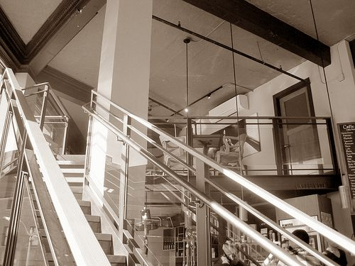

On holiday in southern California, I go into a local coffee bar for a pick-me-up. While I am trying to locate my exact position on the map, I can’t help catching the orders of the other patrons. ‘For me a decaf double tall hazelnut non-fat with a shot of mocha latte’, says a very blonde woman in her thirties sporting a pair of designer glasses on the tip of her nose. The waiter takes it down without batting an eyelid and goes to pass it on to the counter with the same straight face. I am sitting beside a forty-ish man with a perfectly trimmed beard and neatly dressed in pressed shorts and a starched sports shirt. (Who says all Americans are nonchalant?). He wants a ‘venti caffe caramel latte macchiato with whip’. Two very young teens with spiky hair order a ‘Frapuccino’ each.

Flabbergasted, I pick up the menu. Am I on planet earth, I wonder? And am I really in the States, where they usually only have a large bubbling pot standing on a hot plate and where boiled dishwater passes for coffee? What are these people talking about?

  
*The Cafe Language*

An older lady, who came in just before me and is now rearranging her numerous shopping bags around her with a sigh, brings me back to reality. To the standard ‘Can I help you?’ of the waiter, she replies, wistfully, ‘All I want is a cup of coffee. Just give me the house blend.’

‘Today’s special or the regular?’ asks the waiter.

‘And what are they?’

‘Today’s special is Colombia with Mexico, the regular is Sumatra.’

‘Then just give me the regular.’

‘Tall drip or espresso?’ is the waiter’s next patient request.

I am relieved to see the lady look up in surprise now. Hasn’t she solved the coffee puzzle yet?

‘Do you want a tall’ the waiter repeats calmly, pointing to a stack of paper cups, and then, with the same calm, ‘drip, ‘ now pointing to a large coffee machine, ‘or an espresso?’ moving his finger towards the back of the bar, indicating a shiny espresso machine.

‘Espresso please.’

‘Venti, regular or ristretto?’

The lady’s eyes widen into large question marks surrounded with exclamation marks spelling ‘help!’. And her patience is wearing thin. ‘Whatever!’ she exclaims, just a little too loudly, while her palms land with a bang on the aluminum tabletop.

By now, I’m in a cold sweat myself. I am still struggling with the hazelnut, raspberry, or amaretto flavour that threatens to visit my cup soon. And I’m sure that the waiter will want to know whether I want a half-decaf triple and whether or not I want it sugar-free, no-foam, or non-fat. The young man with the notepad and the unvarying smile approaches my seat. Will I expose my ignorance or shall I have a go at it?

I expose my ignorance.

‘I just want a good cup of coffee, preferably an espresso, not too small, no extras.’ The waiter’s eyes become narrow slits, a deep frown appears between his eyebrows, and his pencil suddenly comes to a halt on his pad. Caught unawares by such a simple, clear-cut order, he hesitates for a second, then asks me to wait a minute.

He hurries to the barista, the girl behind the counter who has been specially trained to prepare all this coffee madness. She shrugs her shoulders a little uncertainly, but then confirms, with a nod, that she thinks she can manage to produce my order. The cashier has more problems though. With his index finger, he goes over all the coloured buttons on his big machine, and the further down he gets, the more decisively he shakes his head. It’s a no go. The floor manager is called in, and after conferring on the matter, the waiter is sent back to me.

‘I’m sorry’ he says, ‘we can’t ring up your order, because we don’t have a code for it on our cash register. But if you’ll order something extra, I’ll get it for you immediately.’

‘Well, give me a jug of milk then,’ I give in.

I see him getting ready to ask whether I want it large or small, extra-hot or tepid, frothed, sprinkled with chocolate or nutmeg… but then he thinks the better of it, remembering my predicament, swallows his questions, and goes and gets my ‘difficult’ order.

I find myself sighing for the simple life of a Flemish village cafe…
