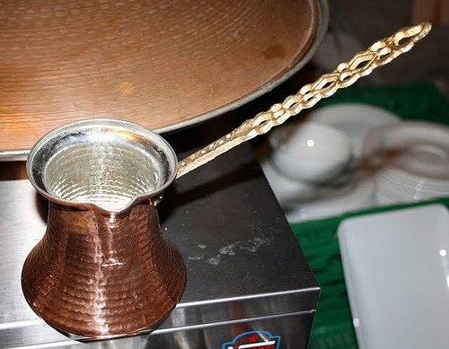

What can your coffee do for you today? When you think I have exhausted the possibilities regarding coffee, wait – there’s more! I found this topic very amusing and entertaining. Some may take this seriously, but I have chosen to take it at face value, that is, dried coffee grounds at the bottom of a cup and nothing more. What am I talking about? Please follow me on a journey to the Middle East, Turkey, perhaps…

You walk into a dimly lit room and take a deep breath, inhaling the dense and thick aroma of incense in the air. The walls are adorned with deep colors, green and burgundy and gold, and you can hear a jingling noise becoming louder and closer. You sit in front of a small table waiting for someone to arrive. You have come to see her, to enjoy a cup of coffee together, and to see what she has to say – about you. But before you can get to that part, you must have some coffee together first.

Turkish coffee, as well as Greek, Armenian, Arabic, or Byzantine coffee for that matter, are similar in their process. If you are familiar with the Ethiopian coffee ceremony, you can find some similarities with it as well. For Turkish coffee, the beans are pulverized with a mortar and pestle or a coffee mill into a very, very fine powder, finer than even an espresso grind. The other items necessary are a small teaspoon, a narrow topped small copper pot with a handle, called a cezve, the spice cardamom, and some cold water.

  
*Tasseography – Coffee Fortune Telling*

All of the ingredients, including the sugar, are heated just to the boiling point, which is very important. If it happens to come to a boil, the foam on the top is lost, and so the whole pot is ruined. After the coffee is made, it is poured into small espresso-sized cups, called fincan, which traditionally are without handles. The grounds settle to the bottom of the cup, and a small amount of coffee has to be left over to avoid drinking the grounds. Now, what can a person do with those grounds left in the bottom of the cup?

Sitting at the small table, with the incense around you, your friend finally arrives. She grinds some dark roasted beans, filling the room with a new aroma, and prepares you both a cup of coffee. She fills your tiny white cup, which is sitting on a perfectly fitting small saucer. As you both sip the coffee, you discuss your current life and events, maybe some of your past, but it is for the future that you have come to see her. When the coffee is gone, she has you put the saucer on top and then flip it all over towards you. Now, she will read your fortune.

Looking deep into the center of the cup she finds pictures that have to do with your past, symbols that have a greater meaning. If they are black they are negative, may be harmful or sad, and if they are white it will be positive good events. She slowly moves her gaze up the sides of the cup, searching for your present situation and then your future, describing the pictures she sees, their meanings, and how she feels. There is a cat, maybe someone will deceive you. She sees an egg, maybe that will be a new beginning, and a ladder, to move up in life. Very thankful, you leave on your journey, wondering what will really come to be.

There are so many contradicting ideas of what the various symbols mean, so each person has to decide for themselves what they think everything means. As for me, staring at dried coffee grounds in the bottom of a cup and looking for pictures is pure entertainment, just as finding pictures in the clouds or in the night sky can spur your imagination.

### Resources

[Coffee Tasseography – Fortune Telling with Coffee](http://ineedcoffee.com/coffee-tasseography-fortune-telling-with-coffee/) – Article by Margaret Wallauer.