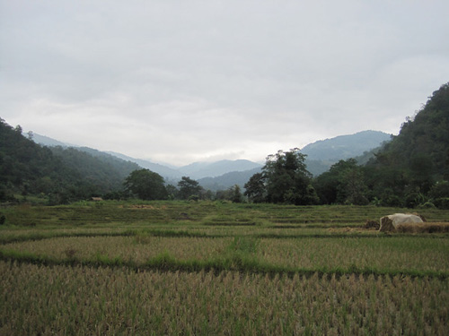
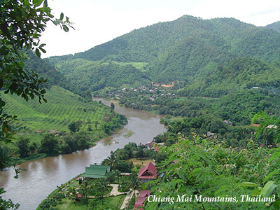
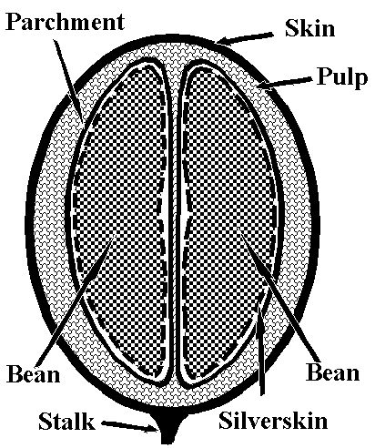

In recent years, Thai coffee has been rising in popularity, and for good reason. The country produces some of the world’s most complex-tasting coffee varieties and has steadily been increasing production with increasing demand.

Nacha coffee, a grower based in Chiang Mai, Thailand, produces a strain of Arabica Typica that will win over anyone skeptical of the taste quality of South East Asian coffees. We were lucky enough to not only discover the coffee but to meet the founder of the company, who retired from public life in Thailand to pursue his dream of producing the world’s best Arabica coffee from his homeland.

The province of Chiang Mai is located 700km (approximately 435 miles) north of Bangkok and, due to several environmental factors, has produced soil that is particularly good for growing coffee. Though situated in a tropical region, Chiang Mai enjoys a milder climate compared to the rest of the country. The area has lower humidity, a shorter monsoon season, and a lower annual temperature, creating a micro-climate among the Chiang Mai mountains. Rainwater from the mountains seeps into the soil, making it particularly rich in mineral content.

  
*Chiang Mai, Thailand*

Grown at 4000-5000ft above sea level, Nacha coffee reflects the land’s complex environmental conditions in its taste. For one, the farmers use a multiple picking process to ensure that the coffee beans are always ripe. Rather than stripping the trees all at the same time and later discarding undesirable beans, Nacha’s arabica is handpicked before it is processed. Coffee pickers will do sweeps of the trees picking only the beans that have fully ripened. In addition, the grower sun-dry their coffee rather than putting their delicate beans through several water processes.

  
*Chiang Mai Mountains*

The anatomy of a coffee bean consists of several layers that insulate the bean and can affect the taste of the coffee. Rather than being power-washed and stripped of these insulating layers, the beans are soaked to soften the pulp, which is removed, and then the beans are left to sun-ripen, thereby naturally separating the layers. The pulp of the cherry and the parchment surrounding the coffee bean itself (a paper-like layer similar to the shelling of a peanut) contain taste elements that give a more complex and layered flavor to the coffee.

Nacha is careful to preserve bits of parchment in order to better conserve the bean’s full-bodied flavor. Nacha growers use minimal processing and manage to clean the beans in the most natural way possible without depriving the coffee of its natural taste. In order to ensure the quality of the final product, Nacha’s beans are hand graded and then roasted in small batches. By doing so, the grower is able to monitor the entire process more closely and guarantee the best tasting final coffee.

  
*Coffee Bean detail. (Image courtesy of kupajoe.com)*

Travelers to Chiang Mai have the special treat of witnessing the gorgeous soil used to produce Nacha’s coffee. The region’s soil is particularly fragrant, smelling of spices that seep into the coffee giving it a much more complex taste than a typical supermarket-bought arabica. The diverse flavor of Nacha’s arabica rivals that of top Kona coffees, and has recently beaten the world-famous Hawaiian Kona coffee in a taste test, and was given the title of “Best Asia Coffee” at the 2007 Long Beach SCAA.

Nacha coffee is not by any means a Kona arabica imitation, but simply what might be a new contender for the world’s best arabica coffee, a position often attributed to true estate-grown Kona. Because of the geographic limitations of Kona production, the critically acclaimed Nacha fills a niche in the coffee market while remaining under the radar and untainted by outsiders. The naturally spiced Nacha bean has an incredibly smooth taste that appeals even to those coffee drinkers who are not otherwise fans of arabica. Coffee-lovers looking to experience a truly outstanding coffee and somewhat wary of the sometimes suspect origins of Kona coffee are in luck because they can now tap into Chiang Mai’s coffee resources.

Nacha prides itself on being a “perfect roast” coffee, in that it is incredibly versatile and can be used to make a wide variety of coffee drinks. The coffee makes a superb dessert drink because it lacks many of the bitter elements found in other types of arabica. Here is a recipe created using the Nacha as an espresso, plays up the smooth flavor of the coffee, and is a people-pleaser given its delightful presentation. All you need is one shot of Nacha espresso, milk, cream, or liquid non-dairy creamer (depending on personal preference), and your choice of sweetener. The “Bullseye Espresso” drink makes you feel like you’re in a gourmet coffee shop, yet it requires nothing more than an entry-level espresso machine.

> **Espresso Bullseye**
> 
> First, brew the espresso into a pot or carafe (not directly into your cup).
> 
> While the espresso is brewing, pour about an inch of milk, cream or non-dairy creamer into your cup. Add sweetener at this point. Important: if your milk is cold, table sugar won’t melt in it. You should use syrup, superfine or confectioner’s sugar, or Splenda/Nutrasweet; or, you can warm the milk first on the stove or in the microwave.
> 
>   
> *Espresso Bullseye*
> 
> When the espresso is done brewing but the machine still has some steam in it, use the extra steam to froth your milk. Milk froths best; cream and creamer don’t froth quite as much, but they still work.Then, pour the espresso in a thin stream into your cup. This makes the bullseye mark in the center.
> 
> Don’t stir the drink! What really makes this drink special is the contrast between the powerful espresso and the sweet milk. Your first sips are sweet and creamy, then gradually more straight espresso; finally, your last sip is sweet again.
> 
> For a delicious variation on the Bullseye Espresso, try using a tablespoon of Bailey’s Irish Cream or Frangelico (hazelnut liquer) instead of sugar. Alternatively, you can try adding pure maple syrup, or heating the milk and using Demerar or Muscovado sugar to add depth of flavor.

One of the pleasures of dabbling in Thai coffee is accessing a world-class coffee that the world market has yet to discover. Another is dealing with producers who are working in a free-market environment and are extremely concerned both about the environment and the welfare of the communities in which they operate. Nacha family-owned, estate-grown coffees rely heavily on the support of their communities and they give back a lot in terms of infrastructure, assistance to education, and the general welfare. This reflects our own belief that coffee is a crop that is more than just a food product, it has a vast effect on human culture and welfare and has for over a century (it is currently the most traded commodity in the world after water and oil).

Thai coffee is exceedingly difficult to procure outside of Thailand. We looked for years to find Thai coffees in the USA, but mostly what we find are powdered coffee mixtures with sugar and spices. Very sweet, they are intended to be used as instant coffee or made into an iced drink. We were lucky to find Nacha coffee when we were down in Philadelphia having some coffee made into pods at ABCD-Pods. Nacha had found this vendor and was also podding some of their coffee into ESE espresso pods. We tried the coffee and were so impressed we asked to be connected to the producer.

Nacha coffee is proactive in plans to distribute its line globally. Hopefully, they will bring some further recognition to Thailand as a fine coffee-producing country (635,000 152-pound bags in 2008) as they pioneer the sale of roasted, branded coffee outside of their own country.

### Resources

Nacha Coffee – Coffee from Chiang Mai, Thailand.

[Wikipedia](https://en.wikipedia.org/wiki/Chiang_Mai) – Wiki page for Chiang Mai, Thailand.