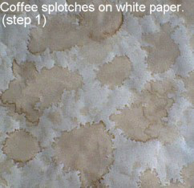
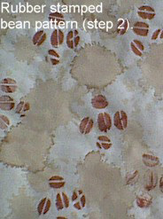
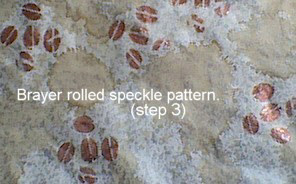
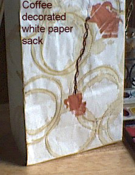
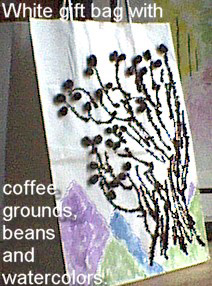

In this article you will learn how to make your own hand-designed coffee wrapping paper, to make your great gift ideas even better.

### Supplies Needed to Make the Coffee Wrapping Paper

-   White paper sack, white craft or postal paper, or white gift bag
-   Craft paint of your choice
-   Unused (new) coffee grounds
-   Fresh-brewed coffee or soaked coffee grounds, enough to drip onto paper in a random pattern
-   Rubber stamps of your choice
-   Wide flat aluminum or foam pan to hold paint
-   Brayer to spread the paint in a flat layer or brush to brush paint onto rubber stamps
-   Gel pen or marker in the color of your choice
-   Elmer’s glue

### Coffee Gift Wrapping Paper Instructions

Gently pull apart the paper bag and flatten, or cut craft paper to the size desired. Lay centered on a flat surface. Drip coffee over the paper, allowing it to splash/splatter. Do not rinse, drain or otherwise remove puddles of coffee. This ensures that your splash patterns will dry distinctly.

When dry, if you want more splashes, repeat the process, dripping more coffee onto paper and allowing it to dry.

  
*Step 1 for the Coffee Wrapping Paper*

Once satisfied with the pattern, spread the paint in a pan or dip the brush in paint. Press rubber stamp into paint or coat with paint from the brush and begin to apply the pattern to paper. Allow it to dry.

  
*Rubber stamped bean pattern (step 2)*

A second color can be used in the same stamp pattern or a different stamp. Decorate with speckles from paint flicked from a brush or a decorative brayer-rolled pattern.

  
*Brayer rolled speckle pattern (step 3)*

### Project Suggestions

1.  Stamp in spaces between your coffee splotches. Load stamp with paint and start in the center of your paper with the first stamping.
2.  Stamp a second or third time moving outward to the sides of the paper, making a lighter impression as you move outward.
3.  Stamping a balanced but semi-random pattern is easier. Finish your project with a third process, such as paint splatters flicked on from a brush, rolled on with a decorative brayer, or highlight the areas of your pattern with a gel metallic pen.

### Coffee Decorated White Paper Sack

  
*Coffee Decorated White Paper Sack*

To do this: dip a mug into coffee and press it onto the sack, making coffee rings. Apply coffeepot and mug using rubber stamps. Draw first coffee stream using a brown marker. Draw second coffee steam with glue and sprinkle with coffee grounds. Draw circles over selected coffee rings with a metallic gel marker.

### White Gift Bag

  
*White Gift Bag with coffee grounds, beans, and watercolors.*

To do this: draw a bush with glue and sprinkle it with coffee grounds. When dry, glue coffee beans to selected branches. Paint mountains design.
